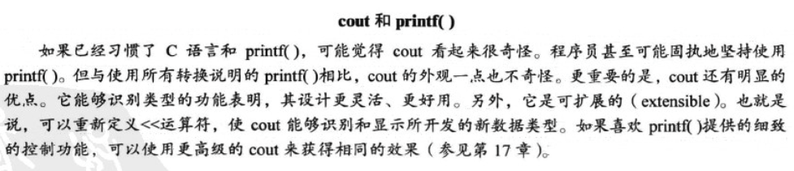

### 1 概述

1. 

2. c++中不能省略分号。

3. 

4. 

5. 

6. 

7. 

8. 

9. 

10. 

11. 

12. C++（和C）有一项不寻常的特性——可以连续使用复制运算符，如：

    ```cp
    int a,b,c;
    a=b=c=1;
    ```

13. 

14. 从键盘赋值给变量carrots：

    ```cpp
    cin >> carrots
    ```

15. 

16. 使用sqrt()函数前，必须`#include<cmath>`

17. 
