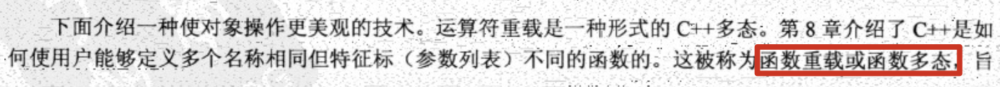
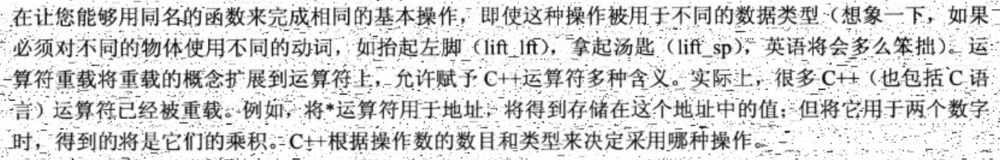
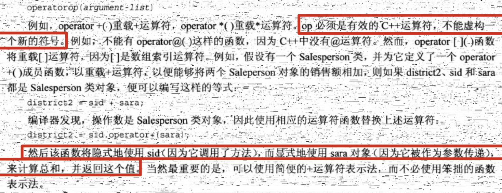
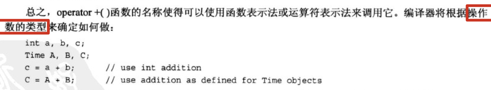
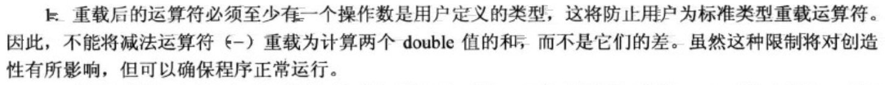
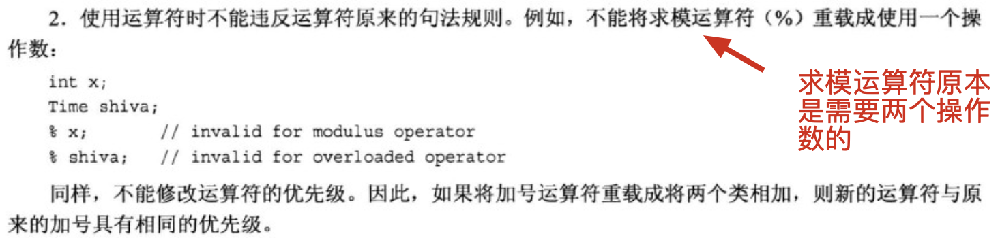
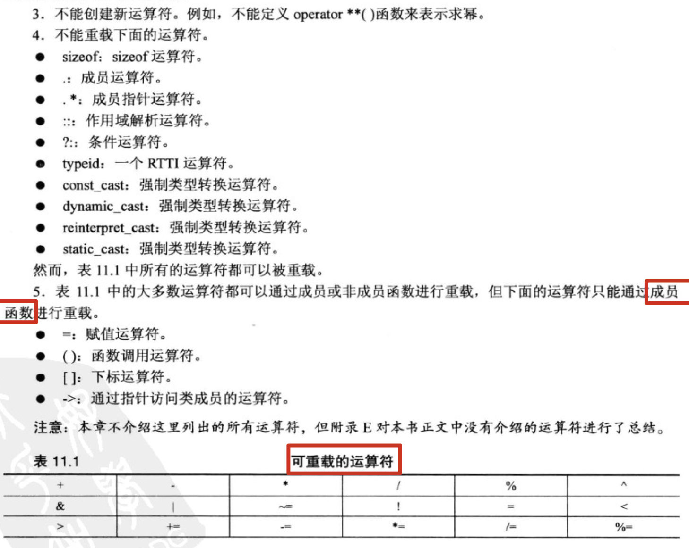
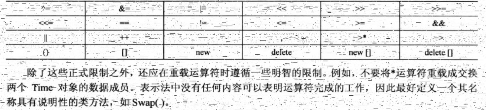

## 10.使用类

1. 学习c++的难点之一是需要记住大量的东西，但在拥有丰富的实践经验之前，根本不可能全部记住这些东西。正如c++创始人Bjarne Stroustrup在一次c++专业程序员大会上所建议的：“轻松地使用这种语言。不要觉得必须使用所有的特性，不要在第一次学习时就试图使用所有的特性。”

2. 运算符重载：

   c++允许将运算符重载扩展到用户定义的类型，如：利用+将两个对象相加。重载运算符可使代码看起来更自然，如：将两个数组相加是一种常见的运算。通常要使用for循环来实现：

   ```cpp
   		for (int i = 0; i < 20; i++) {
           arr_total[i] = arr1[i] + arr2[i];
       }
   ```

   但在c++中可以定义一个表示数组的类并重载+运算符。支持如下语句：

   ```cpp
   arr_total = arr1 + arr2;
   ```

   这种加法表示隐藏了内部机理，并强调了实质，这是OOP的另一个目标。

3. 要重载运算符，需使用被称为**运算符函数**的特殊函数形式，其格式如下：

   

4. 来看一个运算符重载的示例：计算时间

  ```cpp
  // time.h
  class Time {
  private:
      int hours;
      int minutes;
  public:
      Time();
  
      Time(int hours, int minutes);
  
      void add_min(int minutes);
  
      void add_hour(int hours);
  
      void reset(int hours = 0, int minutes = 0);
  
      Time sum(const Time &t) const;
  
      void show() const;
  };
  
  // time.cpp
  #include<iostream>
  #include "time.h"
  
  Time::Time() {
      hours = minutes = 0;
  }
  
  Time::Time(int hours, int minutes) {
      this->hours = hours;
      this->minutes = minutes;
  }
  
  void Time::add_min(int minutes) {
      this->minutes += minutes;
      this->hours = this->minutes / 60;
      this->minutes %= 60;
  }
  
  void Time::add_hour(int hours) {
      this->hours += hours;
  }
  
  void Time::reset(int hours, int minutes) {
      this->hours = hours;
      this->minutes = minutes;
  }
  
  // 注：返回值必须是Time而不能是Time的引用。返回值对象将创建对象的副本，外面调用的函数可以使用它。如果返回值类型为引用，sum_time为局部变量，在该函数结束时将被删除，因此返回到外面的引用将指向一个不存在的对象。
  // 使用返回类型Time意味着程序将在删除局部变量sum_time之前会构造它的拷贝，调用函数将得到该拷贝。
  Time Time::sum(const Time &t) const {
      Time sum_time;
      sum_time.minutes = this->minutes + t.minutes;
      sum_time.hours = this->hours + t.hours + sum_time.minutes / 60;
      sum_time.minutes %= 60;
      return sum_time;
  }
  
  void Time::show() const {
      std::cout << hours << " hours, " << minutes << " minutes" << std::endl;
  }
  
  // main.cpp文件
  		Time t1(6, 14);
      Time t2(1, 49);
      t1.sum(t2).show();	// 输出：8 hours, 3 minutes
  ```
  
  添加加法运算符：只要将`sum()`的名称改为`operator+()`即可：
  
  ```cpp
  // time.h
  Time operator+(const Time &t) const;
  
  // time.cpp
  Time Time::operator+(const Time &t) const {
      Time sum_time;
      sum_time.minutes = this->minutes + t.minutes;
      sum_time.hours = this->hours + t.hours + sum_time.minutes / 60;
      sum_time.minutes %= 60;
      return sum_time;
  }
  
  // main.cpp
  Time t1(6, 14);
  Time t2(1, 49);
  auto sum = t1 + t2;
  sum.show(); // 输出：8 hours, 3 minutes
  ```
  
  注：这两种调用方式都将调用`operator+()`方法：
  
  ```cpp
  		// 方法1：
  		auto sum_1 = t1 + t2;
      sum_1.show();
  
  		// 方法2：
      auto sum_2 = t1.operator+(t2);
      sum_2.show();
  ```
  
  
  
   可以将多个Time对象相加么？
  
  ```cpp
  		Time t1(6, 14);
      Time t2(1, 49);
      Time t3(0, 57);
  
      auto sum = t1 + t2 + t3;
      sum.show();
  ```
  
  可以的，由于+是从左向右结合的运算符，因此首先会被转换成下面这样：
  
  ```cpp
  auto sum = t1.operator+(t2 + t3);
  ```
  
  之后参数`t2+t3`被转换成一个函数调用：
  
  ```cpp
  auto sum = t1.operator+(t2.operator+(t3));
  ```
  
  返回值正式三者之和——正是我们期望的。
  
5. 重载限制：

   

   重载的运算符不一定都得是类的成员函数，但是至少有一个操作数是用户自定义的类型：

   ```cpp
   // 在main.cpp中定义
   void operator+(Time &t) {
       t.show();
   }
   
   int main(){
     	Time t1(6, 14);
       +t1;		// 输出：6 hours, 14 minutes
     	// 相当于调用opertor+(t1);
   }
   ```

   如果操作数都是内置的基本类型，编译器会报错：

   ```cpp
   void operator+(int i) {
       std::cout << i << std::endl;
       return
   }
   
   // 编译器报：overloaded 'operator+' must have at least one parameter of class or enumeration type
   ```

   

   ```cpp
   void operator%(Time &t) {
       t.show();
   }
   
   // 编译器报：overloaded 'operator%' must be a binary operator (has 1 parameter)
   ```

   

6. 友元：

   c++控制对类对象私有部分的访问。通常公有类方法提供唯一的访问途径，但是有时候这样限制太严格，以致于不适合特定的编程问题。这种情况下，c++提供了另外一种形式的访问权限：**友元**。
   
   友元有三种：
   
   - 友元函数
   - 友元类
   - 友元成员函数
   
   通过**让函数成为类的友元**可以赋予该函数与类的成员函数相同的访问权限。在为类重载二元运算符时（带两个参数的运算符）常常需要友元。接上面，Time类有一个乘法重载运算符：
   
   ```cpp
   // time.h
   Time operator*(double mul) const;
   
   // time.cpp
   Time Time::operator*(double mul) const {
       Time res;
       long total_min = (hours * 60 + minutes) * mul;
       res.hours = total_min / 60;
       res.minutes = total_min % 60;
       return res;
   }
   ```
   
   由于左侧的操作数是调用对象，即`A = B * 2.5;`将被转换为`A = B.operator*(2.5);`。但`A = 2.5 * B;`又如何呢？
   
   由于2.5不是Time对象，所以编译器不能使用成员函数调用来替换该表达式。
   
   有一种解决方式——非成员函数（记住：大多数运算符都可以通过成员或非成员函数来重载）。非成员函数不是由对象调用的，它使用的所有值（包括对象）都是显式参数。这样，编译器能够将表达式`A = 2.5 * B;`与下面非成员函数调用匹配：
   
   ```cpp
   A = operator*(2.5, B);
   ```
   
   原型如下：
   
   ```cpp
   Time operator*(double m, const Time & t);
   ```
   
   
   
   
   
   


