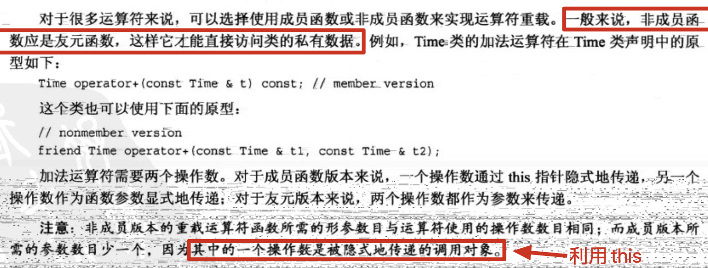

## 10.使用类

1. 学习c++的难点之一是需要记住大量的东西，但在拥有丰富的实践经验之前，根本不可能全部记住这些东西。正如c++创始人Bjarne Stroustrup在一次c++专业程序员大会上所建议的：“轻松地使用这种语言。不要觉得必须使用所有的特性，不要在第一次学习时就试图使用所有的特性。”

2. 运算符重载：

   c++允许将运算符重载扩展到用户定义的类型，如：利用+将两个对象相加。重载运算符可使代码看起来更自然，如：将两个数组相加是一种常见的运算。通常要使用for循环来实现：

   ```cpp
   		for (int i = 0; i < 20; i++) {
           arr_total[i] = arr1[i] + arr2[i];
       }
   ```

   但在c++中可以定义一个表示数组的类并重载+运算符。支持如下语句：

   ```cpp
   arr_total = arr1 + arr2;
   ```

   这种加法表示隐藏了内部机理，并强调了实质，这是OOP的另一个目标。

3. 要重载运算符，需使用被称为**运算符函数**的特殊函数形式，其格式如下：

   

4. 来看一个运算符重载的示例：计算时间

  ```cpp
  // time.h
  class Time {
  private:
      int hours;
      int minutes;
  public:
      Time();
  
      Time(int hours, int minutes);
  
      void add_min(int minutes);
  
      void add_hour(int hours);
  
      void reset(int hours = 0, int minutes = 0);
  
      Time sum(const Time &t) const;
  
      void show() const;
  };
  
  // time.cpp
  #include<iostream>
  #include "time.h"
  
  Time::Time() {
      hours = minutes = 0;
  }
  
  Time::Time(int hours, int minutes) {
      this->hours = hours;
      this->minutes = minutes;
  }
  
  void Time::add_min(int minutes) {
      this->minutes += minutes;
      this->hours = this->minutes / 60;
      this->minutes %= 60;
  }
  
  void Time::add_hour(int hours) {
      this->hours += hours;
  }
  
  void Time::reset(int hours, int minutes) {
      this->hours = hours;
      this->minutes = minutes;
  }
  
  // 注：返回值必须是Time而不能是Time的引用。返回值对象将创建对象的副本，外面调用的函数可以使用它。如果返回值类型为引用，sum_time为局部变量，在该函数结束时将被删除，因此返回到外面的引用将指向一个不存在的对象。
  // 使用返回类型Time意味着程序将在删除局部变量sum_time之前会构造它的拷贝，调用函数将得到该拷贝。
  Time Time::sum(const Time &t) const {
      Time sum_time;
      sum_time.minutes = this->minutes + t.minutes;
      sum_time.hours = this->hours + t.hours + sum_time.minutes / 60;
      sum_time.minutes %= 60;
      return sum_time;
  }
  
  void Time::show() const {
      std::cout << hours << " hours, " << minutes << " minutes" << std::endl;
  }
  
  // main.cpp文件
  		Time t1(6, 14);
      Time t2(1, 49);
      t1.sum(t2).show();	// 输出：8 hours, 3 minutes
  ```
  
  添加加法运算符：只要将`sum()`的名称改为`operator+()`即可：
  
  ```cpp
  // time.h
  Time operator+(const Time &t) const;
  
  // time.cpp
  Time Time::operator+(const Time &t) const {
      Time sum_time;
      sum_time.minutes = this->minutes + t.minutes;
      sum_time.hours = this->hours + t.hours + sum_time.minutes / 60;
      sum_time.minutes %= 60;
      return sum_time;
  }
  
  // main.cpp
  Time t1(6, 14);
  Time t2(1, 49);
  auto sum = t1 + t2;
  sum.show(); // 输出：8 hours, 3 minutes
  ```
  
  注：这两种调用方式都将调用`operator+()`方法：
  
  ```cpp
  		// 方法1：
  		auto sum_1 = t1 + t2;
      sum_1.show();
  
  		// 方法2：
      auto sum_2 = t1.operator+(t2);
      sum_2.show();
  ```
  
  
  
   可以将多个Time对象相加么？
  
  ```cpp
  		Time t1(6, 14);
      Time t2(1, 49);
      Time t3(0, 57);
  
      auto sum = t1 + t2 + t3;
      sum.show();
  ```
  
  可以的，由于+是从左向右结合的运算符，因此首先会被转换成下面这样：
  
  ```cpp
  auto sum = t1.operator+(t2 + t3);
  ```
  
  之后参数`t2+t3`被转换成一个函数调用：
  
  ```cpp
  auto sum = t1.operator+(t2.operator+(t3));
  ```
  
  返回值正式三者之和——正是我们期望的。
  
5. 重载限制：

   

   重载的运算符不一定都得是类的成员函数，但是至少有一个操作数是用户自定义的类型：

   ```cpp
   // 在main.cpp中定义
   void operator+(Time &t) {
       t.show();
   }
   
   int main(){
     	Time t1(6, 14);
       +t1;		// 输出：6 hours, 14 minutes
     	// 相当于调用opertor+(t1);
   }
   ```

   如果操作数都是内置的基本类型，编译器会报错：

   ```cpp
   void operator+(int i) {
       std::cout << i << std::endl;
       return
   }
   
   // 编译器报：overloaded 'operator+' must have at least one parameter of class or enumeration type
   ```

   

   ```cpp
   void operator%(Time &t) {
       t.show();
   }
   
   // 编译器报：overloaded 'operator%' must be a binary operator (has 1 parameter)
   ```

   

6. 友元：

   c++控制对类对象私有部分的访问。通常公有类方法提供唯一的访问途径，但是有时候这样限制太严格，以致于不适合特定的编程问题。这种情况下，c++提供了另外一种形式的访问权限：**友元**。
   
   友元有三种：
   
   - 友元函数
   - 友元类
   - 友元成员函数
   
   通过**让函数成为类的友元**可以赋予该函数与类的成员函数相同的访问权限。在为类重载二元运算符时（带两个参数的运算符）常常需要友元。接上面，Time类有一个乘法重载运算符：
   
   ```cpp
   // time.h
   Time operator*(double mul) const;
   
   // time.cpp
   Time Time::operator*(double mul) const {
       Time res;
       long total_min = (hours * 60 + minutes) * mul;
       res.hours = total_min / 60;
       res.minutes = total_min % 60;
       return res;
   }
   ```
   
   由于左侧的操作数是调用对象，即`A = B * 2.5;`将被转换为`A = B.operator*(2.5);`。但`A = 2.5 * B;`又如何呢？
   
   由于2.5不是Time对象，所以编译器不能使用成员函数调用来替换该表达式。
   
   有一种解决方式——非成员函数（记住：大多数运算符都可以通过成员或非成员函数来重载）。非成员函数不是由对象调用的，它使用的所有值（包括对象）都是显式参数。这样，编译器能够将表达式`A = 2.5 * B;`与下面非成员函数调用匹配：
   
   ```cpp
   A = operator*(2.5, B);
   ```
   
   原型如下：
   
   ```cpp
   Time operator*(double m, const Time & t);
   ```
   
   
   
   使用非成员函数可以按所需的顺序获取操作数（先double，后Time），但是引发一个新问题：**非成员函数不能直接访问类的私有数据，至少常规非成员函数不能访问**。即，上述函数`Time operator*(double m, const Time & t)`无法拿到t的私有成员数据。然而有一类特殊的非成员函数可以访问类的私有成员，它们被称为**友元函数**。
   
7. 创建友元：
  
  ```cpp
  // 不在类定义文件：time.cpp
  Time operator*(double d, const Time &t) {
      Time res;
      long total_min = (t.hours * 60 + t.minutes) * d;
      res.hours = total_min / 60;
      res.minutes = total_min % 60;
      return res;
  };
  ```
  
  这样，语句`A = 2.5 * B;`就可以转换为`A = operator*(2.75, B);`并调用刚才定义的非成员函数的友元函数。
  
  总之，**类的友元函数是非成员函数，其访问权限与成员函数相同**。
  
8. 只有类声明可以决定哪一个函数是友元，因此类声明仍然控制了哪些函数可以访问私有数据。
  
9. 常用的友元：重载<<运算符

    这样可以使用`cout << 自定义结构体对象`来实现`void Time::show() const`的功能。ostream类对运算符"<<"进行了重载，能够识别所有c++的基本类型（即，对于每种基本类型ostream类生命中都包含了相应的重载的`operator<<()`定义）。

   **版本1**：在Time内先定义类函数重载<<（实现`Time对象<<cout`），然后通过友元函数将参数顺序反转（实现`cout<<Time对象`）

   ```cpp
   // time.h类声明中添加
   Time operator<<(std::ostream &os) const;
   friend Time operator<<(std::ostream &os, Time &t);
   
   // time.cpp中增添重载<<的类成员函数定义
   Time Time::operator<<(std::ostream &os) const {
       os << "hours: " << this->hours << ", minutes: " << this->minutes << std::endl;
   }
   
   // time.cpp中定义友元函数
   Time operator<<(std::ostream &os, Time &t) {
     	// 调用重载<<的类成员函数
       t << os;
   }
   
   		// 调用
       Time t1(6, 14);
   		cout << t1 ;
   		// 输出：hours: 6, minutes: 14
   ```

   **版本2**：版本1无法满足`cout << t1 << "Friday";`这样的连续调用，因为`cout << t1`将返回一个Time对象，而`Time Time::operator<<(std::ostream &os) const`类成员函数无法传入一个字符串"Friday"。

   修改：只要修改友元函数即可，让他返回ostream对象：

   ```cpp
   // time.h中修改后的友元函数声明：
   friend std::ostream &operator<<(std::ostream &os, Time &t);
   
   // time.cpp中修改重载<<的类成员函数定义
   Time Time::operator<<(std::ostream &os) const {
       os << "hours: " << this->hours << ", minutes: " << this->minutes;
   }
   
   // time.cpp中的友元函数定义：
   std::ostream &operator<<(std::ostream &os, Time &t) {
       t << os;
       return os;
   }
   
   		// 调用
   		Time t1(6, 14);
       cout << t1 << " Friday" << endl;
   		// 输出：
   		// hours: 6, minutes: 14 Friday
   ```

   总结：

   友元函数的在类声明中也可以直接给出定义，作为内联函数：

   ```cpp
   // time.h
   ...
   // 重载*运算符的函数原型，实现 `Time对象 * double;`
   Time operator*(double mul) const;	
   // 友元函数，直接在声明中定义，作为内联函数。实现 `double * Time对象;`
   friend Time operator*(double m, const Time &t) { return t * m; }
   // 重载<<运算符的函数原型，实现 `Time对象 << cout;`
   Time operator<<(std::ostream &os) const;
   // 友元函数声明，实现 `cout << Time对象 << endl;`
   friend std::ostream &operator<<(std::ostream &os, Time &t);
   ...
   ```

   注：**友元函数在定义时不要使用Time::限定符，限定符只在定义类成员函数时使用**。

10. 重载运算符：作为成员函数还是非成员函数？

    

11. 再谈重载：实现一个矢量类

  

  矢量的描述方式：

  
  
  上方的描述方式为极坐标式（polar），下方的描述方式为直角坐标式（rectangular）
  
  vector.h文件：
  
  ```cpp
  #ifndef TEST_VECTOR_H
  #define TEST_VECTOR_H
  
  #include <iostream>
  
  class Vector {
  public:
      enum Mode {
          RECT, POL
      };
  private:
      double x;
      double y;
      // 极坐标式的长度
      double mag;
      // 极坐标式的角度
      double ang;
      Mode mode;
  
      void set_x();
  
      void set_y();
  
      void set_mag();
  
      void set_ang();
    
    	void rect_mode();
  
      void polar_mode();
  
  public:
      Vector();
  
      Vector(double n1, double n2, Mode form = RECT);
  
      void reset(double n1, double n2, Mode form = RECT);
  
      ~Vector();
  
      // (内联函数:非常短，适合声明为内联函数)
      double get_x() const { return x; }
  
      double get_y() const { return y; }
  
      double get_mag() const { return mag; }
  
      double get_ang() const { return ang; }
  
      // operator overloading
      Vector operator+(const Vector &v) const;
  
      Vector operator-(const Vector &v) const;
  		
    	// 向量对(0,0)点取镜像，即x和y取相反数
      Vector operator-() const;
  
      Vector operator*(double n) const;
  
      // friends
      friend Vector operator*(double n, const Vector &v);
  
      friend std::ostream &operator<<(std::ostream &os, const Vector &v);
  
  };
  
  #endif //TEST_VECTOR_H
  ```
  
  vector.cpp文件：
  
  ```cpp
  #include "vector.h"
  
  using namespace std;
  const double Rad_to_deg = 45.0 / atan(1.0);
  
  // private：
  // 利用直角坐标求解极坐标的距离长度
  void Vector::set_mag() {
      mag = sqrt(x * x + y * y);
  }
  
  // 利用直角坐标求解极坐标的角度
  void Vector::set_ang() {
      if (x == 0.0 && y == 0.0)
          ang = 0.0;
      else
          ang = atan2(y, x);
  }
  
  // 利用极坐标求解直角坐标
  void Vector::set_x() {
      x = mag * cos(ang);
  }
  
  void Vector::set_y() {
      y = mag * sin(ang);
  }
  
  // public:
  // 默认构造函数
  Vector::Vector() {
      x = y = mag = ang = 0.0;
      // 默认为直接坐标表示法
      mode = RECT;
  }
  
  Vector::Vector(double n1, double n2, Mode form) {
      mode = form;
      if (form == RECT) {
          // 如果指定是直角坐标表示法
          x = n1;
          y = n2;
          // 根据直角坐标转化为极坐标
          set_mag();
          set_ang();
      } else if (form == POL) {
          // 如果指定是极坐标表示法
          mag = n1;
          ang = n2;
          // 根据极坐标转化为直角坐标
          set_x();
          set_y();
      } else {
          cout << "Incorrect 3rd argument to Vector()" << endl;
          x = y = mag = ang = 0;
          mode = RECT;
      }
  }
  
  // 析构函数
  Vector::~Vector() {}
  
  void Vector::reset(double n1, double n2, Mode form) {
      mode = form;
      if (form == RECT) {
          x = n1;
          y = n2;
          set_mag();
          set_ang();
      } else if (form == POL) {
          mag = n1;
          ang = n2;
          set_x();
          set_y();
      } else {
          cout << "Incorrect 3rd argument to Vector()" << endl;
          x = y = mag = ang = 0;
          mode = RECT;
      }
  }
  
  // 切换坐标表示法
  void Vector::polar_mode() {
      mode = POL;
  }
  
  void Vector::rect_mode() {
      mode = RECT;
  }
  
  Vector Vector::operator+(const Vector &v) const {
      // 调用构造函数，创建一个新的Vector对象作为运算结果
      return Vector(x + v.x, y + v.y);
  }
  
  // 定义元运算符
  Vector Vector::operator-(const Vector &v) const {
      return Vector(x - v.x, y - v.y);
  }
  
  // 一元运算符
  Vector Vector::operator-() const {
      return Vector(-x, -y);
  }
  
  Vector Vector::operator*(double n) const {
      return Vector(x * n, y * n);
  }
  
  // 友元，显示内容根据mode而定
  std::ostream &operator<<(ostream &os, const Vector &v) {
    	// 由于该函数是友元函数，所以其作用域不在类作用域内。故在使用RECT时，要使用Vector::限定符。
      if (v.mode == Vector::RECT)
          os << "(x,y) = (" << v.x << "," << v.y << ")";
      else if (v.mode == Vector::POL)
          os << "(m,a) = (" << v.mag << "," << v.ang << ")";
      else
          os << "Vector object mode is invalid";
      return os;
  }
  ```
  
  注：**默认参数只需要在函数声明中标明即可，在函数定义时不需要再次显式提及**。
  
  ```cpp
  		Vector v(4, 3);
      Vector v1(2, 1);
      cout << v << endl;							// 输出：(x,y) = (4,3)
      cout << -v << endl;							// 输出：(x,y) = (-4,-3)
      cout << v * 0.1 << endl;				// 输出：(x,y) = (0.4,0.3)
      cout << v + v1 << endl;					// 输出：(x,y) = (6,4)
      cout << v - v1 << endl;					// 输出：(x,y) = (2,2)
  
      // 切换到极坐标表示法
      v.polar_mode();
      cout << v << endl;							// 输出：(m,a) = (5,0.643501)
  ```
  
  关于Vector类的两种表示法的启示：
  
  
  
12. 利用Vector模拟随机漫步：

    ```cpp
    // time(nullptr)：获取当前时间
        // 设置随机种子
        srand(time(nullptr));
        double direction, target, dstep;
        Vector step, result;
        unsigned long steps = 0;
        cout << "Enter target distance (q to quit): ";
    		// 如果键盘输入的不是一个有效的double数，那么 `cin>>target` 将为false
        while (cin >> target) {
            cout << "Enter step length: ";
            if (!(cin >> dstep))
                break;
    
            while (result.get_mag() < target) {
                // rand()生成一个随机整数
                direction = rand() % 360;   // direction为0~360之间的随机整数
                // 生成固定步长，随机方向的Vector
                step.reset(dstep, direction, Vector::POL);
                result = result + step;
                // 累计step
                steps++;
            }
    
            cout << "final location: " << result << " or " << (result.polar_mode(), result) << endl;
            cout << "average outward distance per step = " << result.get_mag() / steps << endl;
    
            // refresh
            steps = 0;
            result.reset(0, 0);
            cout << "Enter target distance (q to quit): ";
        }
        cout << "Bye!" << endl;
    
    // 输出：
    // Enter target distance (q to quit): 1024.1024
    // Enter step length: 100
    // final location: (x,y) = (216.982,1040.47) or (m,a) = (1062.85,1.3652)
    // average outward distance per step = 7.81507
    // Enter target distance (q to quit): q
    // Bye!
    ```

    

13. 

14. 通过强制类型转换，c++中可以手动指定指向地址空间：

    ```cpp
    int *p = (int *) 0x7ffee55288fc;
    cout << p << endl;	// 输出：0x7ffee55288fc
    ```

    但是，如果尝试对该指针进行解引用时，程序会报错：

    ```cpp
    cout << *p << endl;
    // 报错信息： Process finished with exit code 139 (interrupted by signal 11: SIGSEGV)
    ```

15. 复习：如何在类声明中定义一个常数：

    ```cpp
    // 方法1：类声明中定义enum
    // 缺陷：如果要定义一个非整形的常量就无法用enum
    class XXX {
        ...
        enum {
            Arr_len = 1024
        };
      	...
    }
    
    // 方法2：使用静态常量，由XXX类创建出的所有对象，都共享这一个静态常量Arr_len
    class XXX {
        ...
        static const int Arr_len = 1024;
      	...
    }
    
    // 错误：
    class XXX {
        ...
        const int Arr_len = 1024;	// 在类中声明非static的const类型的变量可以，但是不可以这么赋值。
      	int arr[Arr_len];	// 报错，因为在编译阶段是不会去调用构造函数，所以不知道Arr_len的具体值。
      	...
    }
    // 注：“非静态常量”数据成员只有初始化操作（在构造函数的初始化列表中进行），而没有“写”（赋值）操作。
    ```

    如何给类中的非static的const变量赋值（注：此时的const表示的是该变量一旦初始化后就不许修改，而并非真正的常量）：

    ```cpp
    // test.h文件
    class Test {
        int n;
    public:
        const int Arr_len;
    
        Test();
    
        Test(int n);
    };
    
    // test.cpp
    Test::Test() : Arr_len(1024) {
        n = 0;
    }
    
    Test::Test(int n) : Arr_len(1024) {
        this->n = n;
    }
    
    // 每一个对象的Arr_len都可以是不同的
    ```

16. 在c++中，接受**一个参数的构造函数**为将类型与该参数相同的值转换提供了蓝图。因此：

    ```cpp
    // test.h
    class Test {
        int n;
    
    public:
        Test();
    
        Test(int n);
    
        int get_n() const { return n; };
    };
    
    // test.cpp
    Test::Test() {
        this->n = 0;
    }
    
    Test::Test(int n) {
        this->n = n;
    }
    
    // main.cpp
    		Test t;
    		// 该过程为隐式转换
        t = 100;
        cout << t.get_n() << endl;	// 输出：100
    		// 等价于
    		Test t(100);
    ```

    如果一个带有两个参数的构造函数，并给第二个参数提供默认值，那么也可以用来转换类型：

    ```cpp
    Test(int n, double d = 0);
    ```

    

    ```cpp
    // test.h
    class Test {
        int n;
    
    public:
        Test();
    		// 不再允许上述的隐式转换
        explicit Test(int n);
    
        int get_n() const { return n; };
    };
    
    // main.cpp
    		Test t;
        // 编译器不允许这样的隐式转换(编译错误)
        t = 100;
        // 显式转换还是允许的
        t = Test(100);
        cout << t.get_n() << endl;		// 输出：100
    ```

    

    注：函数原型提供的参数匹配过程允许使用Test(double)构造函数来转换其他数值类型。即，下面语句首先将double转为int，然后使用Test(int)构造函数(此时声明无explicit关键字)：

    ```cpp
    		Test t;
    		// 100.1将先转为100,再执行Test(100)
        t = 100.1;
    ```

    然而，当且仅当隐式转换不存在二义性时才会进行上述的二步转换。如果Test类还定义了构造函数`Test(long)`，则编译器将对上述语句报错。

17. 转换函数：上述可以将double/int数字转换为Test对象，但是可以将Test对象转换为数字double/int么？答案是可以的，但是不能使用构造函数。构造函数只用于从某种类型到类类型的转换。要进行相反的转换必须使用特殊的c++运算符函数——**转换函数**。转换函数是**用户定义**的**强制类型转换函数**，可以使用下面的转换：

    ```cpp
    Test t(1024);
    int i = int(t);
    int i1 = (int)t;
    // 也可以让编译器来决定如何做
    Test t1(1024);
    int i1 = t1;
    ```

    编译器发现右侧是Test类型，左侧是int类型，因此它将查看程序员是否定义了与此匹配的转换函数。如果没有找到定义，编译器将生成错误信息指出无法将Test赋给int。

    

    ```cpp
    // test.h
    class Test {
        double d;
    
    public:
        Test();
    
        Test(double d);
    
        double get_d() const { return d; };
    
        // 转换函数
        operator int() const;
    
        operator double() const;
    };
    
    // test.cpp
    Test::Test() {
        d = 0;
    }
    
    Test::Test(double d) {
        this->d = d;
    }
    
    Test::operator int() const {
        return int(d + 0.5);
    }
    
    Test::operator double() const {
        return d;
    }
    
    // main.cpp
    		Test t = 1.5;
        cout << t.get_d() << endl;		// 1.5
        cout << int(t) << endl;				// 2
        cout << double(t) << endl;		// 1.5
    ```

    原则：最好使用**显式转换**，避免使用隐式转换。在c++98中，关键字explicit不能用于转换函数，但c++11消除了这种限制（建议这么做）：

    ```cpp
    class Test {
        ...
        // 转换函数
        explicit operator int() const;
    
        explicit operator double() const;
    };
    ```

    这样声明后，只有在强制转换时才会调用这些运算符：

    ```cpp
    Test t = 1.5;
    // 隐式转换，编译报错
    double d = t;
    // 显式转换，通过编译
    double d = double(t);
    ```

18. 

### 总结：


