## 11.类的动态内存分配

1. 

2. 不能在类声明中初始化静态成员变量。因为声明描述了如何分配内存，但并不分配内存。对于静态的类成员可以在类声明之外使用单独的语句进行初始化：

   ```cpp
   // str.h
   class Str {
       char *str;
       int len;
   public:
     	// 静态类变量
       static int num_strs;
   };
   
   // str.cpp
   // 初始化类中的静态成员变量 (开头的int是必须加的，直接写`Str::num_strs = 10`会报错)
   int Str::num_strs = 10;
   
   // main.cpp调用
   		Str s;
       cout << s.num_strs << endl;				// 输出：10
       cout << Str::num_strs << endl;		// 输出：10
       s.num_strs++;
       cout << Str::num_strs << endl;		// 输出：11
   ```

   初始化类的静态变量需要在方法文件(.cpp)中，而不是在类声明的文件(.h)中。这是因为类声明位于头文件中，程序可能将头文件包含在其他几个文件中。如果在头文件中进行初始化，将出现多个初始化语句副本从而引发错误。

   但是，如果类的静态成员变量是**整形的const**或**枚举型**，则可以在类声明中初始化。

   ```cpp
   class Str {
       char *str;
       int len;
   public:
     	// static const int 是可以直接在类声明里赋值的
       static const int num_strs = 1024;
     	// 枚举型可以在类声明中直接赋值
     	enum {
           Red = 100, Blue = 200, Yellow = 300
       };
   };
   
   // main.cpp
       cout << Str::num_strs << endl;		// 输出：1024
       cout << Str::Red << endl;					// 输出：100
       cout << Str::Blue << endl;				// 输出：200
       cout << Str::Yellow << endl;			// 输出：300
   ```

3. std::strlen()函数的参数需要是一个`const char *`，该函数将计算字符串的长度（真正的字符数量，不包含末尾的空字符）。复制一个字符串副本：

   ```cpp
   		len = strlen(chs);
       str = new char[len + 1];
       strcpy(str, chs);
   ```

4. 关于在构造函数中使用new来在堆内存中分配内存空间：

   

5. 关于构造函数的调用问题：假设有以下类：

   ```cpp
   // str.h
   class Str {
       char *str;
       int len;
   public:
       Str();
   
       Str(const char *);
   
       Str(const Str &);
   
       ~Str();
   };
   // str.cpp
   Str::Str(const char *chs) {
       len = strlen(chs);
       str = new char[len + 1];
       strcpy(str, chs);
       cout << "Str::Str(const char *chs)" << endl;
   }
   
   Str::Str() {
       len = 0;
       cout << "Str::Str()" << endl;
   }
   
   Str::Str(const Str &s) {
       len = s.len;
       str = new char[len + 1];
       strcpy(str, s.str);
       cout << "Str::Str(const Str &s)" << endl;
   }
   
   Str::~Str() {}
   
   // 调用
   			// 调用构造函数Str::Str(const char *chs)
   			Str s("michael.w");		// 输出：Str::Str(const char *chs)
   			// 重点！调用构造函数Str::Str(const Str &s)
   			Str s1 = s;						// 输出：Str::Str(const Str &s)
   ```

   当对象作为值传递时，会在传参时生成副本。这个副本的生成默认调用参数为**该类对象引用的**构造函数：

   ```cpp
   // main.cpp中，有方法
   void func(Str& s) {
       cout << "func" << endl;
   }
   
   // main函数中：
       Str s("michael.w");
   		// 在func函数调用的过程中，会创建s对象的副本。该处将默认调用Str的构造方法Str::Str(const Str &s) 
       func(s);
   ```

   结论：当使用一个对象来初始化另一个对象时，编译器将自动生成上述构造函数（称为**复制构造函数**，因为它创建对象的一个副本）。

6. 具体的说，c++为一个类**自动提供**下面这些成员函数：

   

   **1.默认构造函数**：

   

   ```cpp
   // 显式定义默认构造函数
   Klunk::Klunk(){
     	klunk_ct = 0;
   }
   ```

   

   **2.复制构造函数**

   

   关于复制构造函数需要知道两点：1.何时调用？2.有何功能？

   何时调用复制构造函数？

   

   由于按值传递对象将调用复制构造函数，因此应该**按引用传递对象**。这样可以节省调用构造函数的时间以及存储对象的空间。

   默认的复制构造函数是如何复制对象的？

   默认的复制构造函数逐个复制**非静态成员**（成员复制也称为浅复制），复制的是成员的值。例如下述语句：

   ```cpp
   StringBad sailor = sports;
   ```

   与下面的代码等效（由于私有成员无法访问，因此下面代码不能通过编译）：

   ```cpp
   StringBad sailor;
   sailor.str = sports.str;
   sailor.len = sports.len;
   ```

   如果成员本身就是类对象，则将使用该类的复制构造函数来复制成员对象。**静态类变量**不受影响，因为它们属于整个类，而不是各个对象。

   注：如果类中包含这样的**静态数据成员**，其值在该类的新对象被创建时发生会发生变化，则应该提供一个显式复制构造函数来处理该静态数据成员的计数问题。如果不显式提供，则在系统默认调用复制构造函数（当形参创建副本）时，没有将该静态数据成员自增，而在析构函数中会将静态成员自减（程序员已显式定义析构函数）。

7. 如果一个类的成员是char *（使用new初始化的并且指向数据的指针），而不是数据本身。在调用复制构造函数时（比如函数参数值传递），会将该成员进行浅复制。这样，当这个副本被析构时（函数结束后），会将该指针成员指向的内存也释放掉，而原来的类对象中的指针将指向一个已被释放的空间，十分危险。

   

8. 接6：

   **3.赋值运算符**

   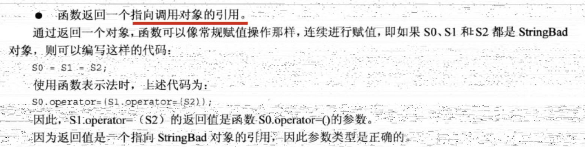

   编写一个String类的赋值运算符：

   ```cpp
   // str.h
   class Str {
       char *str;
       int len;
   public:
       Str();
   
       Str(const char *);
   
       Str(const Str &);
   
       ~Str();
   		// 重载赋值运算符
       Str &operator=(const Str &s);
   };
   
   // str.cpp
   Str &Str::operator=(const Str &s) {
       // 如果一旦一个Str变量自己赋值给自己（自我检查）
       if (this == &s) {
           return *this;
       }
       // 释放返回值中原有分配的堆内存（如果不事先释放掉内存，返回值中最初的str对应的内存将保留在内存空间中。造成内存的浪费）
       delete[] str;
       len = s.len;
       str = new char[len + 1];
       // deep copy
       strcpy(str, s.str);
       return *this;
   }
   ```

   注：赋值运算符是**只能由类成员函数重载**的运算符。

9. 看一个String类的demo：

   ```cpp
   #ifndef TEST_STRING_H
   #define TEST_STRING_H
   
   #include<iostream>
   
   using namespace std;
   
   class String {
       char *str;
       int len;
       static int num_strings;
       static const int CINLIM = 80;
   public:
       String();
   
       String(const String &);
   
       String(const char *);
   
       ~String();
   
       int length() const { return len; };
   
       String &operator=(const String &s);
     
       String &operator=(const char *);
   
       friend bool operator<(const String &s1, const String &s2);
   
       friend bool operator>(const String &s1, const String &s2);
   
       friend bool operator==(const String &s1, const String &s2);
   
       friend ostream &operator<<(ostream &os, const String &s);
   
       friend void operator>>(istream &is, String &s);
   
    		char &operator[](int i);
   
    		const char &operator[](int i) const;
   
       static int HowMany() { return num_strings; };
   };
   
   
   #endif //TEST_STRING_H
   ```
   

看一下默认构造函数的定义：

```cpp
   String::String() {
       len = 0;
       // 为什么默认要将str对应长度设为1,而不是`str = new char`？为了与类的析构函数兼容——析构函数中包含 `delete[] str`
       str = new char[1];
       str[0] = '\0';
     	 num_strings++;
   }
```

   delete[]与使用new[]初始化的指针和**空指针**都兼容，所以上述代码可修改为：

   ```cpp
   String::String() {
       len = 0;
       str = nullptr;
       num_strings++;
   }
   ```

   

   比较成员函数定义：

   ```cpp
   // 比较成员函数
   bool operator<(const String &s1, const String &s2) {
       return strcmp(s1.str, s2.str) < 0;
   }
   
   bool operator>(const String &s1, const String &s2) {
       return strcmp(s1.str, s2.str) > 0;
   }
   
   bool operator==(const String &s1, const String &s2) {
       return strcmp(s1.str, s2.str) == 0;
   }
   ```

   `int strcmp(const char *s1, const char *s2)`函数是标准库中用来比较字符串的。按照字典序，如果s1位于s2前则返回一个负值；如果s1位于s2之后则返回一个正值。如果相等，则返回0。

   **为什么比较成员函数声明成友元而不是类成员函数呢？**

   

   使用**中括号表示法**访问字符：

   

   访问字符的方法定义：

   ```cpp
   char &String::operator[](int i) {
       return str[i];
   }
   ```

   为什么返回值是一个char的引用？因为这样做可以给特定元素赋值。可以编写这样的代码：

   ```cpp
   String s("michael.w");
   s[2] = 'a';
   // s[2]被转换为`s.operator[][2] = 'a';`
   // 由于operator[]返回指向s.str[2]的引用，因此等同于如下代码：
   // `s.str[2] = 'a'`
   ```

   但是，如果只有上面的`operator[]()`的定义，下面代码将出错：

   ```cpp
   const String s("michael.w");
   cout << s[1];
   ```

   因为s是一个const，而operator返回的是一个可修改的引用。在重载时，**c++将区分常量和非常量函数的特征标**，因此可以提供另一个仅供const String对象使用的`operator[]()`版本：

   ```cpp
   const char &String::operator[](int i) const {
       return str[i];
   }
   ```

   **静态类成员函数**：

   

   如果在.cpp文件中定义静态类成员函数（而不是像本例子中直接在声明中定义内联函数），则在实现定义时不能包含关键字static：

   ```cpp
   // string.cpp文件
   int String::HowMany() {
       return num_strings;
   }
   // 不能写成
   // static int String::HowMany() {
   //     return num_strings;
   // }
   ```

   ```cpp
   // main.cpp调用
   			int i = String::HowMany();
       	cout << i << endl;
   ```

   由于静态成员函数不与特定的对象相关联，因此只能使用静态数据成员。即，静态方法HowMany()可以访问静态成员num_strings，但不能访问str和len。

   为了让`char *`字符串可以直接赋值给一个已经初始化过的String对象：

```cpp
String name;
char temp[40];
cin.getline(temp, 40);
// 该语句首先会调用构造函数String(const char *)来创建一个临时的String对象（即只有一个参数的构造函数被用作转换函数），然后再使用赋值运算`String &operator=(const String &s)`将临时String对象中的信息复制到name中。最后调用析构函数~String()删除临时对象。
name = temp;
```

更高效的方法时重载赋值运算符，使之能够直接使用常规字符串（不用创建和删除临时String对象了），实现如下：

```cpp
String &String::operator=(const char *s) {
    delete[] str;
    len = strlen(s);
    str = new char[len + 1];
    strcpy(str, s);
    return *this;
}
```

重载>>运算符：提供一种将键盘输入行读入到String对象中的简单方法。假定输出的字符串不多于`String::CINLIM`的字符数并丢弃多余字符。其定义如下：

```cpp
istream &operator>>(istream &is, String &s) {
    char temp[String::CINLIM];
  	// 键盘输入字符串到临时变量temp中
    is.get(temp, String::CINLIM);
    if (is)
      	// 如果读取成功，则调用重载赋值运算符`String &String::operator=(const char *s)`将temp赋值给s
        s = temp;
    return is;
}
```


10. 关于c++11的空指针：

11. 在构造函数中使用new时应注意的事项：

    - 构造函数中使用new来初始化指针成员，则应在析构函数中使用delete；

    - new和delete必须相互兼容。new对应于delete，new[]对应于delete[]；

    - 如果有多个构造函数，则必须以相同的方式使用new。要么都带中括号，要么都不带。因为只要一个析构函数，必须保证所有的构造函数都与它保持兼容。然而，可以在一个构造函数中使用new初始化指针，而在另一个构造函数中将指针初始化为空（0或c++11中的nullptr）。**这是因为delete（无论是带中括号还是不带中括号）可以用于空指针**。

      

    - 应定义一个**复制构造函数**，通过**深度复制**将一个对象初始化为另一个对象。通常这种构造函数与`String::String(const String & s)`类似。具体的说，复制构造函数应分配足够的空间来存储复制的数据，而不仅仅是数据的地址。另外，还应该更新所有受影响的静态类成员，例如：String::num_strings；

    - 应定义一个**赋值运算符**，通过深度复制将一个对象复制给另一个对象。通常这种类方法与`String &operator=(const String &s)`类似。注意，在赋值运算符的定义中，应进行**检查自我赋值**的情况，释放成员指针以前指向的内存，复制数据而不仅仅是数据地址，并**返回一个指向调用对象的引用**。

12. 关于类成员是类的逐成员复制：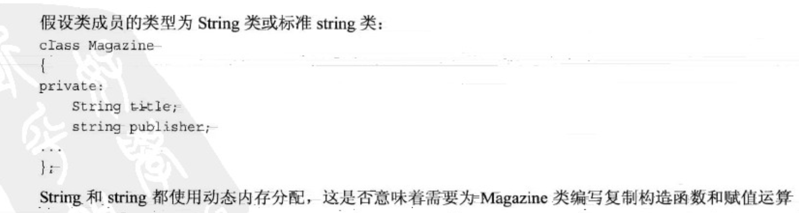

13. 当对象做为返回值的说明：

    **返回指向const对象的引用**：

    **返回指向非const对象的引用**：

    

    **返回对象**：

14. 使用指向对象的指针：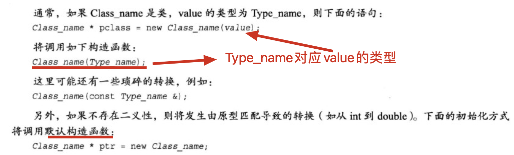

15. 析构函数何时会被调用？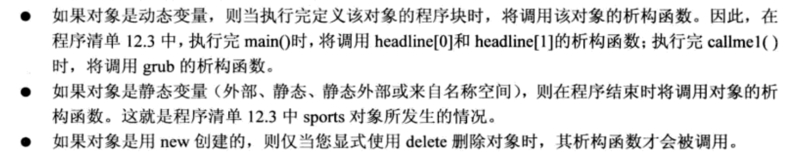

    注：假如A类的对象a中包含一个char *指针成员用来存字符串，如果使用`A *pa = new A(xxx);`来为对象a分配内存，之后使用`delete pa`来释放该内存空间。这将只释放保存char *的空间，不会释放char *指向的内存。这个空间的释放需要在A类的析构函数中手动定义`delete [] char*指针`。


16. 指针和对象小结：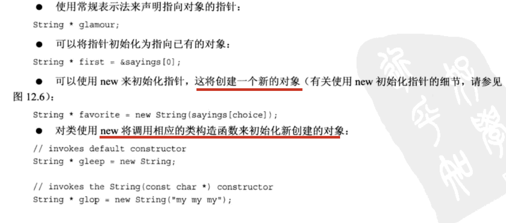

17. delete可与常规new运算符配合使用，但不能与定位new运算符配合使用：

    ```cpp
    		const int BUF = 256;
        char *buffer = new char[BUF];
        String *p1, *p2;
        p1 = new(buffer) String("michael.w");
        p2 = new String("michael.w");
        cout << strlen(buffer) << endl;		// 输出：6
    
        delete p1;	// 释放的是buffer，而不是p1。相当于执行 `delete [] buffer`
        delete p2;	// 释放了p2指向内存
    		cout << strlen(buffer) << endl;		// 输出：0
    ```

    如果想要释放定位new运算符分配出来的对象怎么办？**显式调用该对象的析构函数**：

    ```cpp
        ...
        p1 = new(buffer) String("michael.w");
        p2 = new String("michael.w");
        cout << strlen(buffer) << endl;				// 输出：6
    		
    		// 释放定位new运算符分配出来的对象空间
        p1->~String();
        delete p2;
    
    		// buffer仍存在
        cout << strlen(buffer) << endl;				// 输出：6
    ```

    如果利用定位new在一个buffer上分配了两个相邻的对象空间，应以与创建顺序相反的顺序进行对象析构——因为后创建的对象可能依赖于之前创建的对象：

    ```cpp
    const int BUF = 256;
        char *buffer = new char[BUF];
        String *p1, *p2;
        p1 = new(buffer) String("michael.w");
    		// 在buffer上创建位置相邻的两个对象：利用sizeof来确定偏移量
        p2 = new(buffer + sizeof(String)) String("Iverson");
    
    		// 与创建对象的顺序相反的顺序进行显式析构
        p2->~String();
        p1->~String();
    
        cout << strlen(buffer) << endl;		// 输出：6
    ```

    （对于定位new运算符分配空间）仅当所有对象都销毁后，才能释放用于存储这些对象的缓冲区。

18. 模拟队列

    如何存储表示队列的数据？

    一种方法是用new动态分配一个数组。但是对于队列而言，数组并不合适——删除数组的第一个元素后需要将余下的元素依次向前移动一位。

    另一种方法是使用**链表**（合适）。

    类声明如下：

    ```cpp
    class Queue {
        static const int Q_SIZE = 10;
        // 链表的数据结构
        struct Node {
            Item item;
            Node *next;
        };
    
        // 队首的成员地址
        Node *front;
        // 队尾的成员地址
        Node *rear;
        // 当前链表中的元素个数
        int items;
        // 队列中的元素个数上限
        const int qsize;
    public:
        Queue(int size = Q_SIZE);
    
        ~Queue();
    
        bool is_empty() const { return items == 0; };
    
        bool is_full() const { return items == qsize; };
    
        int queue_count() const { return items; };
    
        // 进队列
        bool enqueue(const Item &item);
    
        // 从队首出队列
        bool dequeue(Item &item);
    };
    ```

    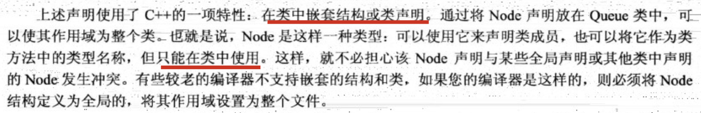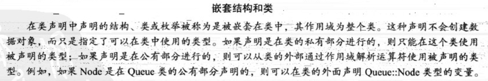

    构造函数：Queue类中有一个`const int`变量qsize。在调用构造函数时，对象本地其实已经被创建。而构造函数只是给这个对象里的各成员赋值。对于const数据成员必须在执行到构造函数之前（创建对象进行初始化）时候被创建。所以c++提供了一种特殊的语法来完成上述工作——**成员初始化列表**。

    ```cpp
    // 即在创建对象本地时，将qsize成员初始化为size值。
    Queue::Queue(int size) : qsize(size) {
        front = rear = nullptr;
        items = 0;
    }
    ```

    当然，也可以将其他非const成员变量也放入成员初始化列表：

    ```cpp
    Queue::Queue(int size) : qsize(size), front(nullptr), rear(nullptr), items(0) {}
    ```

    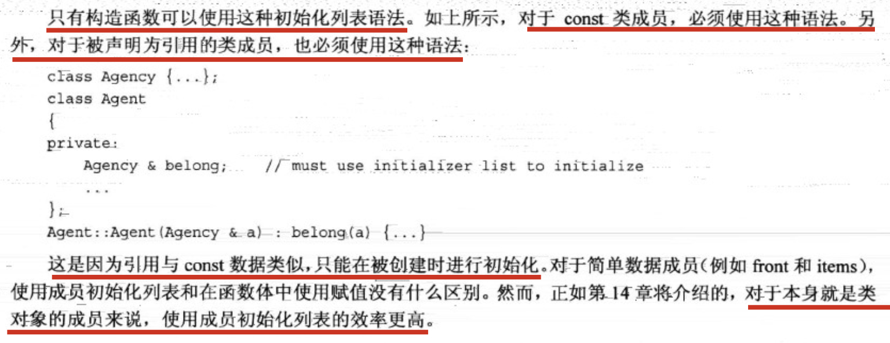

    成员初始化列表的语法：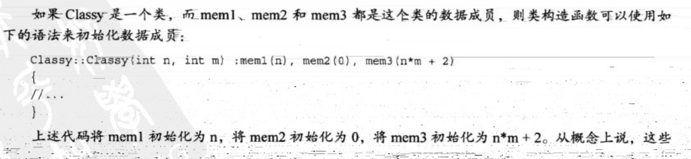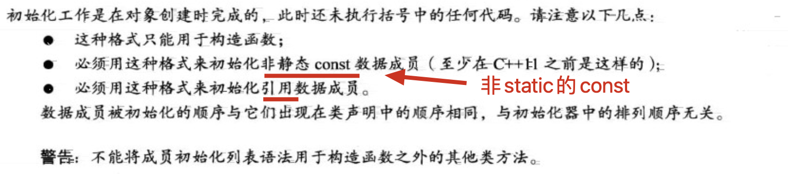

    c++11的类内初始化：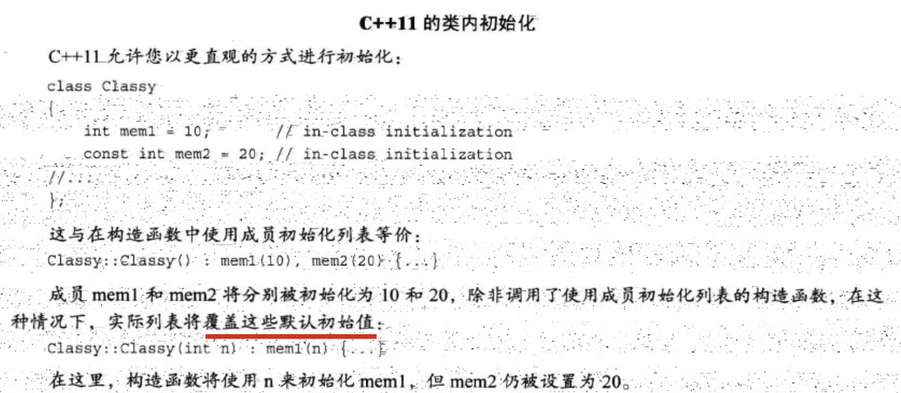

    入队的实现：

    ```cpp
    bool Queue::enqueue(const Item &item) {
        // 队满则入队失败
        if (is_full())
            return false;
        Node *add = new Node;
        add->item = item;
        add->next = nullptr;
        items++;
        if (front == nullptr)
            // 如果此时队列中无元素
            front = add;
        else
            // 如果此时对列中有元素，将add接到之前的rear节点
            rear->next = add;
        // 更新rear指针
        rear = add;
        return true;
    }
    ```

    出队的实现：

    ```cpp
    bool Queue::dequeue(Item &item) {
        if (is_empty())
            return false;
        // 将现在队首的元素内容保存进item
        item = front->item;
        items--;
        // 保存要出队Node的地址到temp指针中，用于地址的释放
        Node *temp = front;
        // front指针指向下一个Node
        front = front->next;
        // 释放原队首对象的内存空间
        delete temp;
        if (items == 0)
            // 出队后，队列空
            rear = nullptr;
        return true;
    }
    ```

    由于无法保证在析构Queue对象时，该对象内部的数据已全部出队。所以需要显式定义析构函数：

    ```cpp
    Queue::~Queue() {
        Node *temp;
      	// 从队首开始依次释放，直到队中无数据（即front为空）
        while (front != nullptr) {
            temp = front;
            front = front->next;
            delete temp;
        }
    }
    ```

    使用new的类通常需要包含**显式复制构造函数**和**执行深度复制的赋值运算符**。

    那么该类是否可以使用默认的成员复制呢？很明显不可以，因为复制Queue对象将生成一个新的对象，该对象指向链表原来的头和尾。相当于两个对象共享一个底层链表，将造成非常严重的后果——假设副本进行了出队操作，该对象中的front改变，而原对象的front仍然保持原状（链表损坏）。

    如果我不手动定义这样的**显式复制构造函数**和**执行深度复制的赋值运算符**，编译器会自动为我们生成（默认的浅复制）。这是一件非常恐怖的事情。如何可以避免这样的事情发生呢？

    答：将**显式复制构造函数**和**执行深度复制的赋值运算符**定义为私有方法：

    ```cpp
    class Queue {
    ...
    private:
        Queue(const Queue &q) : qsize(0) {}
    
        Queue &operator=(const Queue &q) { return *this; } 
    ...
    }
    ```

    这样做：1.编译器不会自动生成对应的公有方法；2.这些方法定义为私有，所以在类外不能被使用。也就是说：如果q1和q2都是Queue对象，则编译器不允许：

    ```cpp
    	Queue q1(q2); 		// 不允许
    	q1 = q2;					// 不允许
    ```

    **自定义Item**

    队列中放置的元素为我们自定义的类别，可以在queue.h文件中在定义一个类作为元素（一定要定义在Queue类之前）：

    ```cpp
    #ifndef TEST_QUEUE_H
    #define TEST_QUEUE_H
    
    class Date {
        int month;
        long day;
    public:
        Date() { month = day = 0; };
    
        void set_month(int month) { this->month = month; }
    
        void set_day(long day) { this->day = day; }
    
        long get_day() const { return day; }
    
        int get_month() const { return month; }
    };
    
    typedef Date Item;
    
    class Queue {
      	...
    }
    ```

    19.  总结：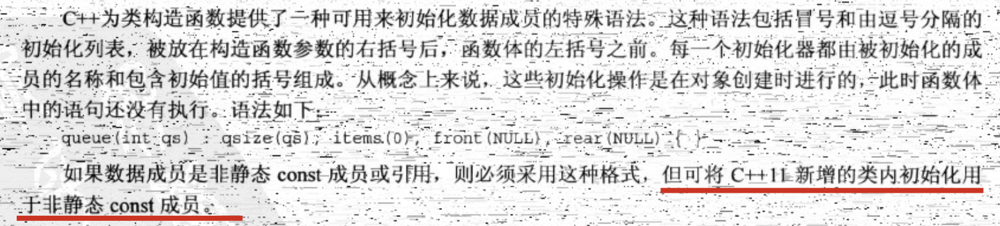

    
