## 12.类继承

1. 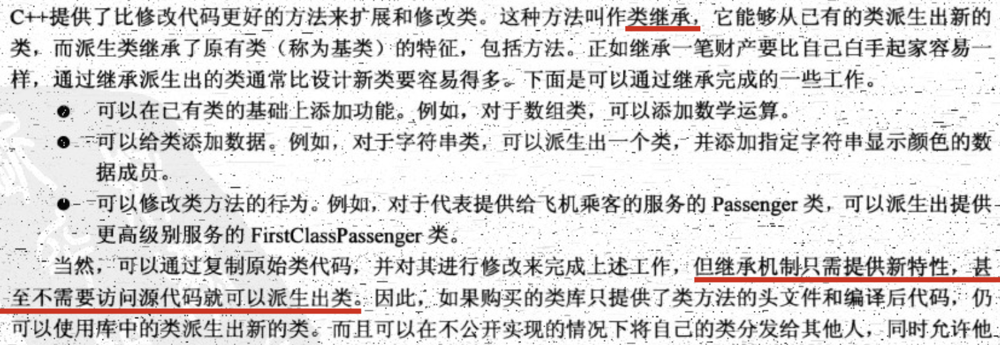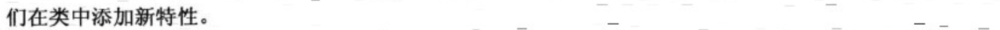

2. 从一个类派生出另一个类时，原始类成为基类，继承类称为派生类。

3. 写一个基类：

   ```cpp
   // table_tennis_player.h
   
   #include<string>
   
   using namespace std;
   
   class TableTennisPlayer {
       string first_name;
       string last_name;
       bool has_t;
   public:
       TableTennisPlayer(const string &first_name = "none", const string &last_name = "none", bool has_table = false);
   
       void name() const;
   
       bool has_table() const { return has_t; };
   
       void reset_table(bool b) { has_t = b; }
   };
   
   // table_tennis_player.cpp
   #include<iostream>
   
   TableTennisPlayer::TableTennisPlayer(const string &first_name, const string &last_name, bool has_table) {
       this->first_name = first_name;
       this->last_name = last_name;
       this->has_t = has_table;
   }
   
   void TableTennisPlayer::name() const {
       std::cout << last_name << ", " << first_name << endl;
   }
   ```

   派生一个类：

   ```cpp
   // rated_player.h
   class RatedPlayer : public TableTennisPlayer {
   		...
   };
   ```

   TableTennisPlayer被声明为一个公有基类，这被称为公有派生。派生类对象包含基类对象。使用公有派生，**基类的公有成员将成为派生类的公有成员**；基类的私有部分也将成为派生类的一部分，但是只能通过基类的**公有和保护方法**访问。

   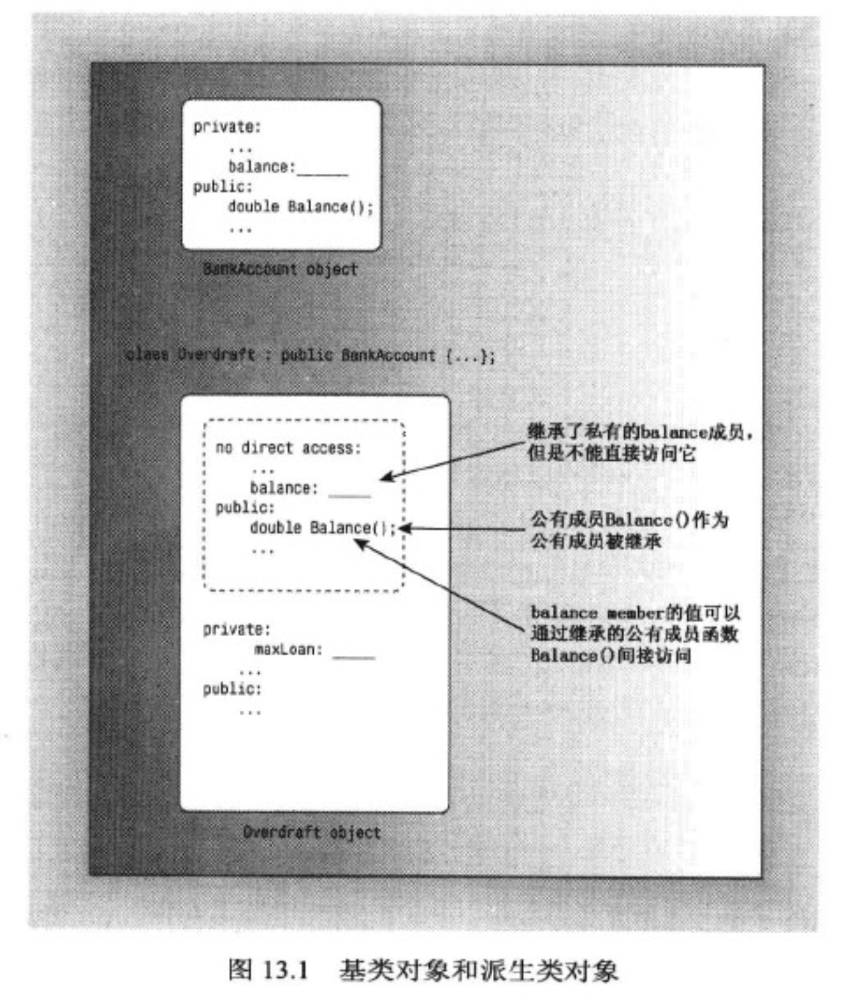

   继承特性中需要增添什么？

   - 派生类需要自己的构造函数；
   - 派生类可以根据需要增添额外的数据成员和成员函数。

   ```cpp
   // rated_player.h
   class RatedPlayer : public TableTennisPlayer {
       unsigned int rating;
   public:
       RatedPlayer(unsigned int r = 0, const string &fn = "none", const string &ln = "none", bool ht = false);
   
       RatedPlayer(unsigned int r, const TableTennisPlayer &ttp);
   
       // 新增添的类函数
       unsigned int get_rating() const { return rating; }
   
       void reset_rating(unsigned int r) { rating = r; }
   };
   
   // rated_player.cpp
   
   // `TableTennisPlayer(fn, ln, ht)`为成员初始化列表，其调用TableTennisPlayer构造函数
   RatedPlayer::RatedPlayer(unsigned int r, const string &fn, const string &ln, bool ht) : TableTennisPlayer(fn, ln, ht) {
       rating = r;
   }
   
   RatedPlayer::RatedPlayer(unsigned int r, const TableTennisPlayer &ttp) : TableTennisPlayer(ttp) {
       rating = r;
   }
   ```

   RatePlayer构造函数不能直接设置继承的成员（first_name、last_name和has_t），必须使用基类的公有方法来访问私有的基类成员。具体的说，**派生类构造函数必须使用基类构造函数**。

   ```cpp
   // 如果省略成员初始化列表`TableTennisPlayer(fn, ln, ht)`，即
   RatedPlayer::RatedPlayer(unsigned int r, const string &fn, const string &ln, bool ht)  {
       rating = r;
   }
   
   // 程序将使用默认的基类构造函数，即等价于
   RatedPlayer::RatedPlayer(unsigned int r, const string &fn, const string &ln, bool ht) : TableTennisPlayer() {	// 该出隐式调用了基类的复制构造函数（如果基类中没有定义复制构造函数，那么编译器将自动生成一个）
       rating = r;
   }
   ```

   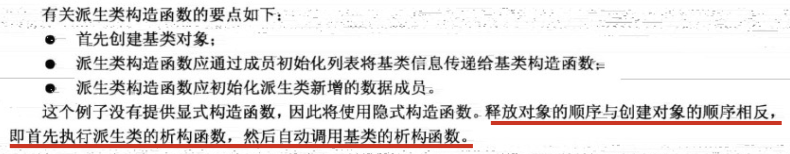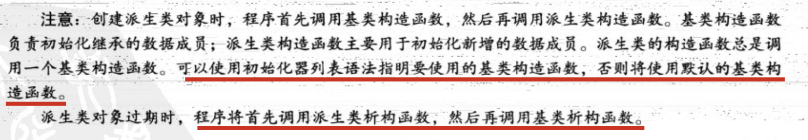

4. 派生类和基类之间的特殊关系：

   - 派生类对象可以使用基类的方法（基类的非私有的方法）；
   - **基类指针**可以在不进行显式类型转换的情况下指向派生类对象；
   - **基类引用**可以在不进行显式类型转换的情况下引用派生类对象；

```cpp
TableTennisPlayer ttp("michael", "wang", false);
    RatedPlayer rp(1024, "Kobe", "Bryant", true);
    // 基类的引用引用派生类对象
    TableTennisPlayer &rttp = rp;
    // 基类的指针指向派生类对象
    TableTennisPlayer *pttp = &rp;
    rttp.name();		// 输出：Bryant, Kobe
    pttp->name();		// 输出：Bryant, Kobe
```

基类指针或引用只能用于调用基类方法，不能调用派生类方法。

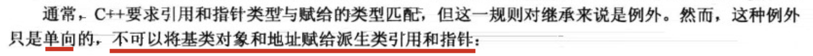

5. 看下面代码：

   ```cpp
   		RatedPlayer rp(1024, "Kobe", "Bryant", true);
   		// 要初始化ttp，匹配构造函数的原型：TableTennisPlayer(const RatedPlayer &);
   		// 但是由于没有在类声明中定义这样的构造函数，会被隐式调用构造函数TableTennisPlayer(const TableTennisPlayer &);
   		TableTennisPlayer ttp(rp);	// 形参是基类引用可以引用派生类
       ttp.name();
   ```

   `TableTennisPlayer ttp(rp)`将ttp初始化成**嵌套在RatedPlayer对象rp中的TableTennisPlayer对象**。

6. 两种重要的机制可用于实现多态公有继承：1.在派生类中重新定义基类的方法；2.使用虚方法。

7. 什么是虚方法？看下面的例子：

   ```cpp
   // father.h
   #include <string>
   
   using namespace std;
   
   class Father {
       int age;
   public:
       void show_age() const;
   
       virtual void show_virtual_age() const;
   };
   
   class Son : public Father {
       string name;
   public:
       void show_age() const;
   
     	virtual ~Father();
     
       virtual void show_virtual_age() const;
   
   };
   
   // father.cpp
   #include "father.h"
   #include<iostream>
   
   // Father
   void Father::show_age() const {
       cout << "Father::show_age()" << endl;
   }
   
   void Father::show_virtual_age() const {
       cout << "Father::show_virtual_age()" << endl;
   }
   
   // Son
   
   void Son::show_age() const {
       cout << "Son::show_age()" << endl;
   }
   
   void Son::show_virtual_age() const {
       cout << "Son::show_virtual_age()" << endl;
   }
   
   // main.cpp
   		// 指针
       Father *pf1 = new Father();
       Father *pf2 = new Son();
   
       pf1->show_age();							// 输出：Father::show_age()
       pf1->show_virtual_age();			// 输出：Father::show_virtual_age()
       pf2->show_age();							// 输出：Father::show_age()		注意！
       pf2->show_virtual_age();			// 输出：Son::show_virtual_age()
   
       // 引用
       Father f = Father();
       Son s = Son();
       Father &rf1 = f;
       Father &rf2 = s;
   
       rf1.show_age();								// 输出：Father::show_age()
       rf1.show_virtual_age();				// 输出：Father::show_virtual_age()
       rf2.show_age();								// 输出：Father::show_age()		注意！
       rf2.show_virtual_age();				// 输出：Son::show_virtual_age()
   ```

   上面例子中的方法调用都是通过指针或引用来进行调用的。前提：派生类重写了基类的函数:

   - 如果方法声明的时候没有加virtual（比如show_age()），调用类方法的时候**按照指针或引用的类型**来做选择（指针pf1和pf2的类型都是Father *，无论他们指向对象是Father还是Son，调用show_age()的选择完全是按照pf1和pf2的类型决定——因为类型都是Father *，所以都将调用Father::show_age()）；
   - 如果方法声明的时候加了virtual，调用类方法的时候**按照指针或引用指向的对象的类型**来做选择。（虽然指针pf1和pf2的类型都是Father *，但是他们指向的对象类型不同——一个是Father，一个是Son。那么在利用pf1和pf2调用show_virtual_age()方法时，将由指向对象类型决定）

8. 虚函数的这种行为非常方便，因此经常在基类中将**派生类会重新定义的方法**都声明为虚方法。基类声明了一个虚的析构函数，这么做是为了确保释放派生类对象时，按正确的顺序调用析构函数（具体后面介绍）。所以，为基类声明一个虚析构函数也是一种惯例。

9. 关键字virtual只用于**类声明的方法原型**中，而不在类方法定义中使用。

10. 只有构造函数才可以使用初始化列表语法：

   ```cpp
   Son::Son(const string &name, int age) : Father(age) {
       this->name = name;
   }
   ```

   非构造函数不能使用成员初始化列表语法，但派生类方法可以调用公有的基类方法。

   ```cpp
   void Son::show_virtual_age() const {
     	// 在派生类方法中调用公有的基类方法
       Father::show_virtual_age();
       cout << "Son::show_virtual_age()" << endl;
   }
   
   // main.cpp
   		Father *pf2 = new Son();
       pf2->show_virtual_age();
   		// 输出：
   		//	Father::show_virtual_age()
   		//	Son::show_virtual_age()
   ```

   在派生类方法中，标准技术是使用作用域解析运算符来调用基类方法。如果没有使用作用域运算符：

   ```cpp
   void Son::show_virtual_age() const {
   		// 这将形成一个自己调用自己的递归函数
       show_virtual_age();
       cout << "Son::show_virtual_age()" << endl;
   }
   ```

11. 为何需要虚析构函数？

    假如程序中使用基类指针指向一个派生类对象，如：

    ```cpp
    Father * p = new Son();
    ```

    当我们要析构分配的空间时：

    ```cpp
    delete p;
    ```

    如果析构函数不是虚的，此时将调用Father类的析构函数，因为指针p是Father指针。这就好比：开始的时候我为派生类Son申请了一部分空间，而在后面我要释放空间却只释放了一个基类Father的空间。因此，使用虚析构函数可以确保**正确的析构函数序列被调用**。

12. 静态联编和动态联编

    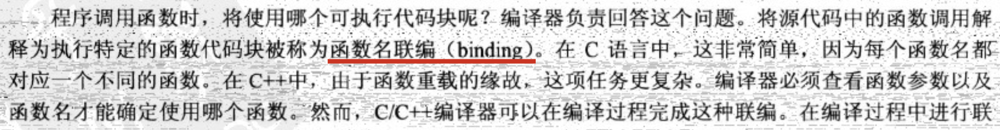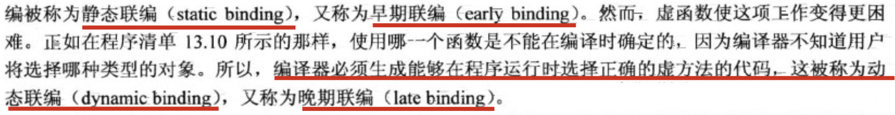

    通常c++不允许将一种类型的地址赋值给另一种类型的指针，也不允许一种类型的引用指向另一种类型：

    ```cpp
    double x =1.1;
    int * p = &x; // 编译报错
    long & r = x; // 编译报错
    ```

    然而**指向基类的引用或指针是可以引用派生类对象**而不必进行显式类型转换。

    ```cpp
    		Son s = Son();
        Father &rf = s;		// 可以
        Son *ps = &s;			// 可以
    ```

    将派生类引用或指针转换为基类引用或指针被称为**向上强制转换**（upcasting），这使公有继承不需要进行显式类型转换。相反的，将基类指针或引用转换为派生类指针或引用被称为**向下强制转换**（downcasting），如果不使用显式类型转换是不允许的。

    对于使用基类引用或指针作为参数的函数调用，将进行向上转换：

    ```cpp
    void func1(Father &rf) {
        rf.show_virtual_age();	// show_virtual_age为虚方法
    }
    // main.cpp调用
    		Son s = Son();
        Father f = Father();
    
        func1(s);		// 输出：Son::show_virtual_age()
        func1(f);		// 输出：Father::show_virtual_age()
    ```

    隐式向上强制转换使基类指针或引用可以指向基类对象或派生类对象，因此需要动态联编。c++使用虚成员函数来满足这种需求。

13. 指针类型在编译时已知，所以编译器对非虚方法使用静态联编。

14. 大多数情况下，动态联编很好，因为它让程序能够选择为特定类型设计的方法。那么会有以下疑问：

    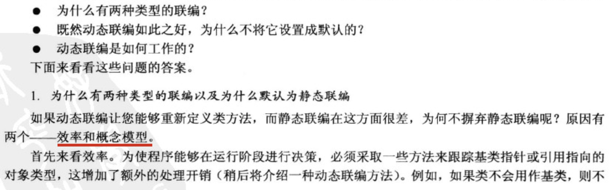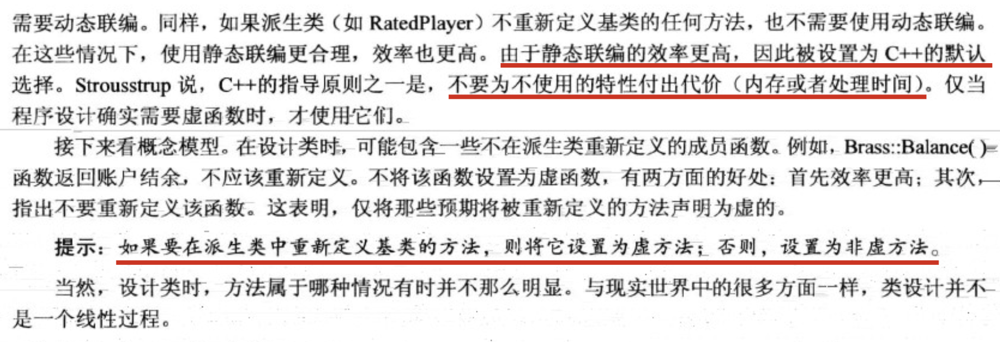    

15. 虚函数的工作原理：

    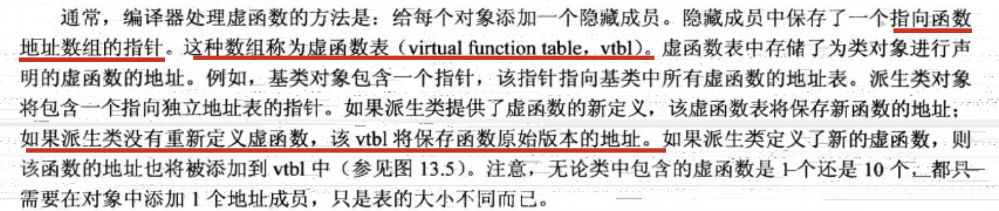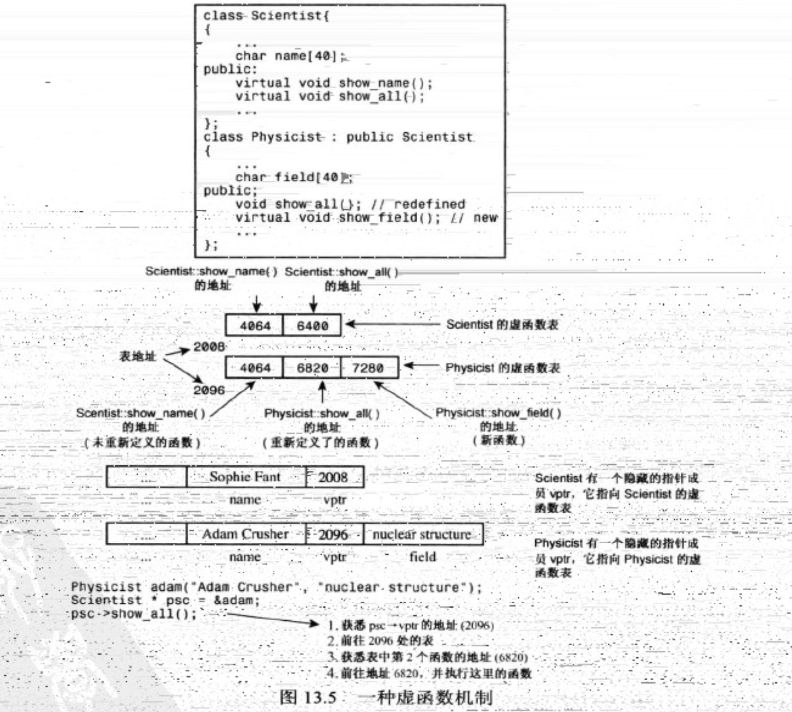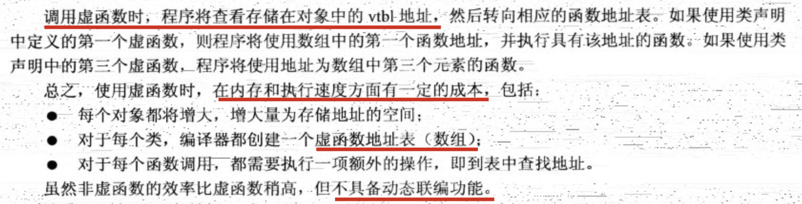

16. 关于虚函数的注意事项：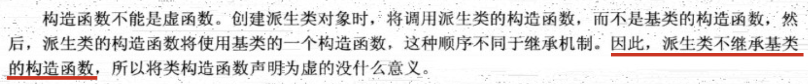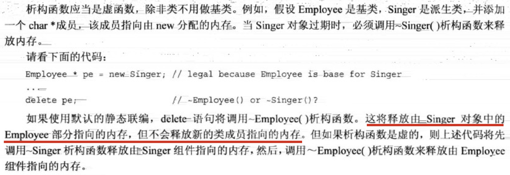

    注：即使基类不需要显式析构函数也不应依赖于默认析构函数，而应提供**虚析构函数**（即使它不执行任何操作）：

    ```cpp
    virtual ~BaseClass(){};
    ```

    

    

      

      

17. c++有3种继承方式：公有继承、保护继承和私有继承。

    ​    