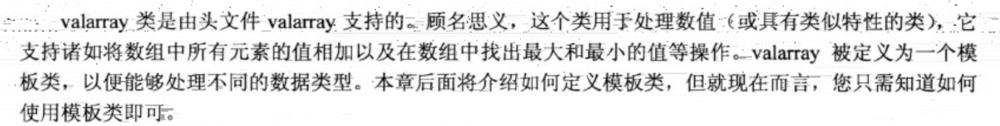
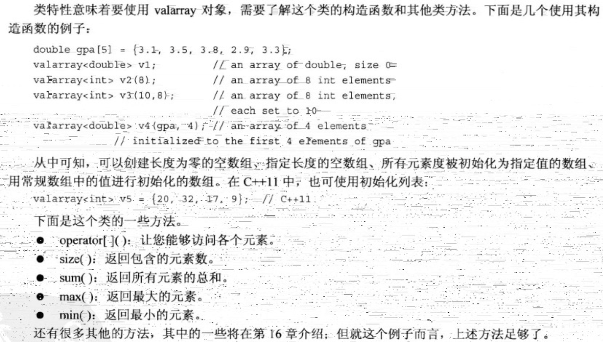
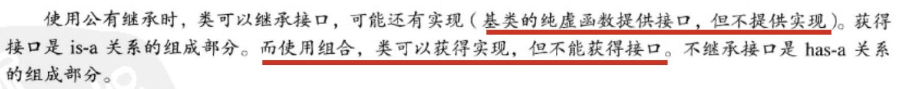
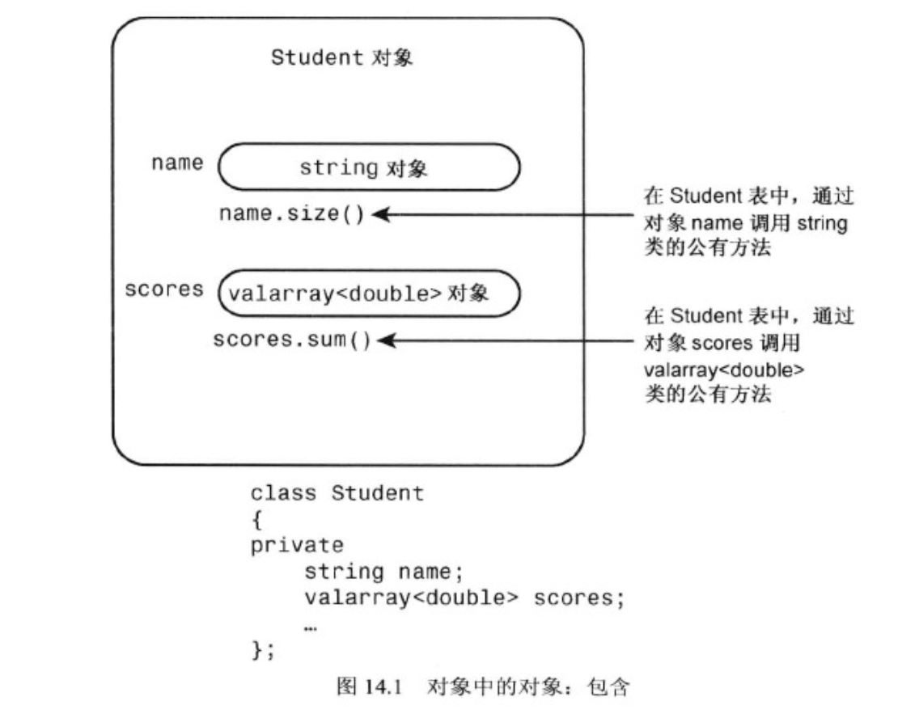

## 13. c++中的代码重用

1. valarray类

   

   ```cpp
   #include<valarray>
   
   int main() {
       valarray<int> q = {1, 2, 3, 4};
       cout << q[0] << endl;		// 1
       double d_arr[3] = {1, 2, 3};
       valarray<double> q1(d_arr, 2);
       cout << q1.max() << endl;			// 2
       cout << q1.size() << endl;		// 2
       cout << q1.sum() << endl;			// 3
   }
   ```

2. 接口与实现

   

3. 包含对象成员的类

   

   ```cpp
   
   ```
   
