## 2 处理数据

1. c++中的变量名注意：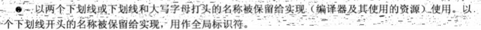

   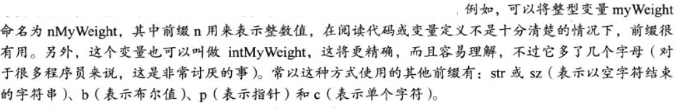

2. 整形short/int/long/long long：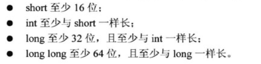

   ```cpp
   #include <iostream>
   #include <climits>
   
   		int n_int = INT_MAX;
       short n_short = SHRT_MAX;
       long n_long = LONG_MAX;
       long long n_long_long = LONG_LONG_MAX;
       cout << n_int << endl;
       cout << n_short << endl;
       cout << n_long << endl;
       cout << n_long_long << endl;
       cout << sizeof(n_int) << endl;
       cout << sizeof(n_short) << endl;
       cout << sizeof n_long << endl;
       cout << sizeof n_long_long << endl;
   // 输出：
   2147483647
   32767
   9223372036854775807
   9223372036854775807
   4
   2
   8
   8
   ```

3. c常用#define来定义自己的符号常量，c++有一种更好的创建符号常量的方法——const，所以其不会经常使用#define。

4. 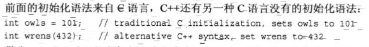

5. 无符号类型：unsigned本身是unsigned int缩写。c++并不保证符号整形超越限制（上溢和下溢）时不出错。

6. 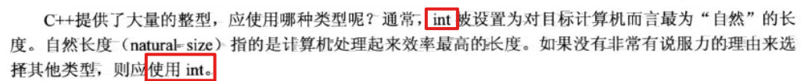

7. 字面量支持8/10/16进制：

   ```cpp
   		int n = 15;
       int m = 015;
       int p = 0x15;
   ```

8. iostream以输出不同进制的数字：

   ```cpp
   int n =15;
       // 打印10进制
       cout<<n<<endl;
       // 打印16进制
       cout<<hex;
       cout<<n<<endl;
       // 打印8进制
       cout<<oct;
       cout<<n<<endl;
   // 输出
   15
   f
   17
   ```

9. c++如何确定常量的类型：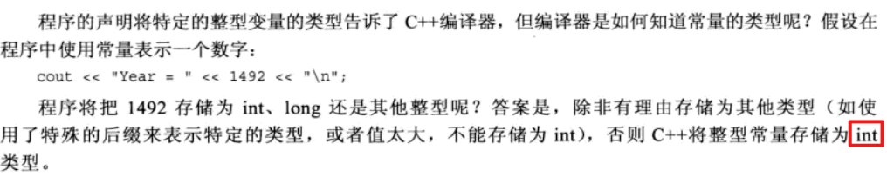

10. 将整数输出成asic码对应的字符：

    ```cpp
    int n = 98;
    cout.put(n);
    // 输出：
    b
    ```

11. 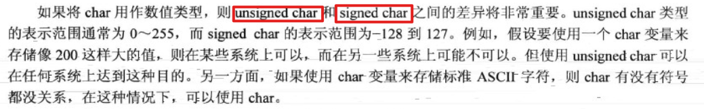

12. 程序处理的字符集无法用一个8位字节表示，如日文汉字系统，可以选择wchar_t（宽字符类型）

    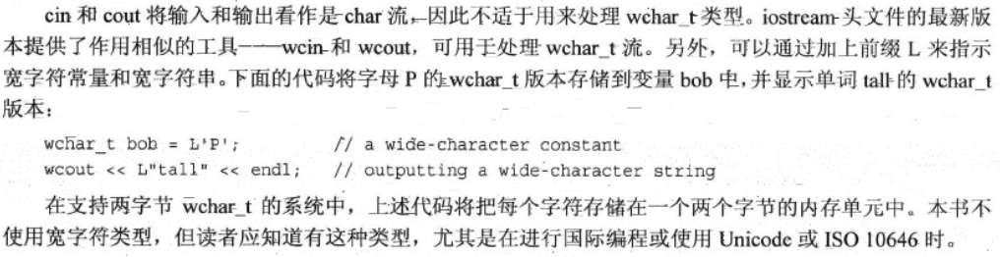

13. 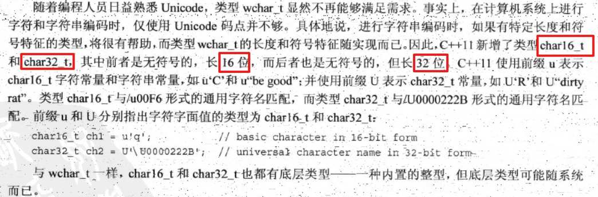

14. 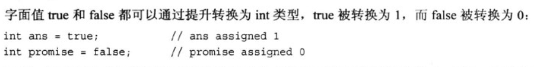

15. 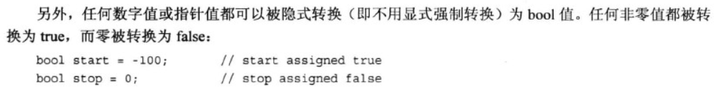

16. c++常将常量的首字母大写：

    ```cpp
    const int Months = 12;
    ```

17. const比#define好的理由：

    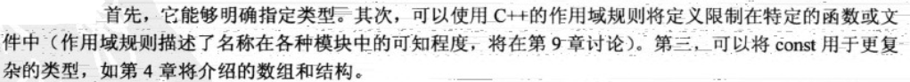

18. 浮点数的e表示法：

    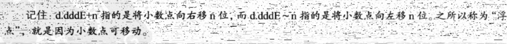

    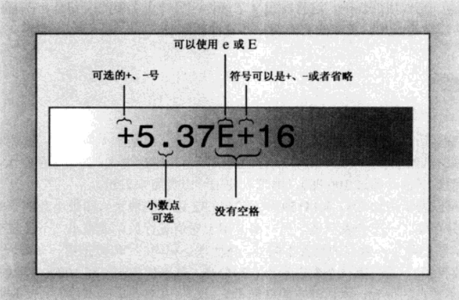

19. c++有3种浮点类型：float、double和long double。

20. 浮点常量：

    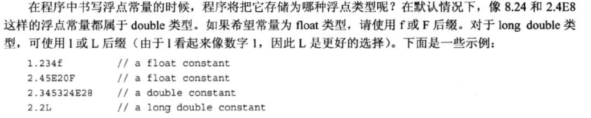

21. 浮点运算的速度通常比整数运算慢，且精度将降低。对于float，c++只保证**6位**有效位，即两个float运算的结果不一定是绝对准确的，但将其四舍五入成6位后是正确的。

22. 模运算两个操作数必须都是整形。

23. 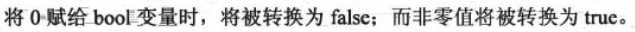

24. 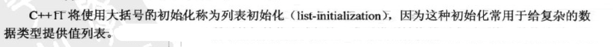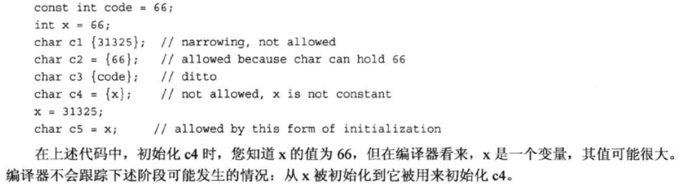

25. 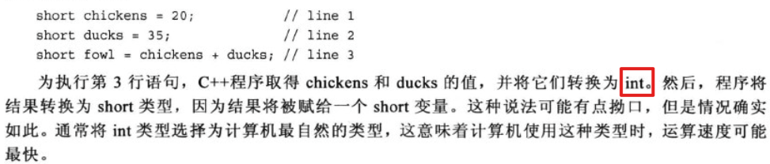

26. 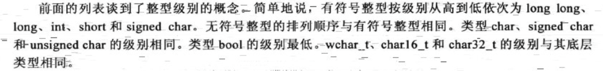

27. 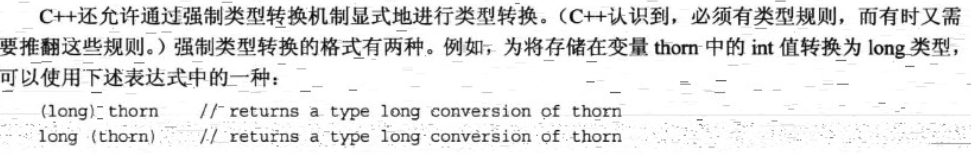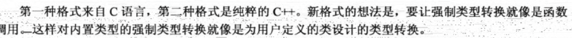

28. c++11的auto声明：

    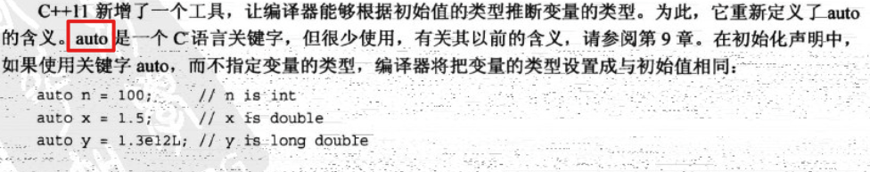

    

    

