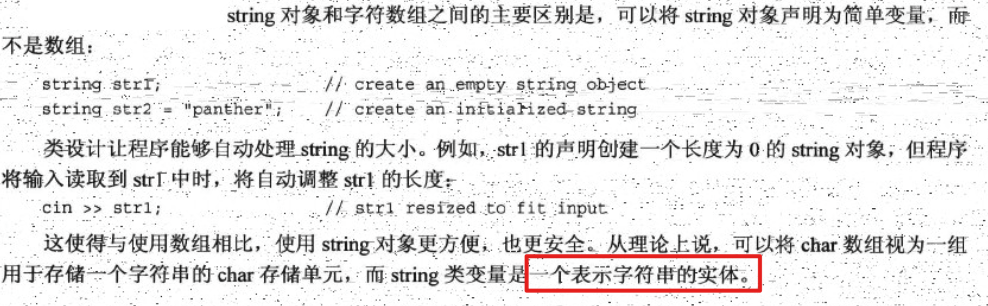

## 3 复合类型

1. 声明数组：

   

2. c++数组越界不会报错：

   ```cpp
   		int arr[3];
       arr[0] = 1;
       arr[1] = 2;
       cout << arr[5] << endl;
   // 输出随机值，但不会报错
   -529135120
   ```

3. sizeof作用于数组名，返回整个数组的字节数：

   ```cpp
       int arr[3] = {1, 2, 3};
       cout << sizeof(arr) << endl;
   // 输出：
   12
   ```

4. 

5. 

6. c++11数组初始化方法：

   

7. 拼接字符串常量

   

8. 将字符串存储到数组中：

   ```cpp
   		char arr[]="12345";
       cout<<sizeof(arr)<<endl;
       cout<<strlen(arr)<<endl;
   // 输出：
   6
   5
   ```

   因为arr数组最后一个元素存'\0'，一共六个元素。strlen()只计算可见字符数，而不会把空字符计算在内。如果一个字符串字面量长度为strlen(x)，那么要存储该字符串的数组长度不能短于strlen(x)+1。

9. ```cpp
   		char name[10];
       char age[3];
       cout << "enter name:" << endl;
       cin >> name;
       cout << "enter age:" << endl;
       cin >> age;
       cout << name << " " << age << endl;
   ```

   

   

   所以cin将“michael”赋给了name数组，而将“wgy”赋给了age数组。

10. 如何利用cin输入一个带空格的字符串：

   

   

   也可拼接起来写:

   ```cpp
   cin.get(name,ArSize).get();
   ```
   
11. 如果利用cin获取一个int变量后再获取字符串，中间必须加cin.get()：

   ```cpp
   int year;
       char name[10];
       cout << "enter year:" << endl;
       // 表达式cin>>year返回cin对象，此时会将\n留在输入队列中。用cin.get()跳过'\n'。
       (cin >> year).get(); 
       cout << "enter name:" << endl;
       cin.getline(name, 10);
       cout << year << '\n' << name << endl;
   ```

   

12. 

13. 

14. 

15. 字符串合并：

   

16. 求string对象长度：.size()方法。下面是两种确定字符串中字符数的方法：

   

   strlen()方法只能接受一个char数组参数。
   
17. 定义结构：

  

18. struct的声明要放在main函数前面，不能像go一样放在任意位置。
  
19. 与C结构不同的是，C++结构除了成员变量之外还可以有成员函数。但这些高级特性通常被用于类中，而不是结构中。

20. 初始化结构数组：

21. 

   ```cpp
   union one4all {
       int age;
       double price;
   };
   ...
     
   one4all o{}; // 初始化一个共用体变量
   o.age = 12;
   cout << o.age << endl;
   cout << o.price << endl; // 此时float成员值为随机值
   o.price = 1.23;
   cout << o.age << endl; // 此时int成员值为随机值
   cout << o.price << endl;
   // 输出：
   12
   6.95293e-310  
   2061584302 
   1.23
   ```

   共用体长度为其最大成员的长度。

   

   注：共用体里不能使用string类型。如果想用字符串，只能用char数组。

22. 匿名共用体：

  当系统有充足内存时，就没有必要使用共用体。

    
  
    
