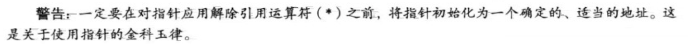
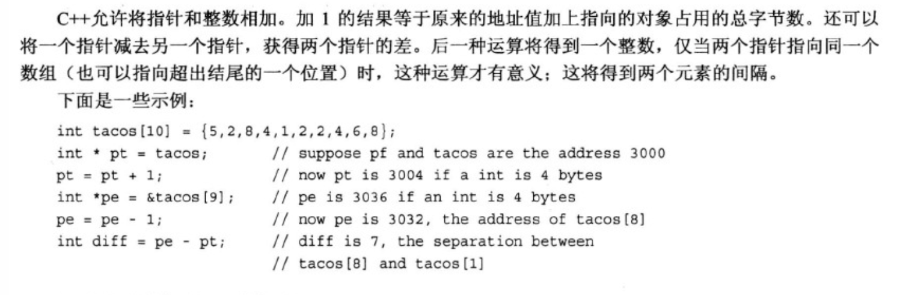
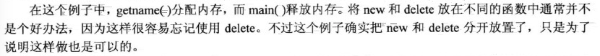
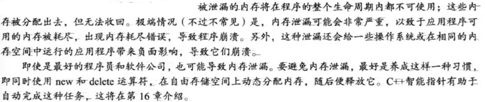

## 3 复合类型

1. 声明数组：

   

   ```cpp
   		char chs[] = "ddafdasfdsa";
       cout << strlen(chs) << endl;
   		// 11
   ```

   

2. c++数组越界不会报错：

   ```cpp
   		int arr[3];
       arr[0] = 1;
       arr[1] = 2;
       cout << arr[5] << endl;
   // 输出随机值，但不会报错
   -529135120
   ```

3. sizeof作用于数组名，返回整个数组的字节数：

   ```cpp
       int arr[3] = {1, 2, 3};
       cout << sizeof(arr) << endl;
   // 输出：
   12
   ```

4. 

5. 

6. c++11数组初始化方法：

   

7. 拼接字符串常量

   

8. 将字符串存储到数组中：

   ```cpp
   		char arr[]="12345";
       cout<<sizeof(arr)<<endl;
       cout<<strlen(arr)<<endl;
   // 输出：
   6
   5
   ```

   因为arr数组最后一个元素存'\0'，一共六个元素。strlen()只计算可见字符数，而不会把空字符计算在内。如果一个字符串字面量长度为strlen(x)，那么要存储该字符串的数组长度不能短于strlen(x)+1。

9. ```cpp
   		char name[10];
       char age[3];
       cout << "enter name:" << endl;
       cin >> name;
       cout << "enter age:" << endl;
       cin >> age;
       cout << name << " " << age << endl;
   ```

   

   

   所以cin将“michael”赋给了name数组，而将“wgy”赋给了age数组。

10. 如何利用cin输入一个带空格的字符串：

   

   

   也可拼接起来写:

   ```cpp
   cin.get(name,ArSize).get();
   ```
   
11. 如果利用cin获取一个int变量后再获取字符串，中间必须加cin.get()：

   ```cpp
   int year;
       char name[10];
       cout << "enter year:" << endl;
       // 表达式cin>>year返回cin对象，此时会将\n留在输入队列中。用cin.get()跳过'\n'。
       (cin >> year).get(); 
       cout << "enter name:" << endl;
       cin.getline(name, 10);
       cout << year << '\n' << name << endl;
   ```

   

   通过cin获取一个字符串：

   ```cpp
   		string str;
       getline(cin, str);
       cout << str << endl;
   ```

12. 

13. 

14. 

15. 字符串合并：

   

16. 求string对象长度：.size()方法。下面是两种确定字符串中字符数的方法：

   

   strlen()方法只能接受一个char数组参数。
   
17. 定义结构：

  

18. struct的声明要放在main函数前面，不能像go一样放在任意位置。
  
19. 与C结构不同的是，C++结构除了成员变量之外还可以有成员函数。但这些高级特性通常被用于类中，而不是结构中。

20. 初始化结构数组：

21. 

   ```cpp
   union one4all {
       int age;
       double price;
   };
   ...
     
   one4all o{}; // 初始化一个共用体变量
   o.age = 12;
   cout << o.age << endl;
   cout << o.price << endl; // 此时float成员值为随机值
   o.price = 1.23;
   cout << o.age << endl; // 此时int成员值为随机值
   cout << o.price << endl;
   // 输出：
   12
   6.95293e-310  
   2061584302 
   1.23
   ```

   共用体长度为其最大成员的长度。

   

   注：共用体里不能使用string类型。如果想用字符串，只能用char数组。

22. 匿名共用体：

  当系统有充足内存时，就没有必要使用共用体。

23. 枚举：
  
  
  
  
  
24. 
  
25. 如何设置枚举量的值：

26. 

27. 

   存储数据将地址视为指定的量，而将值视为派生量，因此*p_updates和updates是完全等价的。
   
25. 

  *运算符两边的空格是可选的，无论是在\*左侧还是右侧添加空格对于编译器来说没有任何区别。

29. 初始化一个指针：

   ```cpp
   int i = -5;
   int *p = &i;
   ```

30. 危险的指针：

   

   fellow指向的地方很可能并不是所有存储223323的地方。这种错误可能会导致一些最隐匿、最难以跟踪的bug。

​     谨记：

31. 不能简单地将整数赋给指针：

    

32.    使用new来分配内存

       

       程序员要告诉new，需要为哪种数据类型分配内存：new将找到一个长度正确的内存块，并返回该内存块的地址。程序员的责任是将该地址赋给一个指针：`int * pn = new int;`

       现在pn是地址，而*pn是存储在里面的值。与将变量的地址赋给指针进行比较：

       

       即，pt同pn相比更加繁琐了，但是使得程序在管理内存方面有了更大的控制权。

33.     使用new来创建内存的正确流程：

       ```cpp
       int * pt = new int;
       *pt = 100;
       // 千万不要这么写：
       int * p;
       *p = 100;
       // 注： p是未初始化过的指针，其值随机。可能随机到一个已经使用的地址上，这时*p=100会复写其中原有的数据，形成隐性bug
       ```

34. new分配的内存块与常规变量声明分配的内存块不同：

    ```cpp
    int * pt = new int;
    *pt = 100;
    
    int nights = 1001;
    ```

    变量nights和pt的值都存储在**栈**的内存区域中，而new从**堆**或**自由存储区**（free store）的内存区域分配内存。

35. 内存被耗尽：

36. 使用delete释放内存：

    

    

37. 使用new创建动态数组

    

38. 

39. 使用动态数组：

    ```cpp
    double *p = new double[3];
        p[0] = 0.1;
        p[1] = 0.2;
        p[2] = 0.3;
        // 超出range范围是可以的，不会报错
        p[3] = 0.4;
        cout << p[3] << endl;   // 输出：0.4
        cout << *p << endl;     // 输出：0.1
        // p从只想第一个元素0.1,变为指向第二个元素0.2
        p = p + 1;
        cout << *p << endl;     // 输出：0.2
    
        // 释放内存空间时，需要原先new出来的地址。即p-1
        delete[] (p - 1);
    ```

    注：指针p可以当做数组名来使用，p[0]为第一个元素。

40. 数组名与指针之间的根本区别：

    ```cpp
      // c为char[7]的数组名
      char c[] = "abcdef";
      cout << c << endl;
    		// 会报错，因为数组名的值是不能改变的
      c = c + 1;
    ```

  还有一个区别：sizeof(数组名)得到的是数组长度，而sizeof(指针)得到的是指针长度。

41. 多数情况下，c++将数组名解释为数组第1个元素的地址。且将指针变量加1后，其增加的值等于指向的类型占用的字节数。

42. ```cpp
    int arr[5]={1,2,3,4,5}
    // 注： *(arr+2)等价于arr[2]
    ```

43. 数组地址：

    

44. 对指针解引用也可以使用数组表示法：

    ```cpp
    		double d = 1.24;
        double *p = &d;
        cout << p[0] << endl;
    // p[0]与*p是一样的
    ```

45. 指针算术

    

    注：pe-pt得到的是两个指针之间隔着多少个元素，并不是地址之间查了多少个字节。

46. 在c++中，用引号括起来的字符串像数组名一样，也是第一个元素的地址:

    ```cpp
    		char *cp = "abcd"; // cp即字符串第一个元素的地址
    		cout << cp << endl;
    		// 输出abcd
        cout << *cp << endl;
    		// 输出 a
    ```

    

47. ```cpp
    char arr[10] = "abcdefg";
        // 输出arr数组的地址：0x7ffee533798e
        cout << (int *) arr << endl;
    
        char *p;
        // 创建动态数组并分配内存，注意：strlen(arr)此时为7
        p = new char[strlen(arr) + 1];
        // 将arr中的内容复制到p地址开始的动态数组内
        strcpy(p, arr);
        cout << p << endl;
        // 输出p地址：0x7fb688405820
        cout << (int *) p << endl;
        delete[] p;
    ```

    strcpy函数接受2个参数，第一个是目标地址，第二个是要复制的字符串的地址。

48. 一般来说，如果给cout提供一个指针，它将打印地址。但如果指针的类型为char*，则cout将打印指向的字符串。如果要显示字符串的地址，则必须将这种指针强制转换为 int *。

49. 需要将字符串放到数组中：

    对c-风格字符串和cstring库有了解后，便可以理解c++ string类型的便利之处：不用担心字符串会导致数组越界，也可以直接使用赋值运算符而不是函数strcpy()和strncpy()。
    
50. 使用new 创建动态结构：

    ```cpp
        struct test {
        string name;
        int age;
    		};
    
    		test *t = new test;
        t->name = "michael";
        t->age = 24;
    		// 注： delete和new要配对使用
    		delete t;
    ```

    

51. 

    ```cpp
    #include <iostream>
    
    using namespace std;
    
    char *get_name();
    
    int main() {
        char *name;
        name = get_name();
        cout << name << " at " << (int *) name << endl;
        delete[] name;	 // memory freed
    
      	// 这次name的地址跟上一次是不同的
        name = get_name();
        cout << name << " at " << (int *) name << endl;
        delete[] name;	 // memory freed
        return 0;
    }
    
    char *get_name() {
        // 临时数组，在函数结束时会被释放掉
        char tmp[100];
        cout << "Please type in:" << endl;
        cin.getline(tmp, 100);
        // 根据输入的实际字节长度创建动态数组, 在函数外free
        char *p = new char[strlen(tmp) + 1];	// 为什么+1，因为需要添加\0结尾
        strcpy(p, tmp);
        return p;
    }
    ```

    

52. 

    **自动存储**：即函数内局部变量，生命周期跟着代码块走。存储在栈中，执行代码块时，变量以此入栈，离开代码块按照相反顺序释放这些变量（LIFO）。因此，在程序执行的过程，栈将不断的放大和缩小。

    **静态存储**：

    **动态存储**：

53. 栈、堆和内存泄漏：

    如果使用new后没有调用delete，即使包含指针的内存由于作用域规则和对象生命周期等原因被释放，在自由存储空间上分配的变量或结构也将继续存在。实际上导致无法访问自由存储空间中的结构。这将导致内存泄漏。

    

    指针是功能最强大的c++工具之一，但也最危险，因为它们允许执行对计算机不友好的操作，如使用未经初始化的指针来访问内存或者试图释放同一个内存块两次。

54. 类型组合：

    
    
55. 数组的替代品：vector和array 

    模板类vector:

    

    模板类array：

    

    ```cpp
    // 数组
        int n_arr[2] = {1, 2};
        cout << &n_arr[0] << " " << &n_arr[1] << endl;
        // 0x7ffeed62f990 0x7ffeed62f994
    
        // array
        array<string, 3> arr = {"abc", "hahaha", "btc"};
        cout << arr[2] << endl;
        cout << &arr[0] << " " << &arr[1] << endl;
        // 0x7ffeed62f948 0x7ffeed62f960
        array<string, 3> arr1;
        // 可以
        arr1 = arr;
        cout << &arr1[0] << " " << &arr1[1] << endl;
        // 0x7ffeed62f8e8 0x7ffeed62f900，可见arr1和arr并不是指向同一地址，即可以将一个arr对象赋值给另一个对象（做了深度copy）
    
        // vector，长度为2
        vector<int> vi(2);
        cout << vi.size() << endl; //2
        vi[0] = 1;
        vi[1] = 2;
        cout << &vi[0] << " " << &vi[1] << endl;
        // 0x7fc014c05820 0x7fc014c05824
    ```

    c++中的负索引：

    ```cpp
    		int n_arr[3] = {1, 2, 3};
        cout << n_arr[-99] << endl; // 1107296256
        int *p = n_arr;
        p = p + 2;
        cout << *p << endl; // 3
    		// 以p当前位置，向前移一个和两个int的变异量，并读取
        cout << p[-1] << " " << p[-2] << endl; // 2 1
    ```

    n_arr本身长度为3，-99已经到了数组外面。与C一样，C++也不检查这种超界错误。

    

56. 

    ```cpp
        char *pc = "abc";
        cout << strlen(pc) << endl; // 3，strlen并不会统计\0
        cout << (pc[3]=='\0') << endl; // 输出1，true。实际上pc[3]就是'\0'
        cout << pc[4] << endl; // 输出P，pc[4]已经超出该数组，内部为随机值
        string str ="abc";
        cout << str.size() << endl; // 3
    ```

57. 

