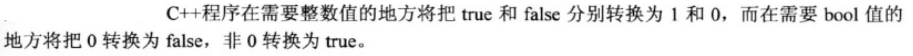

## 4.循环和关系表达式

1. 

   ```cpp
   int limit;
       cin >> limit;
       // limit本身值可以作为判断表达式（相当于bool）
       for (; limit; limit--) {
           cout << limit << endl;
       }
   ```

   

2. 

3. c++中任何值或任何有效的值和运算符的组合都是表达式。c++将赋值表达式的值定义为左侧成员的值。因此，可以编写下面这样的语句：

   ```cpp
   		int a, b;
       a = (b = 3) + 5;
       cout << a << " " << b << endl;
   		// 8 3
   ```

   c++允许这样做，但并不意味着鼓励这样做，同时允许如下的语句：

   ```cpp
   x = y = z = 0;
   ```

   赋值运算符**从右向左**结合，因此首先将0赋值给z，然后将z=0赋值给y，以此类推。

   

4. 如何利用cout打印true或false：

   ```cpp
   		cout.setf(ios_base::boolalpha);
       cout << (2 < 3) << endl; // true
   ```

5. 

6. 

7. 可以在for循环的初始化部分中声明变量：

   ```cpp
   for (int i = 0; i < 10; i++)
   ```

   变量i只存在与for循环当中，当程序离开循环后，变量消失。

8. 

   ```cpp
       const int ArSize = 16;
       long long arr[ArSize];
   ```

9. x++和++x对操作数的影响是一样的，但影响的时间不同：

   ```cpp
    		int x = 0;
       cout << x++ << endl;	// 0
       x = 0;
       cout << ++x << endl;	// 1
   ```

   x++ 先取值，后计算；++x则先计算，后取值。

10. 关于x++和++x的效率区别：

    

11. 递增运算符用于指针时，将把指针的值增加其指向的数据类型占用的字节数：

    

    

12. 

13. 逗号运算符：允许将两个表达式放到c++语法只允许放一个表达式的地方：

    ```cpp
    // 反转字符串 		
    string str;
        cin >> str;
        char tmp;
        for (int i = 0, j = str.size() - 1; i < j; i++, j--) {
            tmp = str[j];
            str[j] = str[i];
            str[i] = tmp;
        }
    
        cout << str << endl;
    ```

    注：在`int i = 0, j = str.size() - 1; `中逗号只是一个列表分隔符，而不是逗号运算符。`i++, j--`中逗号才是逗号运算符。

14. c++为逗号运算符提供两个特性：

    1. 先计算第一个表达式，后计算第二个表达式；
    2. 逗号表达式的值是第二部分的值。`cats = 17,18`被解释为`(cats = 17),18`

15. 

16. 赋值、比较运算符可能犯的错误：

    

17. c风格字符串的比较：

    

    使用strcmp()函数来比较。该函数接受两个字符串地址作为参数（这意味着参数可以使指针、字符串常量或字符数组名）。如果两个字符串相同，则函数返回0；如果第一个字符串按字母排序排在第二个字符串之前，则strcmp()将返回一个负数值；反之返回一个正数：

    ```cpp
		char *p = "michael.w";
    cout << strcmp(p, "michael.x") << endl;
		// -1
		cout << strcmp(p, "michael.w") << endl;
		// 0
		cout << strcmp(p, "kichael.w") << endl;
		// 2
    ```
    

18. string类字符串比较：可使用关系运算符。这之所以可行，是因为类函数重载（重新定义）了这些运算符（第12章将介绍）:

    ```cpp
    		string str = "abc";
        cout.setf(ios_base::boolalpha);
        cout << (str == "abc") << endl;	// true
        cout << (str < "bbc") << endl; // true
        cout << (str > "Zbc") << endl; // true
    ```

    

    ```cpp
    		char *p = "abc";
        char ch_arr[] = "abc";
        cout << (str == p) << endl; // true
        cout << (str == ch_arr) << endl; // true
    ```

19. 利用while遍历c风格字符串（以'\0'结尾）：

    ```cpp
    		char *p = "michael.w";
        int i = 0;
    		// c风格字符串结尾的'\0'的ASCII码值就是0
        while (p[i]) {
            cout << p[i] << ":" << int(p[i]) << endl;
            i++;
        }
    ```

20. for与while的区别：

    

21. 

22. 如何等待一定时间（n秒）？

    ```cpp
    #include <ctime>
    
    // 手动输入要wait的秒数
    float secs;
    cin >> secs;
    
    // 要等待的秒数转化为系统时间单位，即不同的电脑clock()返回的时间单位不一定都是秒
    clock_t delay = secs * CLOCKS_PER_SEC;
    clock_t start = clock();
    // 一直等到已等待间隔大于等于delay值时，跳出while循环
    while (clock() - start < delay);
    ```

    该程序以系统时间单位为单位（而不是以秒为单位）计算延迟时间，避免了在每轮循环中将系统时间转换为秒。

23. 类型别名：

    

24. do while循环：

    它是出口条件循环。这意味着这种循环将首先执行循环体，然后再判定测试表达式，也就是说循环体至少要执行一次。

    ```cpp
    		int i = 0;
        do {
            cout << i << endl;
            i++;
        } while (i < 10);
    ```

25. 基于范围的for循环（C++11）：

    

26. ```cpp
    		char ch;
        int count = 0;
        cin >> ch;
        while (ch != '#') {
            cout << ch;
            cin >> ch;
            count++;
        };
        cout << count << endl;
    
    // 输入：abc de#fg
    // 输出：abcde5
    // 注：输入中的空格不会被cin读取到ch中，所以未被统计在内
    ```

    利用cin来读取char值时，与读取其他基本类型一样，cin将忽略**空格**和**换行符**。

    发送给cin的输入被缓冲，这意味着只有在用户按下回车键后，他输入的内容才会被发送给程序。这就是在运行程序时，可以在#后面输入字符的原因。按下回车键后，整个字符序列将被发送给程序，但程序在遇到#字符后将结束对输入的处理。

27. 成员函数cin.get(ch)可以逐个读取输入缓冲中的字符到ch。

    ```cpp
    		char ch;
        int count = 0;
        cin.get(ch);
        while (ch != '#') {
            cout << ch;
            cin.get(ch);
            count++;
        };
        cout << count << endl;
    	// 输入：abc de#fg
    	// 输出：abc de6
    ```

    cin.get()通过重载还有量种用法：1. cin.get(数组名，int)；2.ch=cin.get()。

    

28. EOF结束输入：

    

    注：方法cin.get(char)的返回值是一个cin对象。istream类提供了一个可以将istream对象（如cin）转换为bool值的函数。当cin出现在需要bool值的地方时，该函数将被调用。另外，如果最后一次读取成功了，则转换得到的bool值为true，否则为false。这样程序可以改写成：

    ```cpp
    		char ch;
        int count = 0;
        cin.get(ch);
        while (cin) {
            cout << ch;
            cin.get(ch);
            count++;
        };
        cout << count << endl;
    ```

    又因为cin.get(char)的返回值为cin，可以更精简为：

    ```cpp
    		char ch;
        int count = 0;
        while (cin.get(ch)) {
            cout << ch;
            count++;
        };
        cout << count << endl;
    ```

29. 关于EOF的值：使用cin.get()需要知道如何处理EOF条件。当该函数到达EOF时，将没有可返回的字符。所以，cin.get()将返回一个用符号常量EOF表示的特殊字符。该常量在头文件iostream中被定义。

    ```cpp
    // 文件：/Library/Developer/CommandLineTools/SDKs/MacOSX10.15.sdk/usr/include/stdio.h中
    #define	EOF	(-1)
    ```

    也可以改写成：

    ```cpp
    		char ch;
        int count = 0;
        ch = cin.get();
        while (ch != EOF) {
            cout << ch;
            ch = cin.get();
            count++;
        }
        cout << count << endl;
    ```

    注：需要知道的是EOF不表示输入中的字符，而是指出没有字符。

30. 如何将int转换为char类型输出：cout.put(int)

    ```cpp
    	cout.put(97);
    	// a
    ```

31. cin.get(ch)与cin.get()的区别：

    

    注：cin.get(char) 函数在到达EOF时，并不会将一个特殊值赋值给ch。事实上，此时它不会将任何值赋给ch（即EOF）。ch不会被用来存储非char值。

32. 二维数组

    

    第一个下标表示**行数**，第二个下标表示**列数**。

33. 初始化二维数组：

    

34. 利用一个char指针数组来实现string数组的功能：将一个char指针数组初始化为一组字符串常量。

    ```cpp
    		const char *chs[3] = {
                "abc",
                "efg",
                "hig",
        };
    
        for (char *ch_p:chs) {
            cout << ch_p << endl;
        }
    
    		// 也可以使用二维数组
    		char chs_1[3][10] = {
                "abc",
                "efg",
                "hig",
        };
    		// 将全部三个字符串最大长度限制为9个字符
    ```

    因此，从存储空间的角度说，使用指针数组更为经济。然而，如果要修改其中任何一个字符串，则二维数组是最好的选择。

    ```cpp
    		// 还可以使用string对象数组
    		const string strs[3] = {
                "abc",
                "efg",
                "hig",
        };
    ```

    如果希望字符串是可修改的，应省略const。在希望字符串是可修改的情况下，string类自动调整大小的特性将比使用二维数组更为方便。

35. 最后再强调：cin.get(char)成员函数调用通过返回转换为false的bool值来指出已到达EOF，而cin.get()成员函数调用则通过返回EOF值来指出已到达EOF。

