## 5.分支语句和逻辑运算符

1. ```cpp
   		char ch = 'a';
       if (ch == 'a') {
           ch++;
       } else if (ch == 'b') {
           ch += 2;
       } else {
           ch += 3;
       }
      
       cout << ch << endl;
   ```

2. 条件运算符的错误防范

   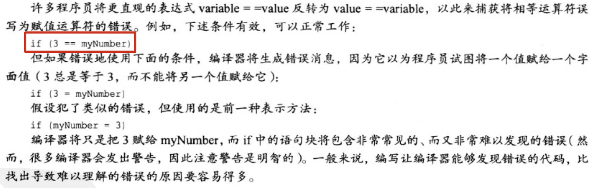

3. 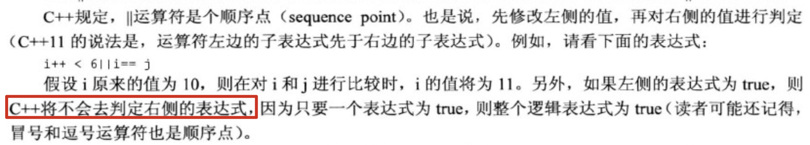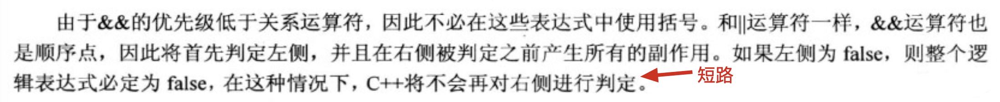

4. 取值范围测试：

   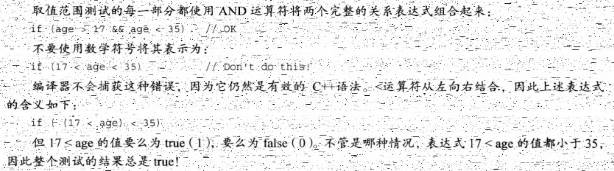

5. 判断一个double值是否处于int的取值区间：

   ```cpp
   		double d;
       cin >> d;
       cout.setf(ios_base::boolalpha);
   		// INT_MIN和INT_MAX为climits中定义的两个符号常量
       if (d >= INT_MIN && d <= INT_MAX)
           cout << true << endl;
       else
           cout << false << endl;
   ```

6. || 和&&优先级低于关系运算符，而！的优先级高于所有关系运算符和算术运算符。因此，要对表达式求反，必须用括号括起来。

7. 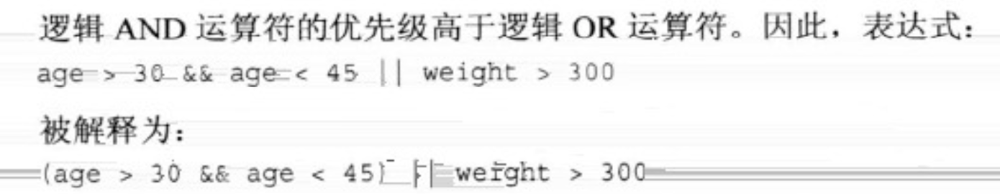

8. 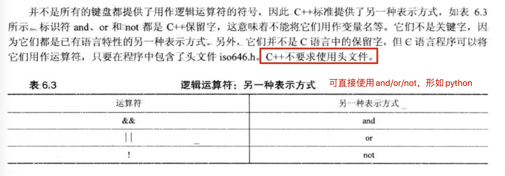

   ```cpp
    		int x = 2;
       if (x < 2 and x % 2 == 1) {
           cout << x << endl;
       } else if (not(x > 10)) {
           cout << "here" << endl;
       }
   ```

9. 字符函数库cctype

   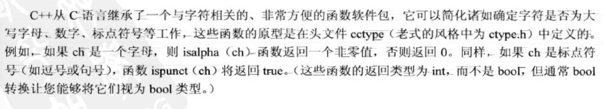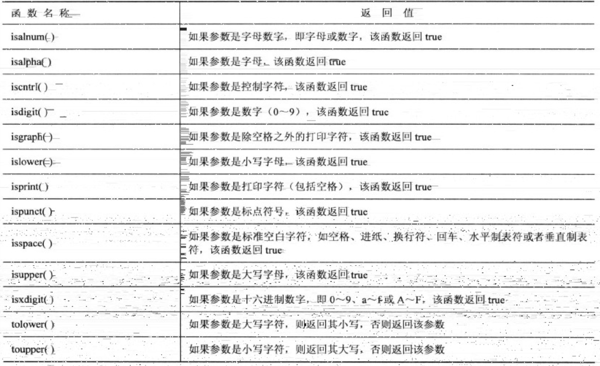

10. ?:运算符（条件运算符）

  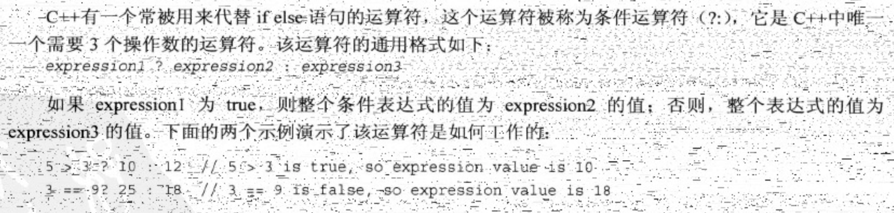
  
  确定两个值中较大的一个：
  
  ```cpp
  int c = a > b ? a : b;
  // c的值为a和b中较大的一个
  
  // 等价于
  int c;
      if (a > b) {
          c = a;
      } else {
          c = b;
      }
  ```
  
11. swtich语句
  
  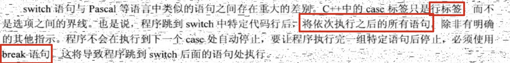
  
  上面说的即是c++中存在case穿透。
  
  ```cpp
  // 如果输入的不是整数，程序会停止		
  		int n;
      while (cin >> n) {
          switch (n) {
              // 0和1都将进入该分支
              case 0:
              case 1:
                  cout << 'a' << endl;
                  break;
              case 2:
                  cout << 'b' << endl;
                  break;
              case 3:
              case 4:
                  cout << 'c' << endl;
                  break;
              default:
                  cout << "error" << endl;
          }
      }
  ```
  
  将枚举量用作标签：switch语句将int值和枚举量标签进行比较时，将枚举量提升为int。另外，在while循环测试条件中，也会将枚举量提升为int类型。
  
  ```cpp
  		enum {
      		Monday, Tuesday, Wednesday, Thursday, Friday
  		};
  
      int n;
      while (cin >> n) {
          switch (n) {
              case Monday:
                  cout << "Monday" << endl;
                  break;
              case Tuesday:
                  cout << "Tuesday" << endl;
                  break;
              case Wednesday:
                  cout << "Wednesday" << endl;
                  break;
              case Thursday:
                  cout << "Thursday" << endl;
                  break;
              case Friday:
                  cout << "Friday" << endl;
                  break;
              default:
                  cout << "error" << endl;
          }
      }
  ```
  
  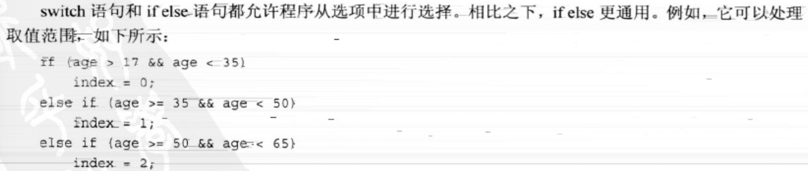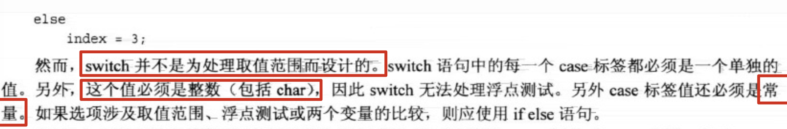
  
  提示：如果既可以使用if else if语句，也可以使用switch语句，则当选项不小于3个时，应使用switch语句。
  
12. 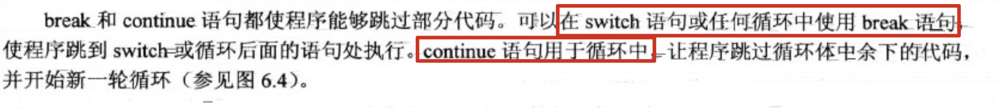
  
13. goto：同c语言一样，c++也有goto语句

    ```cpp
    		int n;
        cin >> n;
        if (n > 100)
            goto here;
        cout << "n<=100" << endl;
        here:
        {
            cout << "n>100" << endl;
            cout << n << endl;
        }
    
    		// 当n输入为99时，输出为：
    		// 		n<=100
    		//		n>100
    		//		99
    
    		// 当n输入为101时，输出为：
    		//		n>100
    		//		101
    
    		// 注：无论n为多少，here中的代码都会被执行
    ```
    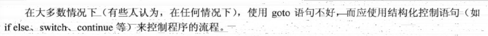

14. 
  

  