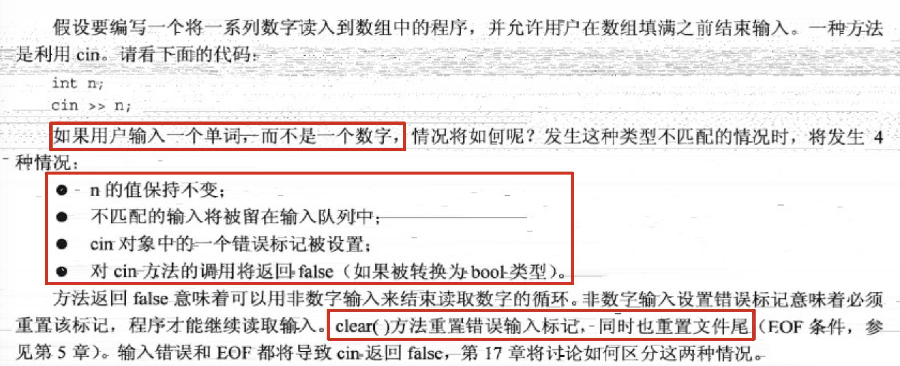

## 5.分支语句和逻辑运算符

1. ```cpp
   		char ch = 'a';
       if (ch == 'a') {
           ch++;
       } else if (ch == 'b') {
           ch += 2;
       } else {
           ch += 3;
       }
      
       cout << ch << endl;
   ```

2. 条件运算符的错误防范

   

3. 

4. 取值范围测试：

   

5. 判断一个double值是否处于int的取值区间：

   ```cpp
   		double d;
       cin >> d;
       cout.setf(ios_base::boolalpha);
   		// INT_MIN和INT_MAX为climits中定义的两个符号常量
       if (d >= INT_MIN && d <= INT_MAX)
           cout << true << endl;
       else
           cout << false << endl;
   ```

6. || 和&&优先级低于关系运算符，而！的优先级高于所有关系运算符和算术运算符。因此，要对表达式求反，必须用括号括起来。

7. 

8. 

   ```cpp
    		int x = 2;
       if (x < 2 and x % 2 == 1) {
           cout << x << endl;
       } else if (not(x > 10)) {
           cout << "here" << endl;
       }
   ```

9. 字符函数库cctype

   

10. ?:运算符（条件运算符）

  
  
  确定两个值中较大的一个：
  
  ```cpp
  int c = a > b ? a : b;
  // c的值为a和b中较大的一个
  
  // 等价于
  int c;
      if (a > b) {
          c = a;
      } else {
          c = b;
      }
  ```
  
11. swtich语句
  
  
  
  上面说的即是c++中存在case穿透。
  
  ```cpp
  // 如果输入的不是整数，程序会停止		
  		int n;
      while (cin >> n) {
          switch (n) {
              // 0和1都将进入该分支
              case 0:
              case 1:
                  cout << 'a' << endl;
                  break;
              case 2:
                  cout << 'b' << endl;
                  break;
              case 3:
              case 4:
                  cout << 'c' << endl;
                  break;
              default:
                  cout << "error" << endl;
          }
      }
  ```
  
  将枚举量用作标签：switch语句将int值和枚举量标签进行比较时，将枚举量提升为int。另外，在while循环测试条件中，也会将枚举量提升为int类型。
  
  ```cpp
  		enum {
      		Monday, Tuesday, Wednesday, Thursday, Friday
  		};
  
      int n;
      while (cin >> n) {
          switch (n) {
              case Monday:
                  cout << "Monday" << endl;
                  break;
              case Tuesday:
                  cout << "Tuesday" << endl;
                  break;
              case Wednesday:
                  cout << "Wednesday" << endl;
                  break;
              case Thursday:
                  cout << "Thursday" << endl;
                  break;
              case Friday:
                  cout << "Friday" << endl;
                  break;
              default:
                  cout << "error" << endl;
          }
      }
  ```
  
  
  
  提示：如果既可以使用if else if语句，也可以使用switch语句，则当选项不小于3个时，应使用switch语句。
  
12. 
  
13. goto：同c语言一样，c++也有goto语句

    ```cpp
    		int n;
        cin >> n;
        if (n > 100)
            goto here;
        cout << "n<=100" << endl;
        here:
        {
            cout << "n>100" << endl;
            cout << n << endl;
        }
    
    		// 当n输入为99时，输出为：
    		// 		n<=100
    		//		n>100
    		//		99
    
    		// 当n输入为101时，输出为：
    		//		n>100
    		//		101
    
    		// 注：无论n为多少，here中的代码都会被执行
    ```
    

14. 
  

如果用户输入了一个单词，而非数字,`!cin`将为true：

  ```cpp
  		int n = 0;
      cin >> n;
  		// 由于输入的为字字母，所以cin>>n失败，n的值还是0
      cout << n << endl;
      if (!cin) {
        	// 由于之前cin>>n失败，所以进入这里
        	// 该方法将重置cin，即重新从缓冲开始的地方读取
          cin.clear();
      }
  		// 输出97，即重新从缓冲开始的读取，读入a
      cout << cin.get() << endl;
  		// 输出98，读入b
      cout << cin.get() << endl;
  		// 输入：ab
  		// 输出：0
  		//      97
  		//      98
  ```

  cin>>n实际上是一个cin方法的函数调用，该方法返回cin对象。如果cin位于测试条件中，则将被转换为bool类型。

15. ```cpp
  		// 看一个会跳过非法输入内容的demo
    		int n = 0;
      while (!(cin >> n)) {
          // 如果这次输入不是一个有效的整数，会进入到这个while中
          cin.clear();    // 重置cin的flag和文件尾
          while (cin.get() != '\n') {
              // 这里会将缓冲中\n之前的内容全部跳过
              continue;
          }
          // 将非法内容跳过后，程序将重新阻塞在while的入口，继续等待第二次输入，直到输入的正确为止
      }
    
      cout << n << endl;
    ```

  		// 输入：ab33
  		//			,34
  		//			45
  		// 输出：45			
  ```
  
16. 简单文件输入/输出

    

    ```cpp
    		char n;
        while (cin >> n) {
            cout << int(n) << endl;
        }
    		// 输入：38.5
    		// 输出：51
    		//			56
    		//			46
    		//			53
  ```

    输入中的每一个字符都将以此赋给n。第一个字符为3，其ASCII值为51，所以第一个输出为51。
    
    ```cpp
    		int n;
        while (cin >> n) {
            cout << int(n) << endl;
        }
    		// 输入：38.5
    		// 输出：38
    ```
    
    这种情况下，cin将不断读取直到遇到非数字字符。最开始将读取到3和8，由于接下来是'.'，所以第一次读入的n就是38。接下来读入'.'，cin>>n 返回false，跳出while循环。
    
    ```cpp
    		double n;
        while (cin >> n) {
            cout << n << endl;
        }
    		// 输入：12.5.34
    		// 输出：12.5
    		//			0.34
    ```
    
    这种情况下cin将不断读取，直到遇到第一个不输入浮点数的字符。所以第一次读入为12.5，第二次读入为.34。
    
    ```cpp
    		char arr[10];
        cin >> arr;
        cout << strlen(arr) << endl;
        cout << arr << endl;
    		// 输入：abcdefghijklmnopq rstuvwxyz
    		// 输出：17
    		//			abcdefghijklmnopq
    ```
    
    向字符数组名输入时，cin将不断读取，直到遇到空白字符。在声明数组时，长度定为10。但由于其未进行初始化，其实际长度为0。在后面的赋值中，缓冲区中空白之前的"abcdefghijklmnopq"存入arr数组中。
    
    ```cpp
    		char arr[10];
        cin.getline(arr, 50);// 会将空格也记录在arr中
        cout << strlen(arr) << endl;
        cout << arr << endl;
    		// 输入：abcdefghijklmnopq rstuvwxyz
    		// 输出：27
    		//			abcdefghijklmnopq rstuvwxyz
    ```
    
    少于50字节以内的内容都将存储到arr中（包括空格）。

17. 文件输入与键盘输入（iostream极其相似）

    

    注：iostream中已经预定义好了一个名为cout的ostream对象，但是没有预定义ofstream对象。你需要自行定义：

    ```cpp
    		ofstream fout;
    		// 将ofstream对象与文件关联，该文件会在可执行文件所在的同级目录中被创建
        fout.open("test.txt");
    		// 向该文件中写入数据
        fout << "michael.w" << endl;
    ```

18. ```cpp
    		double d = 12.1111;
        cout << fixed;
    		// 打印内容保持6位小数（精度）
        cout.precision(6);
        cout.setf(ios_base::showpoint);
        cout << d << endl;
    		// 输出： 12.111100
    ```

    如果是想在文件中输入控制精度，也是如此：

    ```cpp
    		ofstream fout;
        fout.open("test.txt");
    		fout << fixed;
        fout.precision(6);
        fout.setf(ios_base::showpoint);
        fout << d << endl;
    ```

    
