## 6.函数

1. 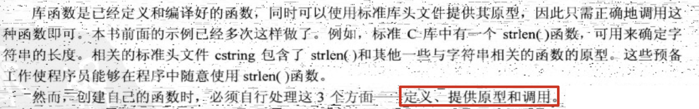

2. 可以将函数分成两类：没有返回值的函数和有返回值的函数。没有返回值的函数成为void函数。如果函数体中没有return，会该函数会默认在右花括号处结束。

   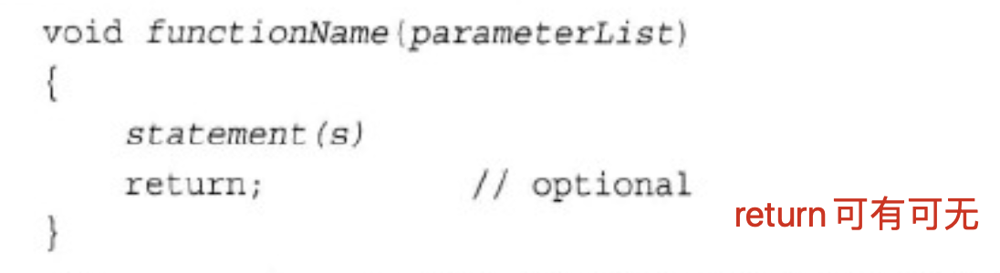

   有返回值的函数：

   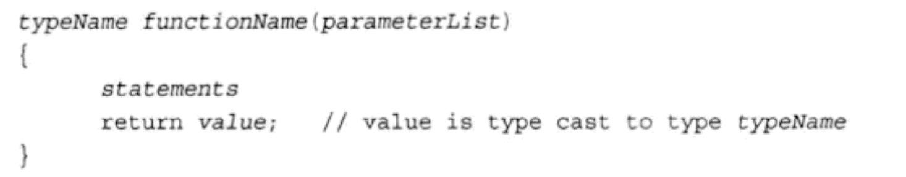

3. c++对于返回值的类型有一定限制：**不能是数组**。但可以是其他任何类型——整数、浮点数、指针，甚至是结构和对象。虽然C++函数不能直接返回数组，但是可以将数组作为结构或对象的组成部分来返回。

4. c++要求提供**函数原型**。原型描述了函数到编译器的接口，也就是说，它将函数返回值的类型以及参数的类型和数量告诉编译器。

   ```cpp
   // 函数原型(声明函数，在main之前)
   // 函数原型不要求提供变量名，有类型列表就足够了
   void func1(int);
   
   double func2(double);
   
   int main() {
       func1(1024);
       cout << func2(1.1) << endl;
   }
   
   // 函数定义
   void func1(int i) {
       cout << i << endl;
   }
   
   double func2(double x) {
       return x * x;
   }
   ```

   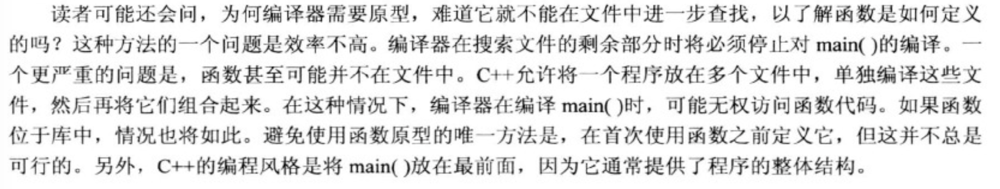

5. ```cpp
   void func3(void){
       
   }
   
   // 等价于
   // 推荐这种写法
   void func3(){
       
   }
   ```

6. 当一个函数有多个参数时，如果两个参数类型相同，必须分别指定每个参数的类型，不能像golang一样组合在一起：

   ```cpp
   void f1(int a, int b) // 可以
   void f1(int a,b)			// 不可以
   ```

7. 小tip：

   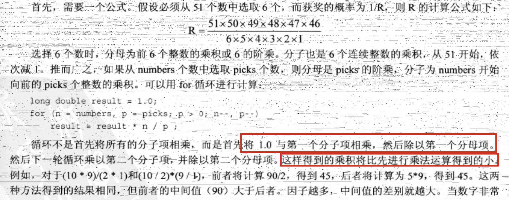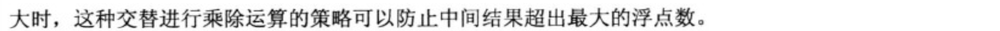

8. 计算数组中各元素的总和：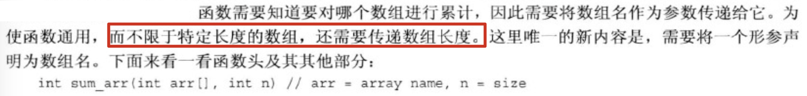

9. 关于数组名和指针：

   ```cpp
   		int arr[3] = {1, 2, 3};
       int *p_arr = arr;
       cout << arr << endl;			// 0x7ffee8af798c
       cout << &arr << endl;			// 0x7ffee8af798c，返回的是数组地址
       cout << &arr[0] << endl;	// 0x7ffee8af798c
       cout << p_arr << endl;		// 0x7ffee8af798c
   ```

10. 在c++中，当且仅当用于函数头或函数原型中，`int * arr`和`int arr[]`的含义才是相同的，他们都意味着arr是一个int指针，而数组表示法（int arr[]）提醒用户arr不仅指向int，还指向int数组的第一个元素。

    **当指针指向数组的第一个元素时，推荐使用数组表示法**。当指针指向一个独立的值时，推荐使用指针表示法。

    请记住下面两个恒等式：

    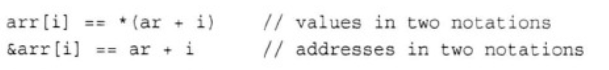

    对于遍历数组而言，使用指针加法和数组下标是等效的。

    注：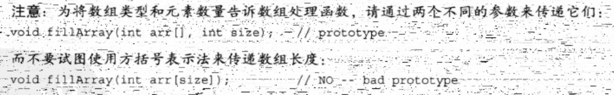

11. 由于c++传递数组名是传递指针，可以通过函数修改其内部的值。为了防止函数无意中修改数组的内容，可在声明形参时使用关键字const。

    ```cpp
    void show_array(const double arr[] , int n);
    ```

    这样，如果在show_array函数中做了修改数组元素值的操作时，编译器会报错。

12. 传统c/c++中处理数组的方法：将指向数组起始处的指针作为一个参数，将数组长度作为第二个参数（指针指出数组的位置和数据类型）。还有一种给函数提供信息的方法，即指定元素区间（range）。这可以通过传递两个指针来完成。一个指向数组开头，一个指向数组尾部。c++标准模板库（STL）将区间方法广义化。STL使用“超尾”的概念来指定区间。

    ```cpp
    int sum_arr(const int *begin, const int *end) {
        int total = 0;
        for (const int *pt = begin; pt != end; pt++) {
            total += *pt;
        }
        return total;
    }
    
    // 调用
    int arr[] = {1, 2, 3, 4, 5, 6, 7, 8, 9};
    cout << sum_arr(arr, arr + 9) << endl;
    // arr+9即是超尾，即区中最后一个元素后面的一个位置
    ```

    如何确定end？通俗的理解：end = begin + 数组长度。

13. const指针指向的值有时也可以修改：

    ```cpp
    		int a = 10;
        const int *p = &a;
        a += 1;
        cout << *p << endl;
    ```

    只是不能通过指针p来修改，直接通过变量a自身来修改是可以的。

14. ```cpp
    			// 可以
        const float f1 = 1.1;
        const float *p1 = &f1;
        
        // 不可以
        const float f2 = 1.1;
        float *p2 = &f2;
        // c++禁止将const地址赋值给非const指针
    ```

15. c++禁止将const地址赋值给非const指针，这意味着：不能将常量数组的数组名作为参数传递给使用非常量形参的函数：

    ```cpp
    const int arr[5]={1,2,3,4,5}
    // arr不能作为参数传给 int sum(int arr[], int n)
    ```

    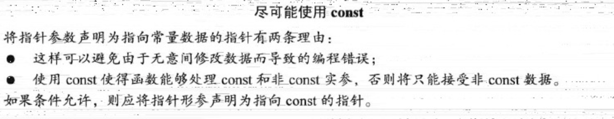

16. ```cpp
    		int a = 12;
        // 通过p1无法修改a的值
        const int *p1 = &a;
        // p2只能指向a,不能换成指向别的变量，但是允许通过p2修改a值
        int *const p2 = &a;
        		
        		// 可
        		p1 = &b;
        		// 不可
        p2 = &b;
    ```

    简而言之，p2和\*p1都是const，而\*p2和p1不是const。

17. 如果愿意，还可以声明指向const对象的const指针：

    ```cpp
    		double d = 1.024;
        const double *const p = &d;
        *p = 1;							// 不可
        double d1 = 2.048;
        p = &d1;						// 不可
    ```

    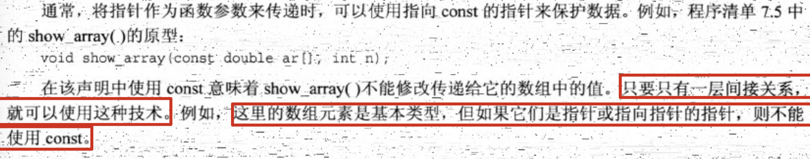

18. 函数与二维数组

    函数参数想要传入一个3行4列的二维数组，那么该形参要怎么声明？原型如下：

    ```cpp
    int sum(int (*arr)[4], int size);
    ```

    arr的类型为由4个int组成的数组的指针，所以arr是指针。即数组指针。还可以写成：

    ```cpp
    int sum(int arr[][4], int size);
    ```

    由于指针类型指定了列数，所以sum函数只能接受由4列组成的数组。形参size可以用来指定行数。

    所以形如：`int a[100][4]`和`int b[6][4]`都可以作为参数传入sum：

    ```cpp
    sum(a, 100);
    sum(b, 6);
    ```

    注意：`int *arr[4]`表示指针数组，即由4个指向int的指针构成的数组。可见c++的类型是从左往右逐层递进，`int *arr[4]`左是指针，右是数组，右侧决定性质，即数组。而`int (*arr)[4]`由于存在括号，所以括号内的类型决定性质，即指针。那是什么样的指针呢？指向由4个int（右侧）组成的数组。

    函数内遍历二维数组：

    ```cpp
    int sum(int arr[][4], int size) {
        int total = 0;
        for (int r = 0; r < size; r++) {
            for (int c = 0; c < 4; c++) {
                total += arr[r][c];
            }
        }
    
        return total;
    }
    ```

    说明：

    ```cpp
    arr								// 表示第一行数组（4个int组成）的地址
    arr + r     			// 表示第r行数组（4个int组成）的地址
    *(arr + r)  			// 表示第r行数组的第一个元素的地址,其实等同于arr+r
    *(arr + r)+c 			// 表示第r行第c列的元素的地址
    *(*(arr + r)+c)		// 表示第r行第c列的元素，等于arr[r][c]
    ```

    注：sum的参数声明arr没有使用const。因为const指针只能用于指向基本类型的指针，而arr是指向指针的指针。

19. c风格字符串作为参数的函数：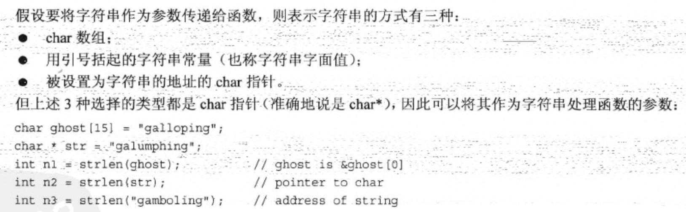

  可以说将字符串作为参数来传递时，实际传递的是字符串第一个字符的地址。这意味着字符串函数原型应将其表示字符串的形参声明为**char ***类型。
  
  c风格字符串与常规char数组之间的区别：字符串有结束字符，而常规char数组不以空值字符结尾。这意味着**不必将字符串长度作为参数传给函数**。
  
  检查一个c风格字符串中某字符出现的次数：
  
  ```cpp
  // 该函数不应该修改原字符串内容，所以声明形参类型使用了限定符const
  unsigned int c_in_str(const char *str, char ch) {
      unsigned int count = 0;
      // while的入口条件即可以检查字符串是否结束
      while (*str) {
          if (*str == ch) {
              count++;
          }
          str++;
      }
      return count;
  }
  
  // 也可以声明成
  unsigned int c_in_str(const char str[], char ch);
  ```
  
20. 返回c风格字符串函数：要创建包含n个字符的字符串，需要能够存储n+1个字符的空间（以\0结束），看下面的函数：

    ```cpp
    char *buildstr(char c, int n) {
        char *pstr = new char[n + 1];
        pstr[n] = '\0';
        while (n-- > 0) {
            pstr[n] = c;
        }
    
        return pstr;
    }
    ```

    但是不要忘记，在函数的外侧调用要记得释放内存：

    ```cpp
        char *pstr = buildstr('a', 2);
    		cout << pstr[0] << endl;
        cout << pstr[1] << endl;
        cout << pstr[2] << endl;
        delete [] pstr;
    ```

    第12章中将介绍c++类如何使用构造函数和析构函数来处理这些细节问题。

21. 可以将一个结构赋给另一个结构，同样也可以按照值传递就够。这种情况下，函数将使用原始结构的副本。结构名只是结构的名称，要获得结构地址必须使用地址运算符&。

22. 传递和返回结构：使用值传递，在进入函数时会创建副本。

    ```cpp
    struct test_time {
        int hours;
        int mins;
    };
    
    const int mins_per_hour = 60;
    
    test_time sum(test_time t1, test_time t2) {
        test_time total;
        total.mins = (t1.mins + t2.mins) % mins_per_hour;
        total.hours = t1.hours + t2.hours + (t1.mins + t2.mins) / mins_per_hour;
        return total;
    }
    ```

23. 传递结构的地址：

  ```cpp
  void show_time(const test_time *t) {
      cout << t->hours << endl;
      cout << t->mins << endl;
  }
  ```
  
24. 
  
  ```cpp
  void display(const string strs[], int n) {
      for (int i = 0; i < n; i++) {
          cout << strs[i] << endl;
      }
  }
  
  		const int SIZE = 3;
  		string strs[SIZE] = {"aaaaa", "bbbbbb", "cccccc"};
      display(strs, SIZE);
  		// 输出：
  		// 	aaaaa
  		// 	bbbbbb
      // 	cccccc
  ```
  
25. 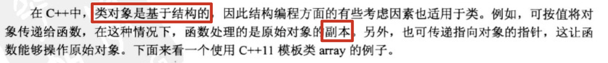

    ```cpp
    #include <array>
    using namespace std;
    
    void show(const array<double, 4> da) {
        for (int i = 0; i < da.size(); i++) {
            cout << da[i] << endl;
        }
    }
    
    void fill(array<double, 4> *da) {
      	// 由于要修改array的内在值，所以传递指针
        for (int i = 0; i < da->size(); i++) {
            cout << "input " << i + 1 << " double number:" << endl;
          	// 修改da中第i个元素的值
            cin >> (*da)[i];
        }
    }
    
    		array<double, 4> da;
        fill(&da);
        show(da);
    ```

    show函数存在的问题：为参数创建了一个副本，降低效率。

    array中还能存储对象：
    
    ```cpp
    struct test {
        string name;
        int age;
    };
    
    		array<test, 2> arr;
        arr[0] = test{"michael", 18};
        arr[1] = test{"kobe", 24};
        cout << &arr << endl;
    ```
    
26. 包含一个递归调用的调用

    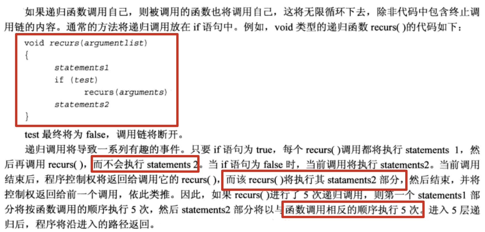

    例子：

    ```cpp
    void countdown(int n) {
        cout << "statement1 " << n << endl;
        if (n > 0)
            countdown(n - 1);
        cout << "statement2 " << n << endl;
    
    }
    
        countdown(3);
    // 输出：
    // statement1 3
    // statement1 2
    // statement1 1
    // statement1 0
    // statement2 0
    // statement2 1
    // statement2 2
    // statement2 3
    ```

    注意，每个递归调用都创建自己的一套变量，因此当程序到达第4次调用时，将有4个独立的n变量。改写程序将其地址打印：

    ```cpp
    void countdown(int n) {
        cout << "statement1 " << n << " (at " << &n << ')' << endl;
        if (n > 0)
            countdown(n - 1);
        cout << "statement2 " << n << " (at " << &n << ')' << endl;
    }
    	countdown(3);
    // 输出：
    // statement1 3 (at 0x7ffee647895c)
    // statement1 2 (at 0x7ffee647893c)
    // statement1 1 (at 0x7ffee647891c)
    // statement1 0 (at 0x7ffee64788fc)
    // statement2 0 (at 0x7ffee64788fc)
    // statement2 1 (at 0x7ffee647891c)
    // statement2 2 (at 0x7ffee647893c)
    // statement2 3 (at 0x7ffee647895c)
    ```

27. 包含多个递归调用的递归

    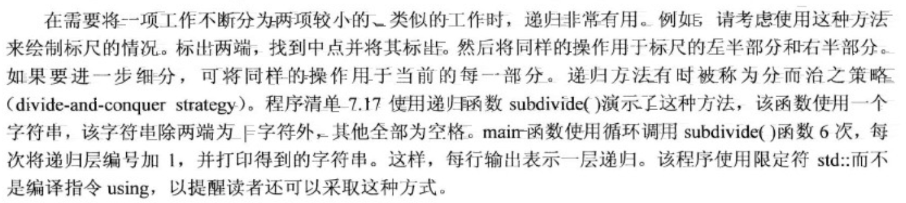

    ```cpp
    
    ```

    

