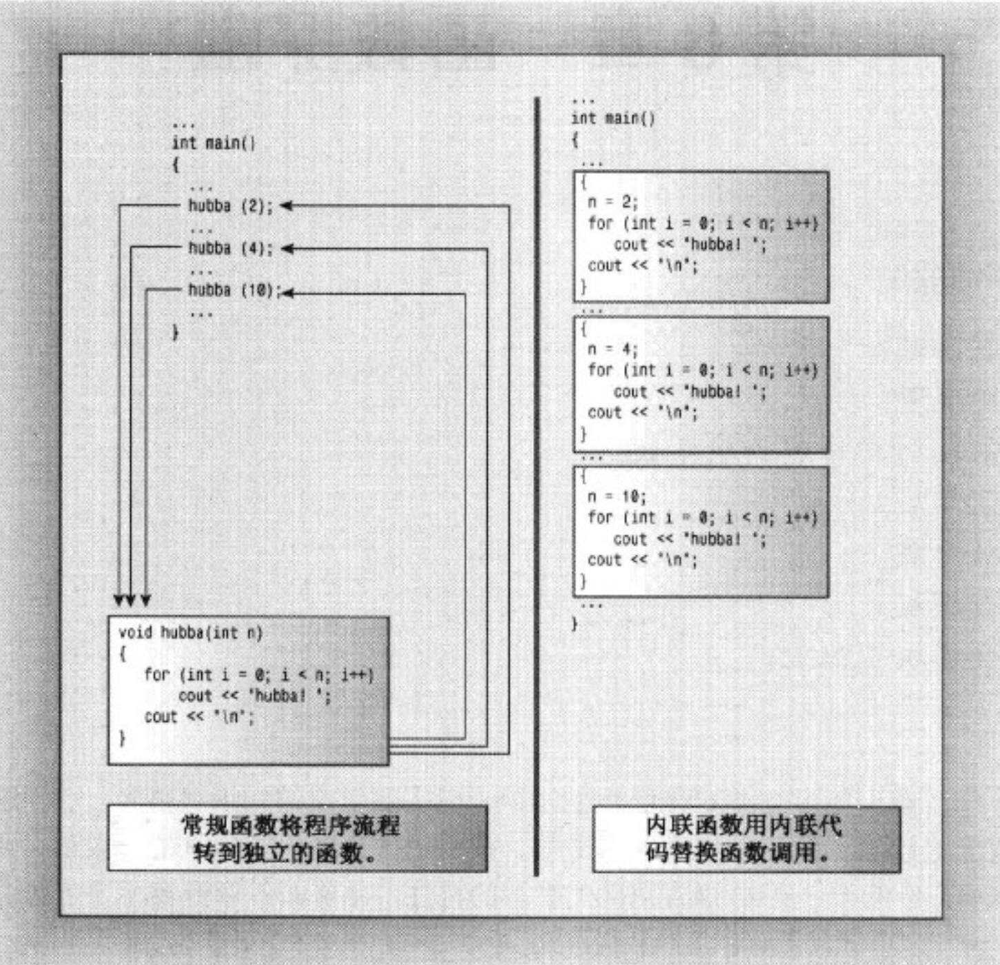
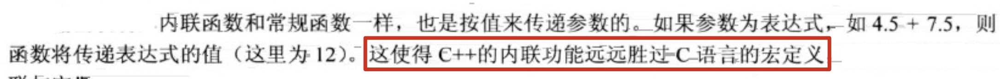
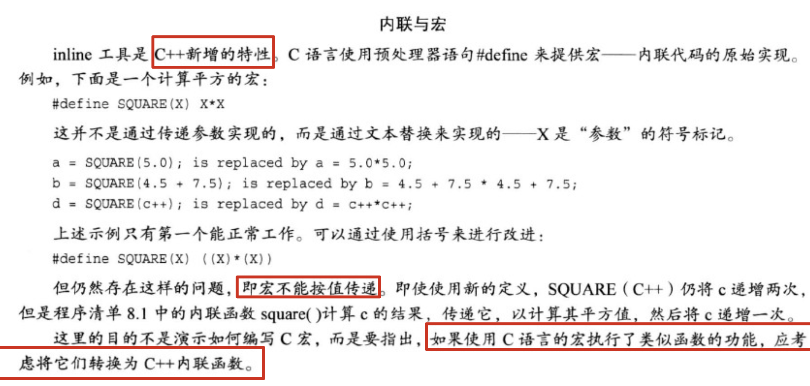

## 7.函数探幽

1. 内联函数：编译器将使用相应的函数代码替换函数调用。对于内敛代码，程序无需跳到另一个位置执行代码然后再调回来。因此，内联函数的运行速度比常规函数稍**快**，但是代价是需要占用**更多内存**。如果程序在10个不同的地方调用同一个内联函数，则该程序将包括该函数代码的10个副本：

   

2. 应有选择地使用内联函数。如果执行函数的时间比处理函数调用机制的长，则节省的时间将只占整个过程的很小一部分。**如果代码执行时间短，则内联调用就可以节省非内联调用使用的大部分时间**。该过程非常快，因此节省了该过程的大部分时间，但是节省的时间绝对值并不大，**除非该函数经常被调用**。

3. 使用内联特性：

4. 

5. 

6. 

7. 