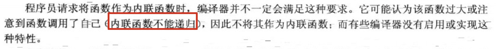

## 7.函数探幽

1. 内联函数：编译器将使用相应的函数代码替换函数调用。对于内敛代码，程序无需跳到另一个位置执行代码然后再调回来。因此，内联函数的运行速度比常规函数稍**快**，但是代价是需要占用**更多内存**。如果程序在10个不同的地方调用同一个内联函数，则该程序将包括该函数代码的10个副本：

   

2. 应有选择地使用内联函数。如果执行函数的时间比处理函数调用机制的长，则节省的时间将只占整个过程的很小一部分。**如果代码执行时间短，则内联调用就可以节省非内联调用使用的大部分时间**。该过程非常快，因此节省了该过程的大部分时间，但是节省的时间绝对值并不大，**除非该函数经常被调用**。

3. 使用内联特性：

4. 

5. 

6. 

7. 引用变量：

   创建引用变量：

   ```cpp
   		int n = 1024;
       // ref_n 为引用变量
       int &ref_n = n;
       // 通过引用变量修改n的值
       ref_n = 1025;
       cout << n << endl;	// 1025
   		// 地址相同
   		cout << &n << endl;				// 0x7ffeea9c496c
       cout << &ref_n << endl;		// 0x7ffeea9c496c
   ```

   &不是地址运算符，而是类型标识符的一部分。就像声明中的char*指的是指向char的指针一样，int &指的是指向int的引用。上述引用声明允许将ref_n和n互换，它们指向相同的值和内存单元。

8. 引用看上去很像伪装表示的指针。差别之一是：必须在声明引用时将其初始化，不能像指针那样可以先声明，再赋值：

9. 

10. ```cpp
   		int n = 1024;
       int &ref_n = n;
       int a = 2048;
       cout << &n << endl;				// 0x7ffee5adb96c
       cout << &ref_n << endl;		// 0x7ffee5adb96c
       cout << &a << endl;				// 0x7ffee5adb95c
   
       // 并不是ref_n变成了a的引用（因为ref_n已经初始化成为了n的引用）
       ref_n = a;  // 相当于 n = a;
   		// n、ref_n和a的地址都没有改变，只有n对应的值改变了
       cout << &n << endl;				// 0x7ffee5adb96c
       cout << &ref_n << endl;		// 0x7ffee5adb96c
       cout << &a << endl;				// 0x7ffee5adb95c
       cout << n << endl;				// 2048
       cout << ref_n << endl;		// 2048
       cout << a << endl;				// 2048
   ```

11. 将引用用作函数参数：

    ```cpp
    void swap(int &a, int &b) {
      	// 此处形参a的地址和传入的n1地址一样
        int temp;
        temp = a;
        a = b;
        b = temp;
    }
    
    		int n1 = 1;
        int n2 = 2;
        swap(n1, n2);
        cout << n1 << endl;		// 2
        cout << n2 << endl;		// 1
    ```

12. 如果想让函数用引用作为参数（提高效率，避免制造副本），但是又不想让函数中的操作对该引用进行修改。可以使用const：

    ```cpp
    double cube(const double &d) {
      	// 此处编译将报错，因为其试图修改引用的值
        d *= d * d;
        return d;
    }
    ```

    注：函数传参使用基本数值类型时，应采用**按值传递**的方式。当数据比较大（如结构和类），**引用参数**将很有用。

13. 使用引用变量做形参的限制：

    ```cpp
    double cube(double &d) {
        return d * d * d;
    }
    
    		// 下列传参会报错
    		// 12.2为字面量，并不是变量
    		double d = cube(12.2);
    		
    		// d + 11 是表达式，不是变量。
    		double d = 1.024;
        cube(d + 1.1);
    		
    ```

    

