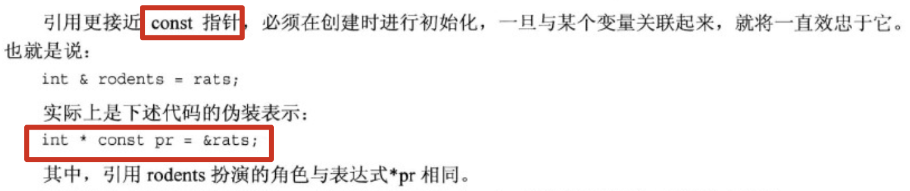

## 7.函数探幽

1. 内联函数：编译器将使用相应的函数代码替换函数调用。对于内敛代码，程序无需跳到另一个位置执行代码然后再调回来。因此，内联函数的运行速度比常规函数稍**快**，但是代价是需要占用**更多内存**。如果程序在10个不同的地方调用同一个内联函数，则该程序将包括该函数代码的10个副本：

   

2. 应有选择地使用内联函数。如果执行函数的时间比处理函数调用机制的长，则节省的时间将只占整个过程的很小一部分。**如果代码执行时间短，则内联调用就可以节省非内联调用使用的大部分时间**。该过程非常快，因此节省了该过程的大部分时间，但是节省的时间绝对值并不大，**除非该函数经常被调用**。

3. 使用内联特性：

4. 

5. 

6. 

7. 引用变量：

   创建引用变量：

   ```cpp
   		int n = 1024;
       // ref_n 为引用变量
       int &ref_n = n;
       // 通过引用变量修改n的值
       ref_n = 1025;
       cout << n << endl;	// 1025
   		// 地址相同
   		cout << &n << endl;				// 0x7ffeea9c496c
       cout << &ref_n << endl;		// 0x7ffeea9c496c
   ```

   &不是地址运算符，而是类型标识符的一部分。就像声明中的char*指的是指向char的指针一样，int &指的是指向int的引用。上述引用声明允许将ref_n和n互换，它们指向相同的值和内存单元。

8. 引用看上去很像伪装表示的指针。差别之一是：必须在声明引用时将其初始化，不能像指针那样可以先声明，再赋值：

9. 

10. ```cpp
   		int n = 1024;
       int &ref_n = n;
       int a = 2048;
       cout << &n << endl;				// 0x7ffee5adb96c
       cout << &ref_n << endl;		// 0x7ffee5adb96c
       cout << &a << endl;				// 0x7ffee5adb95c
      
       // 并不是ref_n变成了a的引用（因为ref_n已经初始化成为了n的引用）
       ref_n = a;  // 相当于 n = a;
      		// n、ref_n和a的地址都没有改变，只有n对应的值改变了
       cout << &n << endl;				// 0x7ffee5adb96c
       cout << &ref_n << endl;		// 0x7ffee5adb96c
       cout << &a << endl;				// 0x7ffee5adb95c
       cout << n << endl;				// 2048
       cout << ref_n << endl;		// 2048
       cout << a << endl;				// 2048
     ```
   ```

11. 将引用用作函数参数：

    ```cpp
    void swap(int &a, int &b) {
      	// 此处形参a的地址和传入的n1地址一样
        int temp;
        temp = a;
        a = b;
        b = temp;
    }
    
    		int n1 = 1;
        int n2 = 2;
        swap(n1, n2);
        cout << n1 << endl;		// 2
        cout << n2 << endl;		// 1
   ```

12. 如果想让函数用引用作为参数（提高效率，避免制造副本），但是又不想让函数中的操作对该引用进行修改。可以使用const：

    ```cpp
    double cube(const double &d) {
      	// 此处编译将报错，因为其试图修改引用的值
        d *= d * d;
        return d;
    }
    ```

    注：函数传参使用基本数值类型时，应采用**按值传递**的方式。当数据比较大（如结构和类），**引用参数**将很有用。

13. 使用引用变量做形参的限制：

    ```cpp
    double cube(double &d) {
        return d * d * d;
    }
    
    		// 下列传参会报错
    		// 12.2为字面量，并不是变量
    		double d = cube(12.2);
    		
    		// d + 11 是表达式，不是变量。
    		double d = 1.024;
        cube(d + 1.1);	
    ```

    上面是由于实参与引用参数不匹配。c++只有在一种情况下才允许——仅当参数为const引用时：

    ```cpp
    double cube(const double &d) {
        return d * d * d;
    }
    
    		// 可以通过编译
    		double d = cube(1.1);
    ```

    编译器将在为传入的参数1.1创建临时变量。

14. 将引用参数声明为常量的引用的理由有三个：

    

    因此，**应尽可能将引用形参声明为const**。

15. 

16. 将引用用于结构：

    ```cpp
    struct test {
        string name;
        int age;
    };
    
    void show_test(const test &t) {
        cout << t.name << endl;
        cout << t.age << endl;
    }
    
    		test t = {"michael.w", 18};
        show_test(t);
    		// 在show_test中的形参就是t，地址是一样的(因为是引用参数)
    ```

17. 当引用作为函数返回值：

    ```cpp
    int &fun(int &i) {
        i += 1;
        cout << i << endl;
        return i;
    }
    
    		int i = 1024;
    		// 可以这样写：值在函数fun中变成1025，被函数返回后又变成100（很有意思的写法）
        fun(i) = 100;
        cout << i << endl;
    		// 输出：
    		// 1025
    		// 100
    ```

    返回应用时需要注意的问题：

    ```cpp
    struct test {
        string name;
        int age;
    };
    
    test &func(test &t) {
        test tmp = t;
      	// 当函数func结束后，tmp对应的内存单元将不存在
        return tmp;
    }
    
    		test t = {"michael.w"};
        test t1 = func(t);
    		// t1内成员将是随机值
        cout << t1.name << endl;	// 输出：9#���8#���Μ�
    ```

18. 将c风格字符串用作string对象引用参数

    ```cpp
    string func(const string &str1, const string &str2) {
        return str1 + str2;
    }
    
    			cout << func("abcd", "1234") << endl;
    ```

    两个形参str1和str2类型都是string &，但是实参是字符串字面量，即const char*。这为什么可以呢？

    

    ```cpp
        string s = "michael";
        cout << func(s, "1234") << endl;
    ```

    再看一个函数：

    ```cpp
    const string &func1(string &str1, const string &str2) {
        str1 += str2;
        return str1;
    }		
    
    		string res;
        string str1 = "michael";
    
        res = func1(str1, "111");
    		// 等价于
    		func1(str1, "111");
    		res = str1;
    ```

    注意：

    ```cpp
    const string &func1(const string &str1, const string &str2) {
        string temp = str1 + str2;
      	// 注：temp在函数内部被创建，离开函数后内存空间自动释放
        return temp;
    }
    
        string str = func1("1", "222");
        cout << str << endl;	// 输出为空
    ```

19. 基类引用可以指向派生类对象，即父类引用可以指向其子类：

    ```cpp
    #include <fstream>
    // ostream是基类，os既可以指向ostream对象(cout)，也可以指向ofstream对象(fout)。
    void func(ostream &os, double fo) {
        // 保存原始的配置
        ios_base::fmtflags initial = os.setf(ios_base::fixed);
        // 进行新的配置
        os.precision(1);
        os << "michael.w";
        // 设置输出内容宽度
        os.width(10);
        os << fo << endl;
        // 恢复配置
        os.setf(initial);
    }
    
    
        ofstream fout;
        fout.open("./test.txt");
        if (!fout.is_open()) {
            cout << "not open" << endl;
            exit(EXIT_FAILURE);
        }
        double d = 1024.1024;
        // 屏幕输出
        func(cout, d);
        // 写文件
        func(fout, d);
    
    		// 输出：michael.w    1024.1
    ```

    

20. 使用引用参数的主要原因有二：

    什么时候使用引用？什么时候使用指针？什么时候使用值传递？

    

21. 默认参数：

    设置默认值：

    在设计类时将发现：通过使用默认参数可以减少定义的析构函数、方法以及方法重载的数量。

22. 函数重载：

    函数特征标：

    看下列语句：

    注：在定义这样的函数时：

    ```cpp
    void func1(int i) {
        cout << "int" << endl;
        cout << i << endl;
    }
    
    void func1(long l) {
        cout << "long" << endl;
        cout << l << endl;
    }
    ```
    
    会编译出错：
    
    ```shell
    [ 33%] Building CXX object CMakeFiles/test.dir/main.cpp.o
    /Users/oker/code/c++/test/main.cpp:473:6: error: redefinition of 'func1'
    void func1(int i) {
         ^
    /Users/oker/code/c++/test/main.cpp:166:6: note: previous definition is here
    void func1(int i) {
         ^
    1 error generated.
    ```
    
    编译器会认为以上两个函数无法进行重载，其本质是一个函数。在进行：
    
    ```cpp
        short s = 100;
        func1(s);
    ```
    
    将无法获知该将short强制转换成int还是long，并进行函数的重载调用。
    
23. 函数重载匹配函数时，并不区分const和非const变量：

    

24. 函数是否可以进行重载是看**特征标**，而不是看返回值：

    ```cpp
    int func1(int i) {
    }
    
    long func1(int i) {
    }
    ```

    这两个函数定义是无法进行重载的，编译出错。函数重载的返回类型既可以相同，也可以不相同，但是特征标必须不相同。

25. 重载引用参数：

    

26. 何时使用函数重载：

  看情况在默认参数与函数重载二选一。选择函数重载后，一旦需要修改该函数内的逻辑时，需要修改多个函数（所有进行重载的函数）。

27. 名称修饰：

    

28. 函数模板：

    比如实现一个在两个相同类型之间交换值的函数：

    ```cpp
    // 函数原型声明
    template<typename T>
    void func_swap(T &t1, T &t2);
    
    int main() {
    		double d1 = 1.1;
        double d2 = 10.1;
        func_swap(d1, d2);
        cout << d1 << endl;		// 10.1
        cout << d2 << endl;		// 1.1
    }
    
    // 函数定义
    template<typename T>
    void func_swap(T &t1, T &t2) {
        T temp = t1;
        t1 = t2;
        t2 = temp;
    }
    ```

    
