## 8. 内存模型和名称空间

1. 单独编译：

2. 如果多个文件都使用了同一种struct，那是要在每一个文件中都复制一份struct的声明么？

3. 请不要将**函数定义**或**变量声明**放到头文件中！如果头文件包含一个函数的定义，然后在其他两个文件（属于同一个程序）中包含该头文件，则同一个程序中将包含同一个函数的两个定义。除非函数是内联的，否则将出错。

4. 头文件中常包含：

   

5. 关于头文件的包含方式：

   

6. 头文件举例：

   头文件`coordin.h`：

   ```cpp
   #ifndef COORDIN_H_
   #define COORDIN_H_
   
   struct polar {
       double distance;
       double angle;
   };
   
   struct rect {
       double x;
       double y;
   };
   
   polar rect_to_polar(rect xypos);
   
   void show_polar(polar dapos);
   
   #endif
   ```

   源代码文件`coordin.cpp`：

   ```cpp
   #include "coordin.h"
   #include <cmath>
   #include <iostream>
   
   using namespace std;
   
   // 定义coordin.h中声明的函数
   polar rect_to_polar(rect xypos) {
       polar answer;
       answer.distance = sqrt(xypos.x * xypos.x + xypos.y * xypos.y);
       answer.angle = atan2(xypos.y, xypos.x);
       return answer;
   }
   
   void show_polar(polar dapos) {
       const double Rad_to_deg = 57.29577951;
       cout << "distance = " << dapos.distance;
       cout << ", angle = " << dapos.angle * Rad_to_deg << " degrees" << endl;
   }
   ```

   源代码文件main.cpp：

   ```cpp
   #include "coordin.h"
   
   int main() {
       rect rplace = rect{4, 3};
       polar pplace = rect_to_polar(rplace);
       show_polar(pplace);
   }
   
   // 输出：
   // distance = 5, angle = 36.8699 degrees
   ```

   注：一个.h头文件往往都配有一个同文件名的.cpp文件，来定义.h头文件中的函数原型。

7. cpp文件的编译流程：

8. 头文件管理：

   

   通过#define定义一个同**头文件名相同的常量符号**就会为了让编译器快速得知该头文件在当前有没有被包含过，如果该变量已经被定义，说明该头文件已经被包含过了。

9. 

10. 多个库的链接

   

11. c++使用三种（c++11中是四种）不同的方案来存储数据：

    

12. 作用域（scope）：描述了名称在文件（单元）的多大范围内可见。例如：函数中定义的变量可在该函数中使用，但不能在其他函数中使用；在文件中的函数定义之前定义的变量则可在所有函数中使用。

13. 链接性（linkage）：描述了名称如何在不同单元间共享。链接性为**外部**的名称可在文件间共享，链接性为**内部**的名称只能由一个文件中的函数共享。自动变量的名称没有链接性，因为它们不能共享。

14. 

    如果同名，代码块内的变量名将屏蔽代码块外的变量名：

    

15. 关于auto关键字：

    c++11中关键字auto用于自动类型推断。但在c语言和以前的c++版本中，auto的含义截然不同，它用于显式地指出变量为自动存储（即局部自动变量）:

    ```cpp
    		// c语言和以前的c++版本中
    		auto float ford;
        // 等价于
        float ford;
    ```

    因此程序员几乎不使用它。

16. 

    栈传递参数示意图：

    

17. 寄存器变量：

18. 静态持续变量：

    如何创建三种不同链接性的静态持续变量：

    注：上述代码中的global、one_file和count在整个程序执行期间都存在。count在函数内部定义，无链接性，所以只能在funct1函数内部使用它。global和one_file作用域都是真个文件。由于one_file为内部链接性，因此只能在上述代码文件中使用它。而global（外部链接性）在其他程序文件中也可以使用。

    
    
19. 静态变量的初始化：

    ```cpp
    #include <cmath>
    
    int x;                  // 零初始化
    int y = 5;              // 常量表达式初始化
    long z = 13 * 13;       // 常量表达式初始化
    const double pi = 4.0 * atan(1.0);  // 动态初始化
    ```

    初始化pi必须调用函数atan()，这需要等到该函数被链接并且程序执行时。

    

    注：c++11新增了关键字`constexpr`，这增加了创建**常量表达式**的方式。这里不会相信介绍该特性。

20. 

    在每个使用外部变量的文件中，都必须声明它。由于c++要求每个变量只能由一次定义。为满足这种需求，c++提供了两种变量声明：

    - 定义声明（defining declaration）或简称为定义（definition）：它给变量分配存储空间；
    - 引用声明（referencing declaration）或简称为声明（declaration）：它不给变量分配存储空间。

    引用声明使用关键字**extern**，且不进行初始化：

    ```cpp
    double up;              // 定义，up的值为0（零值初始化）
    extern int blem;        // 声明，blem在别处被定义
    extern char gr = 'r';   // 定义
    ```

    

    注：在file01.cpp中定义cats时的extern，是可以省略的。

21. 假设当函数中局部变量与外部变量同名：

    ```cpp
    int num = 1024;
    
    int main() {
        int num = 2048;	// 局部同名变量将屏蔽全局变量
        cout << num << endl;
      	// ::num表示全局版本的num变量。如果在局部变量名与全局变量名不发生冲突时（没有叫num的局部变量），num直接表示全局变量
        cout << ::num << endl;
    }
    ```

    c++比c语言更进一步——提供了作用域解析运算符`::`。放在变量名前面时，该运算符表示使用变量的全局版本。

22. 全局变量和局部变量的选择：

23. 如果文件定义了一个静态外部变量，其名称与另一个文件中声明的常规外部变量相同，则在该文件中静态变量将隐藏常规外部变量：

    ```cpp
    // file1
    int i = 1;      // 外部变量定义
    
    // file2
    static int i = 5;		// 在file2中，将只能看见该静态外部变量而看不到file1中的i
    void func(){
      cout << i; // 输出5
    }
    ```

    

24. 可使用外部变量在**多个文件程序的不同部分**之间共享数据；可使用链接性为内部的静态变量在**同一个文件中的多个函数**之间共享数据（名称空间提供了另外一种共享数据的方法）。

25. 将static限定符用于代码块中定义变量，将导致局部变量的存储持续性为**静态**的。虽然该变量只在该代码块中可用，但它在该代码块不处于活动状态时仍然存在。另外，如果初始化了静态局部变量，则程序只在启动时进行一次初始化。以后再调用函数时不会像自动变量那样再次被初始化：

    ```cpp
    void func(const char chs[]) {
      	// 静态局部变量。函数结束后，该变量仍然后存在。
        static int total;
        total += strlen(chs);
        cout << total << endl;
    }
    		func("abc");
        func("michael");
        func("z");
    		// 输出：
    		//	3
    		//  10
    		//	11
    ```

    所以静态局部变量total将记录所有传入过func函数的字符串长度之和。

26. cv-限定符

    - const
    - volatile

    最常用的cv-限定符就是const，表明内存被初始化后，程序便不能再对它进行修改。

    volatile表明即使代码没有对内存单元进行修改，其值也可能发生变化。例如：

    1.将一个指针指向某个硬件位置，其中包含了来自串行端口的时间或信息。这种情况下，硬件（而不是程序）可能修改其中的内容；

    2.两个程序可能相互影响共享数据。

    该关键字的作用是为了改善编译器的优化能力。例如假设编译器发现程序在几条语句中两次使用了某个变量的值，则编译器可能不是让程序查找这个值两次，而是将这个值缓存到寄存器中。这种优化假设变量的值在这两次使用之间不会改变。如果不将变量声明为volatile，则编译器将进行这种优化；将变量声明为volatile相当于告诉编译器不要进行这种优化。

27. mutable

    

    ```cpp
    		const data d = {"michael", 20};
        strcpy(d.name, "aaa");	// 编译报错
        d.accesses++;	// 编译器允许
    ```

    d的const限定符禁止程序修改mutable，但accesses成员的mutable说明符使得accesses不受到这种限制。   

28. 

    ```cpp
    const int i = 10; // 等价于static const int i = 10;
    
    int main() {
    		......
    }
    ```

    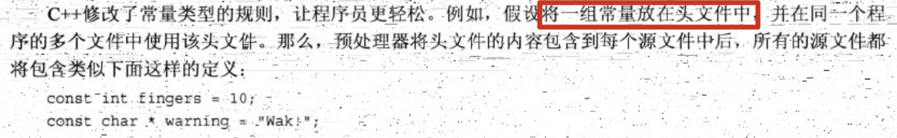

29. 为什么const声明的链接性不能像常规变量那样是外部的呢？

    因为根据单定义规则，只能有一个文件可以包含前面的声明，而其他文件必须使用extern关键字来提供引用声明。另外，只有未使用extern关键字的声明才能进行初始化：

    ```cpp
    // 假设：使用别的文件定义“全局const变量”的声明
    extern const int i;
    ```

    所以各个文件要做的声明是不一样的。自己文件定义的“全局const变量”不要extern，别的文件定义的则需要。而如果const定义的链接性为内部时，所有文件中可以使用相同的声明。

    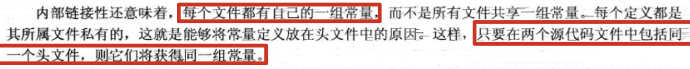

30. 如果出于某种原因，程序员希望某个常量的链接性为外部，则可以使用extern关键字来覆盖默认的内部链接性：

    ```cpp
    extern const int i = 1024;		// 定义为外部链接性
    ```

    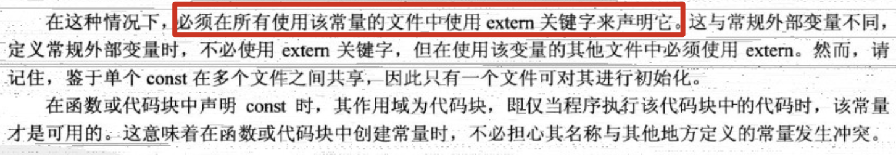

31. 函数的链接性：

    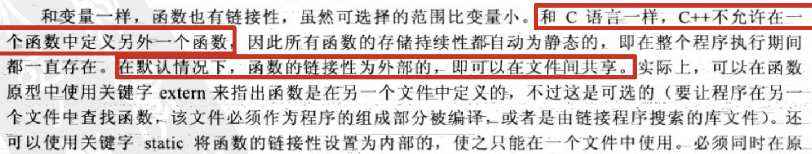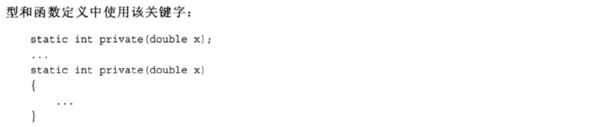

    这意味该函数只在这个文件中可见，并且在别的文件中可以定义同名的函数。和变量一样，在定义静态函数的文件中，静态函数将覆盖外部定义。因此即使在外部定义了同名函数，该文件仍将使用静态函数。

32. 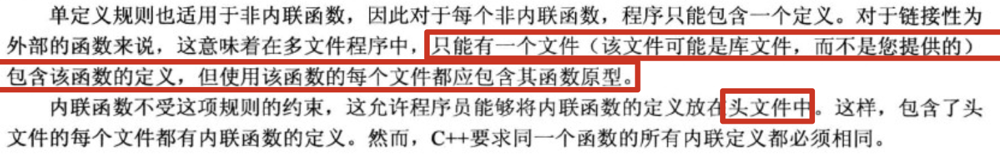

33. c++在哪里查找函数？

    

34. 语言链接性

    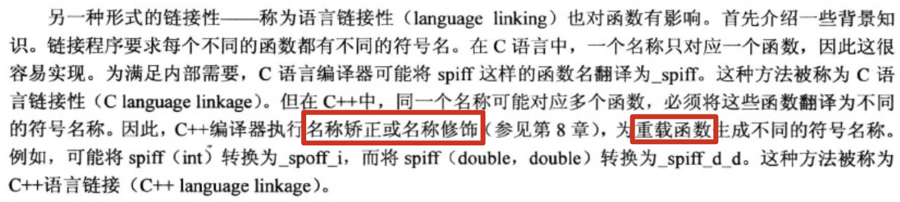

    链接程序寻找与c++函数调用匹配的函数与c语言不通。但是如果在c++程序中使用c库中预编译的函数可能会出现一些问题：

    ```cpp
    spiff(22); // 在c++调用c库中的spiff(int)函数
    ```

    spiff在c库文件中的符号名称为`_spiff`。但是对于c++程序而言，它在查找的符号名称为`_spiff_i`。为解决该问题，需要用函数原型来指出要使用的约定：

    ```cpp
    extern "C" void spiff(int); 	// 使用c语言链接性
    extern void spiff(int);     	// 使用c++语言链接性
    extern "C++" void spiff(int);	// 使用c++语言链接性
    ```

    第二个原型通过默认方式指出这一点，而第三个显式地指出这一点。

35. 前面介绍的c++用来为变量分配内存的5种方案（线程内存除外）并不适用于c++的运算符new（或c函数malloc()）分配的内存。这种内存被称为动态内存。由于动态内存是由运算符new和delete控制，而不是由作用域和链接性规则控制。因此可以在一个函数中分配动态内存，而在另一个函数中将其释放。与自动内存不同，动态内存不是LIFO（栈），其分配和释放要取决于new和delete在何时以何种方式被使用。

    通常，编译器使用3块独立内存：一块用于**静态变量**，一块用于**自动变量**，第三块用于**动态存储**。

    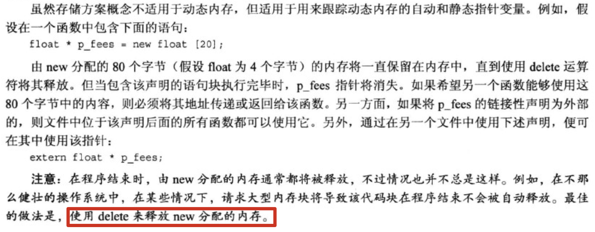

36. 如何使用new运算符初始化：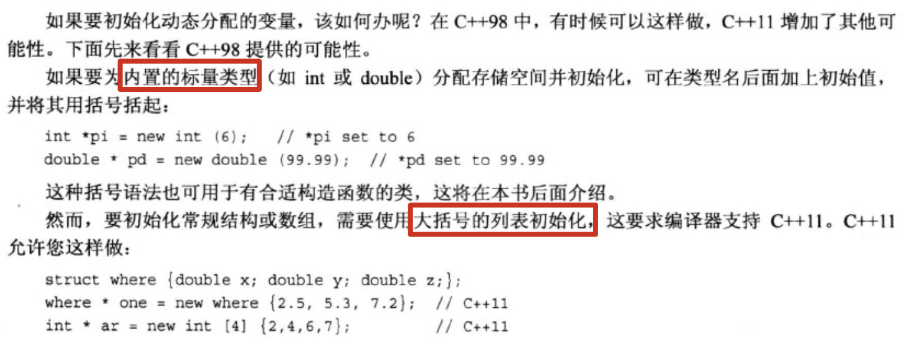

    在c++11中，还可以将**列表初始化**用于单值变量：

    ```cpp
    int *p_i = new int{6};		// *p_i 为 6
    double *p_d = new double{1.1};	// *p_d 为 1.1
    ```

37. new失败时：

    

38. new和delete的执行：

    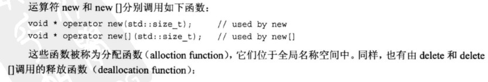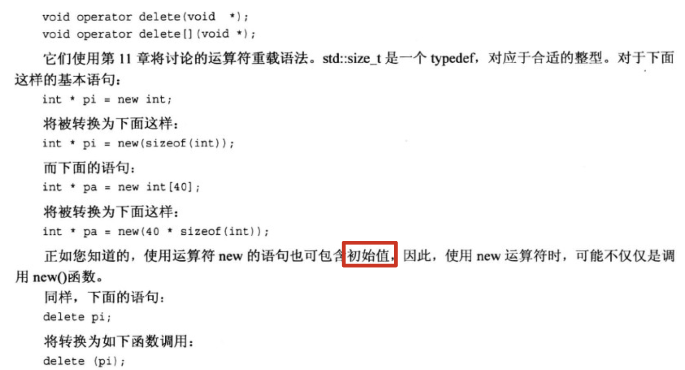

    c++将这些函数成为**可替换的**（replaceable）。这意味着如果你有足够的知识和意愿，可为new和delete提供替换函数，并根据需求对其进行定制。比如：可定义作用域为类的替换函数并对其进行定制以满足该类的内存分配需求。在代码中仍将使用new运算符，但它将调用你自己定义的new()函数。

39. 定位new运算符：

    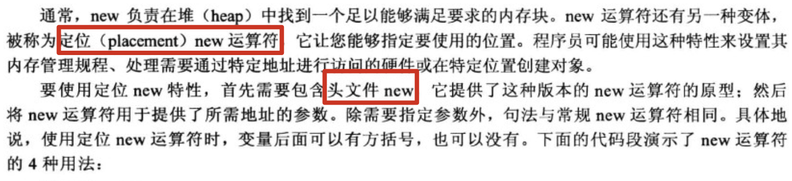

  ```cpp
  #include <new>
  
  struct test {
      char chs[20];
      int i;
  };
  
  char buffer1[50];
  char buffer2[500];
  
  int main() {
      test *t1, *t2;
      int *p1, *p2;
      // 常规的new
      t1 = new test;      // 将test对象存入堆中
      p1 = new int[20];   // 将int数组对象存入堆中
  
      // 使用定位new
      t2 = new(buffer1) test;     // 将test对象存入buffer1中
      p2 = new(buffer2) int[20];  // 将int数组对象存入buffer2中
  }
  ```

  上面例子中使用两个静态数组buffer1和buffer2来为定位new运算符提供内存空间。所以从buffer1中分配空间给结构test，从buffer2中分配空间给一个包含20个元素的int数组。

  看一段实际的程序demo：

  ```cpp
  #include <new>
  
  const int BUF = 512;
  const int N = 3;
  char buffer[BUF];
  
  int main() {
      double *pd1, *pd2;
      pd1 = new double[N];
      pd2 = new(buffer) double[N];
    	cout << "buffer addr:" << endl;
      cout << (void *) buffer << endl;
    	// 输出：
    	// buffer:
  		// 0x102ae50f0
      for (int i = 0; i < N; i++)
          pd1[i] = pd2[i] = 1000 * i;
  
      cout << "pd1:" << endl;
      for (int i = 0; i < N; i++)
          cout << pd1[i] << " at " << &pd1[i] << endl;
    	// 输出：
    	// pd1:
  		// 0 at 0x7f87b0c059a0
  		// 1000 at 0x7f87b0c059a8
  		// 2000 at 0x7f87b0c059b0
  
      cout << "pd2:" << endl;
      for (int i = 0; i < N; i++)
          cout << pd2[i] << " at " << &pd2[i] << endl;
    	// 输出：
  		// pd2:
  		// 0 at 0x102ae50f0
  		// 1000 at 0x102ae50f8
  		// 2000 at 0x102ae5100
  
      double *pd3, *pd4;
      pd3 = new double[N];
      pd4 = new(buffer) double[N];
      for (int i = 0; i < N; i++)
          pd3[i] = pd4[i] = 1000 * i;
  
      cout << "pd3:" << endl;
      for (int i = 0; i < N; i++)
          cout << pd3[i] << " at " << &pd3[i] << endl;
  		// 输出：
  		// pd3:
  		// 0 at 0x7f87b0c05a60
  		// 1000 at 0x7f87b0c05a68
  		// 2000 at 0x7f87b0c05a70
      cout << "pd4:" << endl;
      for (int i = 0; i < N; i++)
          cout << pd4[i] << " at " << &pd4[i] << endl;
    	// 输出：
  		// pd4:
  		// 0 at 0x102ae50f0
  		// 1000 at 0x102ae50f8
  		// 2000 at 0x102ae5100
    	// 注：地址与d2完全相同
  
      delete[]pd1;
      pd1 = new double[N];
      pd2 = new(buffer + N * sizeof(double)) double[N];
      for (int i = 0; i < N; i++)
          pd1[i] = pd2[i] = 1000 * i + 1;
  
      cout << "pd1:" << endl;
      for (int i = 0; i < N; i++)
          cout << pd1[i] << " at " << &pd1[i] << endl;
      // 输出：
  		// pd1:
  		// 1 at 0x7f87b0c059a0
  		// 1001 at 0x7f87b0c059a8
  		// 2001 at 0x7f87b0c059b0
      cout << "pd2:" << endl;
      for (int i = 0; i < N; i++)
          cout << pd2[i] << " at " << &pd2[i] << endl;
    	// 输出
    	// pd2:
  		// 1 at 0x102ae5108
  		// 1001 at 0x102ae5110
  		// 2001 at 0x102ae5118
    	// 注：地址都是接着pd4
    	delete[]pd1;
      delete[]pd3;
  }
  ```

  定位new运算符将数组p2放在了数组buffer中，p2和buffer的地址都是0x102ae50f0。p1是double指针，buffer是char指针，这也是为什么在打印的时候要使用(void *)对buffer进行强制转换（因为不这么做，cout<<buffer将直接打印buffer中的char组成的字符串）。

  常规new将数组p1放到很远的地方0x7f87b0c059a0，位于动态管理的堆中。

  第三次调用定位new运算符时，提供了一个从数组buffer开头算起的偏移量：

  ```cpp
  pd2 = new(buffer + N * sizeof(double)) double[N]; // 40字节的偏移量
  ```

  注：可以通过delete来释放常规new运算符创建出来的内存。那delete可以用来释放**定位new运算符**分配的内存么？不可以！因为buffer指定的内存是静态内存，而delete只能用于常规new运算符分配的堆内存。也就是说：数组buffer位于delete的管辖区之外。

  ```cpp
  delete[]pd2； // 将引发错误
  ```

  错误提示：

  ```
  test(80964,0x10d254e00) malloc: *** error for object 0x102ae5108: pointer being freed was not allocated
  test(80964,0x10d254e00) malloc: *** set a breakpoint in malloc_error_break to debug
  
  Process finished with exit code 134 (interrupted by signal 6: SIGABRT)
  ```

  如果buffer是使用常规new运算符创建的，便可以使用常规delete来释放整个内存块。

40. 定位new运算符的工作原理：基本上它只是返回传递给它的地址，并将其强制转换为`void *`，以便能够赋给任何指针类型。

41. 定位new的其他形式：

    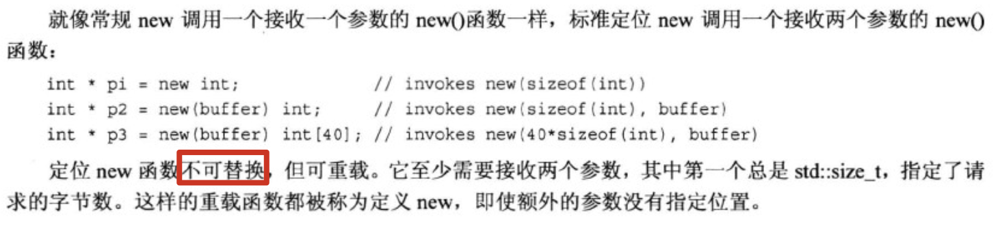

42. 名称空间：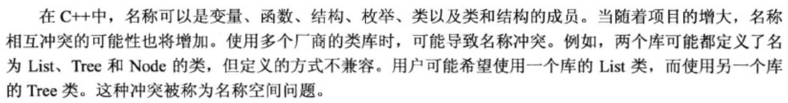

  **声明区域**（declaration area）：可以在其中进行声明的区域。例如：可以在函数外声明全局变量，其声明区域为其声明所在的文件。对于在函数中声明的变量，其声明区域为其声明所在的代码块。
  
  **潜在作用域**（potential scope）：从声明点开始，到其声明区域的结尾。因此潜在作用域比声明区域小。
  
  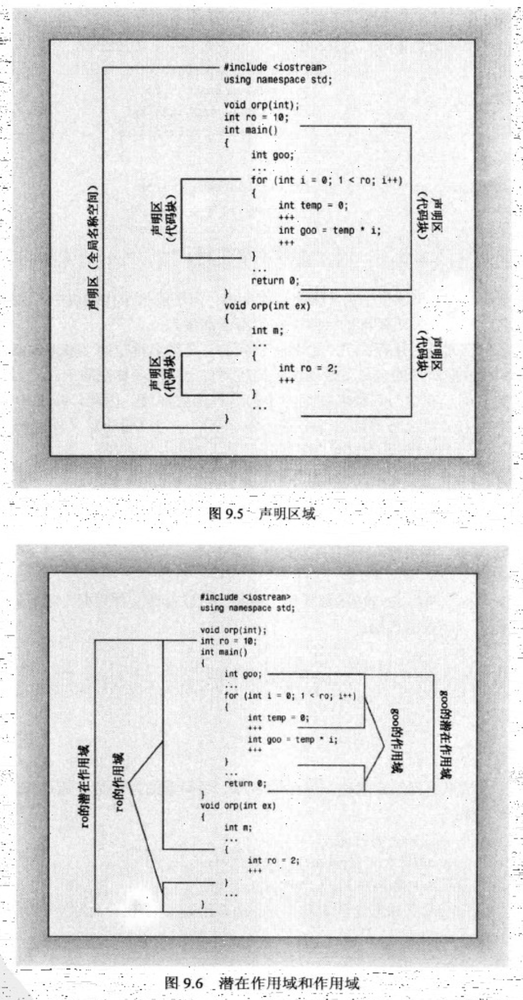
  
43. 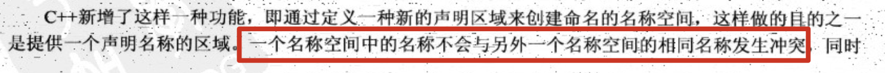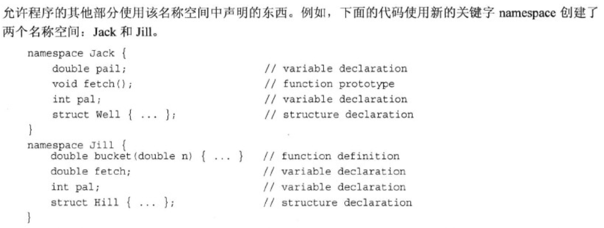

    名称空间可以是全局的，也可以位于另一个名称空间中，但不能位于代码块中。因此，在默认情况下，在名称空间中声明的名称的链接性为外部的（除非它引用了常量）。

    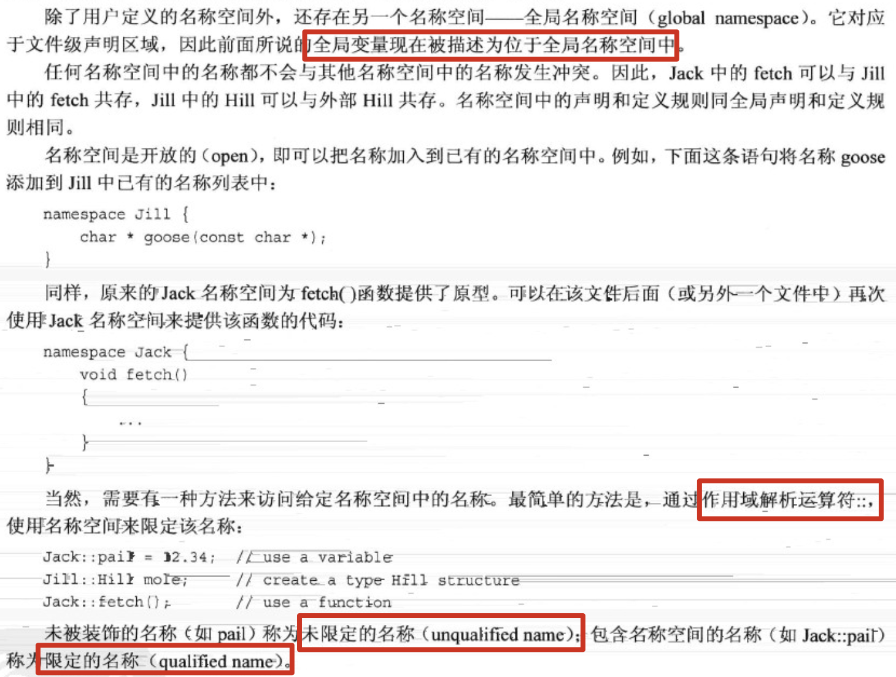

    ```cpp
    namespace Wang {
        int i = 1024;
    
        void func() {
            cout << i << endl;
        }
    }
    
    namespace Song {
        int i = 2048;
    
        void func() {
            cout << i << endl;
        }
    }
    
    int main() {
        Wang::func();	// 输出1024
        Song::func();	// 输出2048
    }
    ```

44. using声明和using编译指令：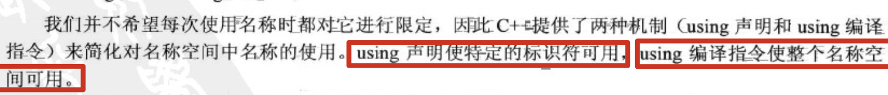

    using声明由被限定的名称和它前面的关键字using组成：

    ```cpp
        using Wang::func; // using声明
        func(); 	// 输出1024
    ```

    using声明将特定的名称添加到它所属的声明区域中。完成该声明后，便可以使用func()代替Wang::func()

45. 在函数外使用using声明时，将把名称添加到全局名称空间中：

    ```cpp
    namespace Wang {
        int i = 1024;
    
        void func() {
            cout << i << endl;
        }
    }
    
    using Wang::func;	// 在函数外使用using声明
    
    void test() {
        func();	// 将调用Wang::func()
    }
    
    int main() {
        test();	// 输出：1024
        func();	// 输出：1024
    }
    ```

46. using声明使一个名称可用，而using编译指令使所有的名称都可用。using编译指令由**名称空间名**和它前面的关键字`using namespace`组成，它使名称空间中的所有名称都可用，而不需要使用作用域解析运算符。

    ```cpp
    namespace Wang {
        int i = 1024;
    
        void func() {
            cout << i << endl;
        }
    }
    
    int main() {
        using namespace Wang;
        cout << i << endl;	// 输出：1024
        func();							// 输出：1024
    }
    ```

    关于using编译指令和using声明：它们实际增加了名称冲突的可能性。如果在程序中使用作用域运算符，即`Wang::xxx`，则不会存在二义性。

47. using编译指令和using声明的差异：

    ```cpp
    namespace Song {
        int i = 2048;
    
        void func() {
            cout << i << endl;
        }
    }
    
    int main() {
        using namespace Wang;
        int i = 2048;	// 局部变量i将屏蔽命名空间Wang中变量i
        cout << i << endl;	// 输出： 2048
        func();
    }
    ```

    如果使用using声明：

    ```cpp
    namespace Song {
        int i = 2048;
    
        void func() {
            cout << i << endl;
        }
    }
    
    int main() {
        using Wang::i;
      	// 编译报错，提示声明冲突
        int i = 2048i		// 与using声明的发生冲突
        cout << i << endl;
    }
    ```

    再看下面这个例子：

    ```cpp
    int i = 1024;
    
    namespace Wang {
        int i = 2048;
    
        void func() {
            cout << i << endl;
        }
    }
    
    int main() {
        using Wang::i;
        cout << i << endl;	// 输出：2048
      	// Wang::i将覆盖全局的i
    }
    ```

    注：函数中的using编译指令将名称空间的名称视为在**函数之外**命名的，但它不会使得该文件中的其他函数能够使用这些名称。

48. 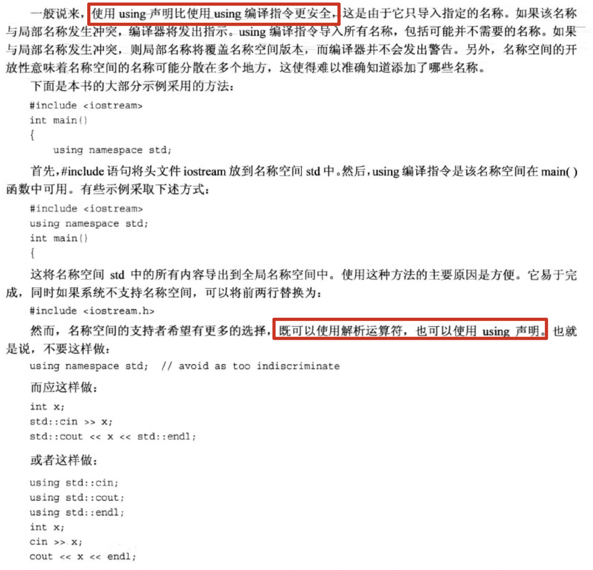

49. 可以将命名空间进行嵌套：

    ```cpp
    namespace a {
        namespace b {
            int i = 1024;
        }
        int i = 2048;
    }
    
    int main() {
        cout << a::b::i << endl;	// 输出：1024
        cout << a::i << endl;			// 输出：2048
    }
    ```

    再看下面的例子：

    ```cpp
    namespace a {
        namespace b {
            int i = 1024;
        }
        int i = 2048;
    }
    
    namespace total {
        using namespace a;
        using std::cout;
        using std::cin;
    }
    
    int main() {
        using namespace total;
        cout << a::b::i << endl;	// 输出1024
    }
    ```

    注：在main函数中的`using namespace total;`等价于

    ```cpp
    using namespace total;
    using namespace a;
    ```

50. 可以给名称空间创建别名：

  ```cpp
namespace a {
      namespace b {
          int i = 1024;
      }
      int i = 2048;
  }
  
  namespace total {
      using namespace a;
      using std::cout;
      using std::cin;
  }
  
  // 名称空间别名
  namespace alias = total::b;
  
  int main() {
      using alias::i;
    	// 相当于调用total::b::i
      cout << i << endl;		// 输出：1024
  ```
  
  可以使用这种技术来简化对嵌套名称空间的使用。
  
51. 未命名的空间名称

    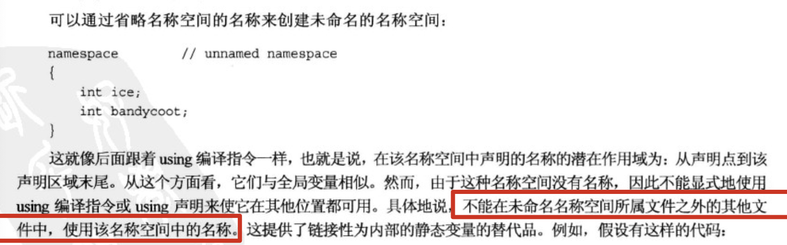

    ```cpp
    static int counts;
    int main() {
      	...
    }
    
    // 可以采用名称空间的方式
    namespace{
        int counts;
    }
    int main() {
      	...
    }
    ```

52. 看一个名称空间的实用实例：

  文件1：namesp.h，定义两种namespace及若干struct及方法
  
  ```cpp
  #ifndef TEST_NAMESP_H
  #define TEST_NAMESP_H
  
  #include<string>
  
  namespace pers {
      struct Person {
          std::string fname;
          std::string lname;
      };
  
      void get_person(Person &);
  
      void show_person(const Person &);
  }
  
  namespace debts {
      using namespace pers;
      struct Debt {
          Person name;
          double amount;
      };
  
      void get_debt(Debt &);
  
      void show_debt(const Debt &);
  
      double sum_debt(const Debt arr[], int n);
  }
  #endif 
  ```
  
  文件2：namesp.cpp，提供namesp.h中声明的定义
  
  ```cpp
  #include <iostream>
  #include "namesp.h"
  
  using std::cout;
  using std::endl;
  
  namespace pers {
  
      void set_person(Person &per, const string &fname, const string &lname) {
          per.fname = fname;
          per.lname = lname;
      }
  
      void show_person(const Person &per) {
          cout << per.lname << endl;
          cout << per.fname << endl;
      }
  }
  
  namespace debts {
      void set_debt(Debt &debt, const Person &per, double amount) {
          debt.name = per;
          debt.amount = amount;
      }
  
      void show_debt(const Debt &debt) {
          pers::show_person(debt.name);
          cout << debt.amount << endl;
      }
  
      double sum_debt(const Debt arr[], int n) {
          double total = 0;
          for (int i = 0; i < n; i++) {
              total += arr[i].amount;
          }
  
          return total;
      }
  }
  ```
  
  文件3：main.cpp，函数的调用
  
  ```cpp
  #include "namesp.h"
  #include <iostream>
  
  void other();
  
  void another();
  
  int main() {
      using debts::Debt;
      using debts::show_debt;
      using std::cout;
      using std::endl;
      Debt debt = {{"Wang", "Michael"}, 1024.1024};
      show_debt(debt);
    	// 输出：
    	// Michael
  		// Wang
  		// 1024.1
      cout<<"other:"<<endl;
      other();
    	// 输出：
    	// other:
  		// Bob
  		// Alice
  		// 3072.31
      cout<<"another:"<<endl;
      another();
    	// 输出：
    	// another:
  		// 3072.31
  }
  
  void other() {
      using namespace debts;	// 由于debts名称空间包含pers名称空间的using编译指令，所以using namespace debts后就可以使用pers名称空间中的东西
      using std::cout;
      using std::endl;
      Person per = {"Alice", "Bob"};
      show_person(per);
      Debt arr[2] = {
              {{"Wang", "Michael"}, 1024.1024},
              {{"Song", "Yao"},     2048.2048},
      };
  
      cout << sum_debt(arr, 2) << endl;
  }
  
  void another() {
      using namespace debts;
      using std::cout;
      using std::endl;
      Debt arr[2];
      set_person(arr[0].name, "Kobe", "Bryant");
      set_debt(arr[0], arr[0].name, 1024.1024);
      set_person(arr[1].name, "Allen", "Iverson");
      set_debt(arr[1], arr[1].name, 2048.2048);
    
      cout << sum_debt(arr, 2) << endl;
  }
  ```
  
53. 名称空间及其前途：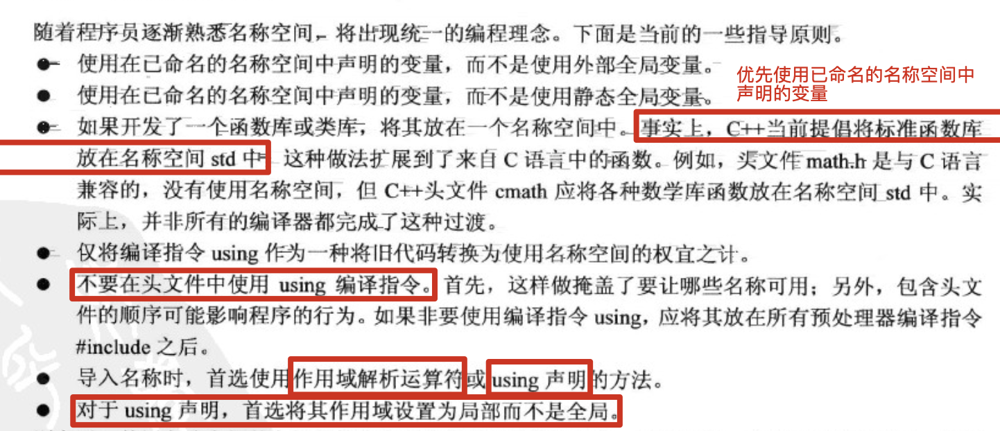

    注：使用名称空间的主旨是简化大型编程项目的管理工作。对于只有一个文件的简单程序，使用using编译指令（而非using声明）并非什么大逆不道的事。

54. 头文件名的变化反映了这些（名称空间）变化。老式文件（如iostream.h）**没有**使用名称空间，但新头文件iostream使用了**std**名称空间。
