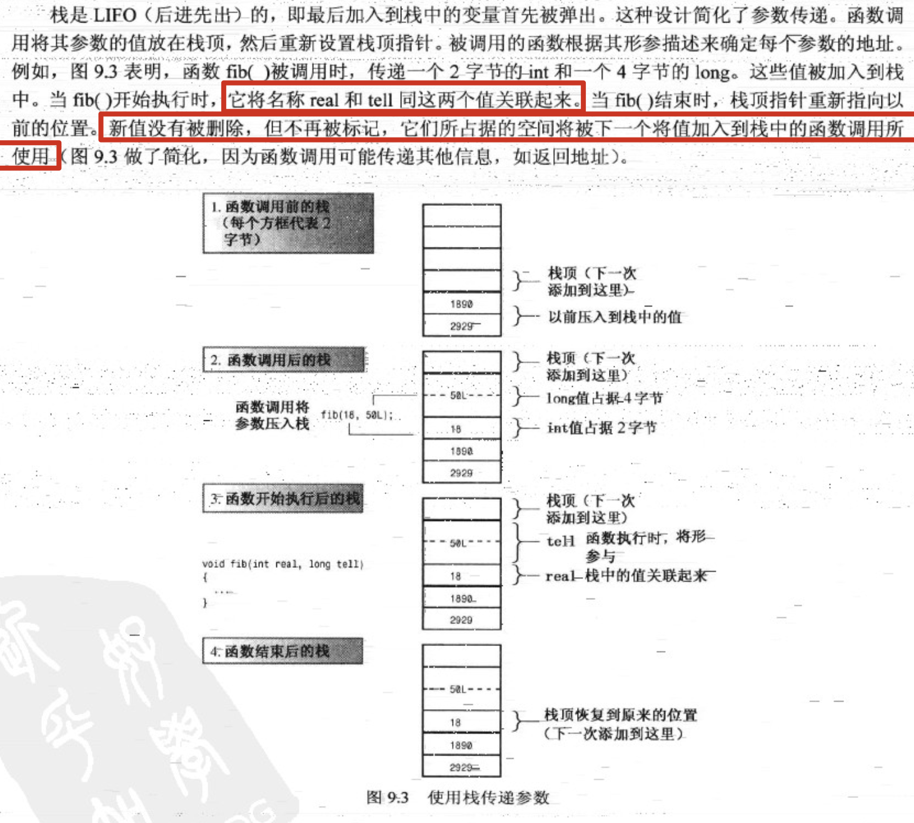
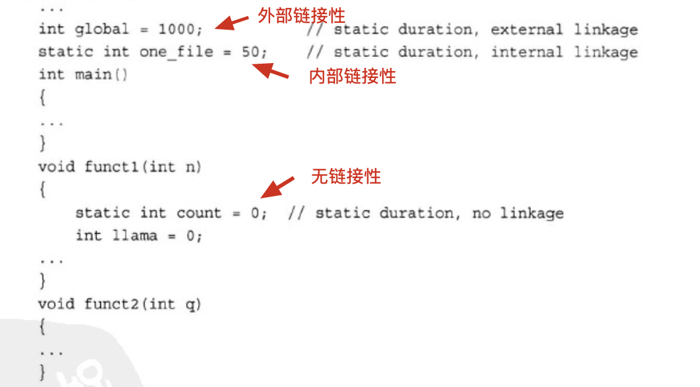

## 8. 内存模型和名称空间

1. 单独编译：

2. 如果多个文件都使用了同一种struct，那是要在每一个文件中都复制一份struct的声明么？

3. 请不要将**函数定义**或**变量声明**放到头文件中！如果头文件包含一个函数的定义，然后在其他两个文件（属于同一个程序）中包含该头文件，则同一个程序中将包含同一个函数的两个定义。除非函数是内联的，否则将出错。

4. 头文件中常包含：

   

5. 关于头文件的包含方式：

   

6. 头文件举例：

   头文件`coordin.h`：

   ```cpp
   #ifndef COORDIN_H_
   #define COORDIN_H_
   
   struct polar {
       double distance;
       double angle;
   };
   
   struct rect {
       double x;
       double y;
   };
   
   polar rect_to_polar(rect xypos);
   
   void show_polar(polar dapos);
   
   #endif
   ```

   源代码文件`coordin.cpp`：

   ```cpp
   #include "coordin.h"
   #include <cmath>
   #include <iostream>
   
   using namespace std;
   
   // 定义coordin.h中声明的函数
   polar rect_to_polar(rect xypos) {
       polar answer;
       answer.distance = sqrt(xypos.x * xypos.x + xypos.y * xypos.y);
       answer.angle = atan2(xypos.y, xypos.x);
       return answer;
   }
   
   void show_polar(polar dapos) {
       const double Rad_to_deg = 57.29577951;
       cout << "distance = " << dapos.distance;
       cout << ", angle = " << dapos.angle * Rad_to_deg << " degrees" << endl;
   }
   ```

   源代码文件main.cpp：

   ```cpp
   #include "coordin.h"
   
   int main() {
       rect rplace = rect{4, 3};
       polar pplace = rect_to_polar(rplace);
       show_polar(pplace);
   }
   
   // 输出：
   // distance = 5, angle = 36.8699 degrees
   ```

   注：一个.h头文件往往都配有一个同文件名的.cpp文件，来定义.h头文件中的函数原型。

7. cpp文件的编译流程：

8. 头文件管理：

   

   通过#define定义一个同**头文件名相同的常量符号**就会为了让编译器快速得知该头文件在当前有没有被包含过，如果该变量已经被定义，说明该头文件已经被包含过了。

9. 

10. 多个库的链接

   

11. c++使用三种（c++11中是四种）不同的方案来存储数据：

    

12. 作用域（scope）：描述了名称在文件（单元）的多大范围内可见。例如：函数中定义的变量可在该函数中使用，但不能在其他函数中使用；在文件中的函数定义之前定义的变量则可在所有函数中使用。

13. 链接性（linkage）：描述了名称如何在不同单元间共享。链接性为**外部**的名称可在文件件共享，链接性为**内部**的名称只能由一个文件中的函数共享。自动变量的名称没有链接性，因为它们不能共享。

14. 

    如果同名，代码块内的变量名将屏蔽代码块外的变量名：

    

15. 关于auto关键字：

    c++11中关键字auto用于自动类型推断。但在c语言和以前的c++版本中，auto的含义截然不同，它用于显式地指出变量为自动存储（即局部自动变量）:

    ```cpp
    		// c语言和以前的c++版本中
    		auto float ford;
        // 等价于
        float ford;
    ```

    因此程序员几乎不使用它。

16. 

    栈传递参数示意图：

    

17. 寄存器变量：

18. 静态持续变量：

    如何创建三种不同链接性的静态持续变量：

    注：上述代码中的global、one_file和count在整个程序执行期间都存在。count在函数内部定义，无链接性，所以只能在funct1函数内部使用它。global和one_file作用域都是真个文件。由于one_file为内部链接性，因此只能在上述代码文件中使用它。而global（外部链接性）在其他程序文件中也可以使用。

    
    
19. 静态变量的初始化：

    ```cpp
    #include <cmath>
    
    int x;                  // 零初始化
    int y = 5;              // 常量表达式初始化
    long z = 13 * 13;       // 常量表达式初始化
    const double pi = 4.0 * atan(1.0);  // 动态初始化
    ```

    初始化pi必须调用函数atan()，这需要等到该函数被链接并且程序执行时。

    

    注：c++11新增了关键字`constexpr`，这增加了创建**常量表达式**的方式。这里不会相信介绍该特性。

20. 

    在每个使用外部变量的文件中，都必须声明它。由于c++要求每个变量只能由一次定义。为满足这种需求，c++提供了两种变量声明：

    - 定义声明（defining declaration）或简称为定义（definition）：它给变量分配存储空间；
    - 引用声明（referencing declaration）或简称为声明（declaration）：它不给变量分配存储空间。

    引用声明使用关键字**extern**，且不进行初始化：

    ```cpp
    double up;              // 定义，up的值为0（零值初始化）
    extern int blem;        // 声明，blem在别处被定义
    extern char gr = 'r';   // 定义
    ```

    

    注：在file01.cpp中定义cats时的extern，是可以省略的。

21. 假设当函数中局部变量与外部变量同名：

    ```cpp
    int num = 1024;
    
    int main() {
        int num = 2048;	// 局部同名变量将屏蔽全局变量
        cout << num << endl;
      	// ::num表示全局版本的num变量。如果在局部变量名与全局变量名不发生冲突时（没有叫num的局部变量），num直接表示全局变量
        cout << ::num << endl;
    }
    ```

    c++比c语言更进一步——提供了作用域解析运算符`::`。放在变量名前面时，该运算符表示使用变量的全局版本。

22. 全局变量和局部变量的选择：

23. 如果文件定义了一个静态外部变量，其名称与另一个文件中声明的常规外部变量相同，则在该文件中静态变量将隐藏常规外部变量：

    ```cpp
    // file1
    int i = 1;      // 外部变量定义
    
    // file2
    static int i = 5;		// 在file2中，将只能看见该静态外部变量而看不到file1中的i
    void func(){
      cout << i; // 输出5
    }
    ```

    

24. 可使用外部变量在**多个文件程序的不同部分**之间共享数据；可使用链接性为内部的静态变量在**同一个文件中的多个函数**之间共享数据（名称空间提供了另外一种共享数据的方法）。

25. 将static限定符用于代码块中定义变量，将导致局部变量的存储持续性为**静态**的。虽然该变量只在该代码块中可用，但它在该代码块不处于活动状态时仍然存在。另外，如果初始化了静态局部变量，则程序只在启动时进行一次初始化。以后再调用函数时不会像自动变量那样再次被初始化：

    ```cpp
    void func(const char chs[]) {
      	// 静态局部变量。函数结束后，该变量仍然后存在。
        static int total;
        total += strlen(chs);
        cout << total << endl;
    }
    		func("abc");
        func("michael");
        func("z");
    		// 输出：
    		//	3
    		//  10
    		//	11
    ```

    所以静态局部变量total将记录所有传入过func函数的字符串长度之和。

26. cv-限定符

​    