## 9.对象和类

1. 类是一种将抽象转换为用户定义类型的c++工具，它将数据表示和操纵数据的方法合成一个整洁的包。一般来说类规范由两个部分组成：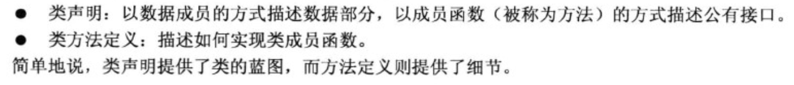

2. 什么是接口？

   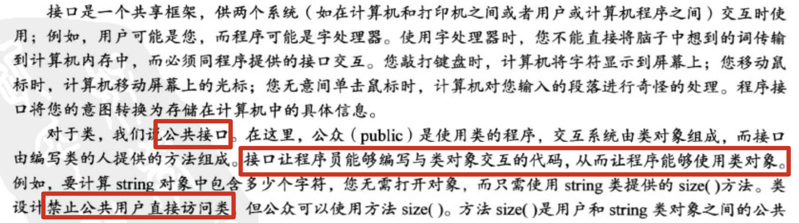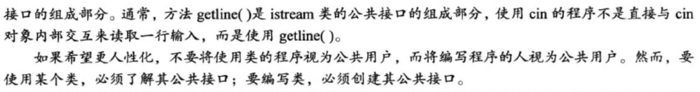

3. 通常c++程序员将接口（类定义）放在头文件中，并将实现（类方法的代码）放在源代码文件中。

4. 为帮助识别类，需要遵循一种常见但不通用的约定——**将类首字母大写**。

5. 来看一个类声明的例子：

   ```cpp
   // 文件stock.h
   #ifndef TEST_STOCK_H
   #define TEST_STOCK_H
   
   
   #include <string>
   
   class Stock {       // 类声明
   private:
       std::string company;
       long shares;
       double share_val;
       double total_val;
   
       void set_tot() { total_val = shares * share_val; }
   
   public:
       void acquire(const std::string &company, long n, double pr);
   
       void buy(long num, double price);
   
       void sell(long num, double price);
   
       void update(double price);
   
       void show();
   };  //注：类声明以分号结尾
   
   
   #endif //TEST_STOCK_H
   ```

6. 访问控制：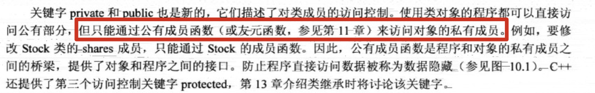

   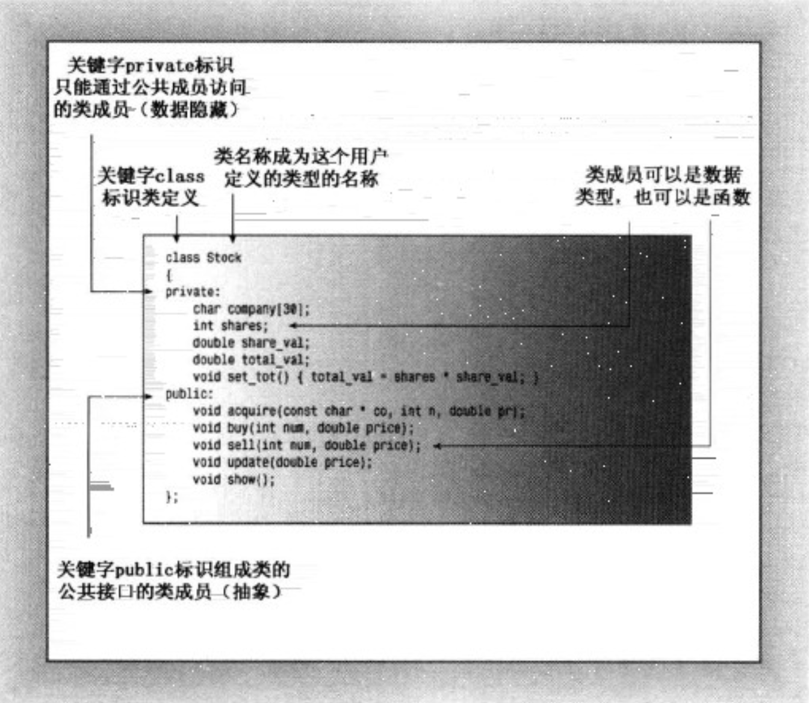

7. 类设计尽可能将公有接口与实现细节分开。公有接口表示设计的**抽象组件**。将实现细节放在一起并将它们与抽象分开被称为**封装**。

8. 数据隐藏（将数据放在类的私有部分中）是一种封装，将实现的细节隐藏在私有部分中，就像Stock类对set_tot()所做的那样。封装的另一个例子：将**类型函数定义**和**类声明**放在不同的文件中。

   数据隐藏不仅可以防止直接访问数据，还让开发者（类的用户）无需了解数据是如何被表示的。例如上面Stock的例子：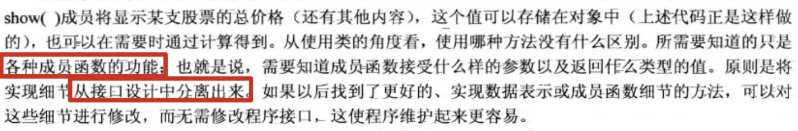

9.  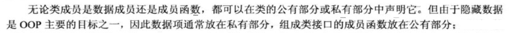

  不必在类声明中使用关键字private，因为这是类对象默认访问控制：
  
  ```cpp
  class Stock {       // 类声明
      std::string company;	// 默认是private的访问权限
     	...
  public:
      void acquire(const std::string &company, long n, double pr);	// 公有
  }
  ```
  
10. 类和结构的区别：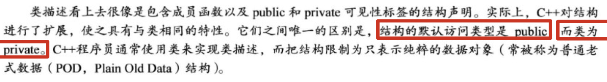

11. 实现类成员函数：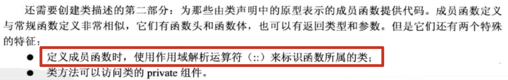

    Stock类的其他成员函数不必使用**作用域解析运算符**就可以使用其他Stock类的成员函数。因为它们属于同一个类，因此所有类成员函数都是相互可见的。

    如果试图使用非成员函数访问一个类的私有数据成员，编译器是禁止这样做的（友元函数除外）。

    看个例子：

    ```cpp
    // 文件stock.cpp
    #include "stock.h"
    #include<iostream>
    
    using std::cout;
    using std::endl;
    using std::string;
    
    void Stock::acquire(const string &co, long n, double pr) {
        company = co;
        if (n < 0) {
            cout << "Number of shares can't be negative" << endl;
            shares = 0;
        } else {
            shares = n;
        }
        share_val = pr;
        set_tot();
    }
    
    void Stock::buy(long num, double price) {
        if (num < 0) {
            cout << "Number of shares can't be negative" << endl;
            return;
        }
    
        shares += num;
        share_val = price;
        set_tot();
    }
    
    // 以下类的函数成员定义省略不写
    void Stock::sell(long num, double price) {}
    
    void Stock::update(double price) {}
    
    void Stock::show() {}
    ```

12. 需要注意的是：**定义位于类声明中的函数**都将自动成为**内联函数**，例如`Stock::set_tot()`就是一个内联函数。类声明常将短小的成员函数作为内联函数，set_tot()符合这样的要求。

  如果愿意，也可以在类声明之外定义成员函数并使之成为内联函数。只需在类实现部分中定义函数时使用inline限定符即可：
  
  ```cpp
  // 文件stock.h
  #ifndef TEST_STOCK_H
  #define TEST_STOCK_H
  
  
  #include <string>
  
  class Stock {       // 类声明
      std::string company;
      long shares;
      double share_val;
      double total_val;
  
      void set_tot();
  
  public:
      void acquire(const std::string &company, long n, double pr);
  
      void buy(long num, double price);
  
      void sell(long num, double price);
  
      void update(double price);
  
      void show();
  };  //注：类声明以分号结尾
  
  // 在头文件中定义内联函数
  inline void Stock::set_tot() {
      total_val = shares * share_val;
  }
  ```
  
  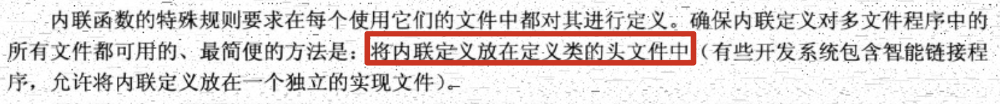
  
  注：直接**在类声明中定义方法**等同于**用原型替换方法定义，然后在类声明的后面将定义改写为内联函数**。所以，上述定义内联函数`set_tot`的方式同在类声明中直接定义是等价的。
  
13. 类对象的数据存储：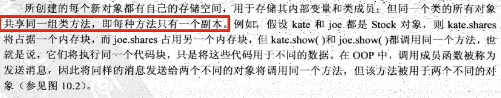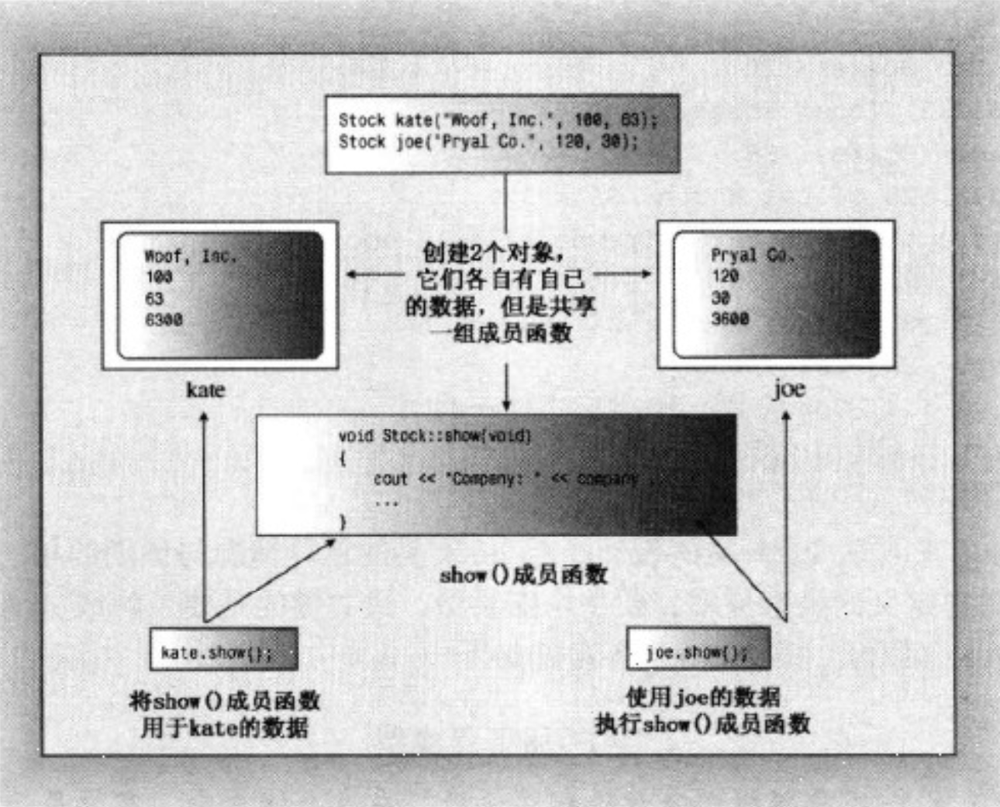
  
14. 创建类对象可以声明类变量，也可以使用new为类对象分配存储空间。要使用新类时，最关键的是要了解成员函数的功能，而不必考虑其实现细节。正如cs模型：

    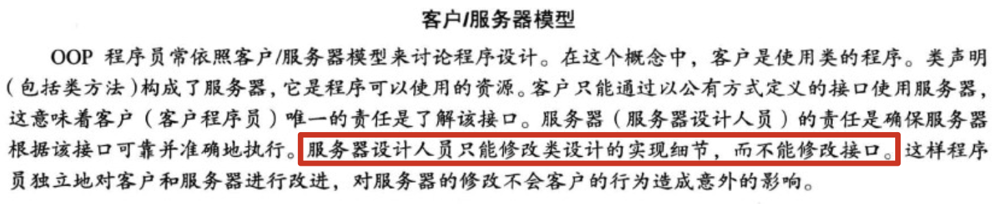

15. 小结：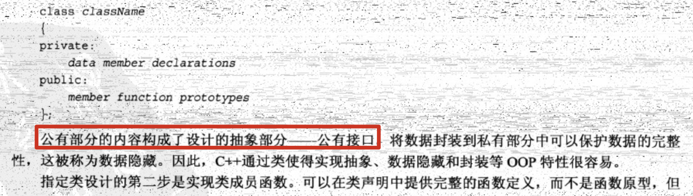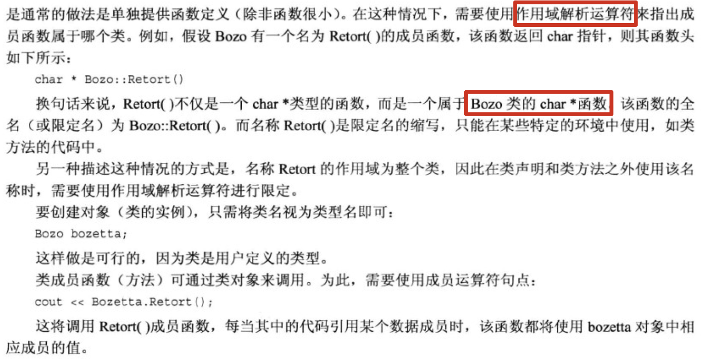

16. 类的构造函数和析构函数：常规的初始化语法不适用于类：

    ```cpp
    int year = 2001;
    struct thing{
      char * pn;
      int m;
    };
    
    thing amabob = {"michael", -12};	// 有效的初始化
    Stock hot = {"Sukie's Autos, Inc.", 200, 50.25}; // 编译错误
    ```

    由于类数据部分是private的，所以程序不能直接访问数据对象。初始化赋值也不可以。

17. 类的构造函数的原型和函数头有一个有趣的特征：虽然没有返回值，但是没有被声明为void类型。实际上，构造函数没有声明类型。

  ```cpp
  // stock.h中构造函数声明
  Stock(const std::string &co, long n = 0, double pr = 0.0);
  
  // stock.cpp中的构造函数的定义
  Stock::Stock(const std::string &co, long n, double pr) {
      company = co;
      if (n < 0) {
          std::cerr << "Number of shares can't be negative" << endl;
          shares = 0;
      } else
          shares = n;
      share_val = pr;
      set_tot();
  }
  ```
  
  上述代码和类函数成员acquire()相同，区别在于：程序声明对象时将**自动调用构造函数**。
  
18. 成员名和参数名：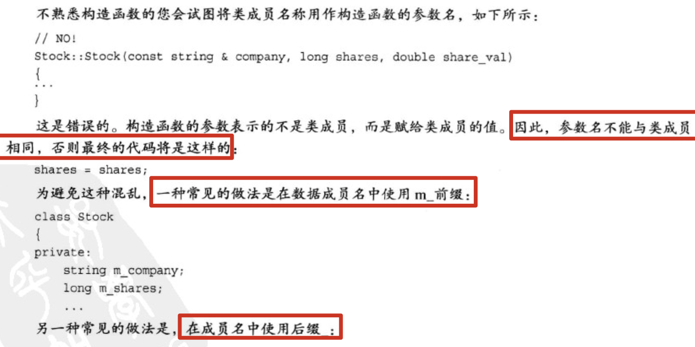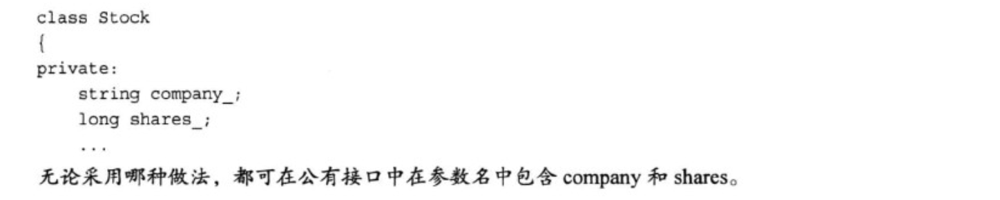

19. 
