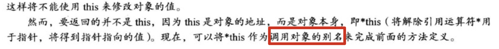

## 9.对象和类

1. 类是一种将抽象转换为用户定义类型的c++工具，它将数据表示和操纵数据的方法合成一个整洁的包。一般来说类规范由两个部分组成：

2. 什么是接口？

   

3. 通常c++程序员将接口（类定义）放在头文件中，并将实现（类方法的代码）放在源代码文件中。

4. 为帮助识别类，需要遵循一种常见但不通用的约定——**将类首字母大写**。

5. 来看一个类声明的例子：

   ```cpp
   // 文件stock.h
   #ifndef TEST_STOCK_H
   #define TEST_STOCK_H
   
   
   #include <string>
   
   class Stock {       // 类声明
   private:
       std::string company;
       long shares;
       double share_val;
       double total_val;
   
       void set_tot() { total_val = shares * share_val; }
   
   public:
       void acquire(const std::string &company, long n, double pr);
   
       void buy(long num, double price);
   
       void sell(long num, double price);
   
       void update(double price);
   
       void show();
   };  //注：类声明以分号结尾
   
   
   #endif //TEST_STOCK_H
   ```

6. 访问控制：

   

7. 类设计尽可能将公有接口与实现细节分开。公有接口表示设计的**抽象组件**。将实现细节放在一起并将它们与抽象分开被称为**封装**。

8. 数据隐藏（将数据放在类的私有部分中）是一种封装，将实现的细节隐藏在私有部分中，就像Stock类对set_tot()所做的那样。封装的另一个例子：将**类型函数定义**和**类声明**放在不同的文件中。

   数据隐藏不仅可以防止直接访问数据，还让开发者（类的用户）无需了解数据是如何被表示的。例如上面Stock的例子：

9.  

  不必在类声明中使用关键字private，因为这是类对象默认访问控制：
  
  ```cpp
  class Stock {       // 类声明
      std::string company;	// 默认是private的访问权限
     	...
  public:
      void acquire(const std::string &company, long n, double pr);	// 公有
  }
  ```
  
10. 类和结构的区别：

11. 实现类成员函数：

    Stock类的其他成员函数不必使用**作用域解析运算符**就可以使用其他Stock类的成员函数。因为它们属于同一个类，因此所有类成员函数都是相互可见的。

    如果试图使用非成员函数访问一个类的私有数据成员，编译器是禁止这样做的（友元函数除外）。

    看个例子：

    ```cpp
    // 文件stock.cpp
    #include "stock.h"
    #include<iostream>
    
    using std::cout;
    using std::endl;
    using std::string;
    
    void Stock::acquire(const string &co, long n, double pr) {
        company = co;
        if (n < 0) {
            cout << "Number of shares can't be negative" << endl;
            shares = 0;
        } else {
            shares = n;
        }
        share_val = pr;
        set_tot();
    }
    
    void Stock::buy(long num, double price) {
        if (num < 0) {
            cout << "Number of shares can't be negative" << endl;
            return;
        }
    
        shares += num;
        share_val = price;
        set_tot();
    }
    
    // 以下类的函数成员定义省略不写
    void Stock::sell(long num, double price) {}
    
    void Stock::update(double price) {}
    
    void Stock::show() {}
    ```

12. 需要注意的是：**定义位于类声明中的函数**都将自动成为**内联函数**，例如`Stock::set_tot()`就是一个内联函数。类声明常将短小的成员函数作为内联函数，set_tot()符合这样的要求。

  如果愿意，也可以在类声明之外定义成员函数并使之成为内联函数。只需在类实现部分中定义函数时使用inline限定符即可：
  
  ```cpp
  // 文件stock.h
  #ifndef TEST_STOCK_H
  #define TEST_STOCK_H
  
  
  #include <string>
  
  class Stock {       // 类声明
      std::string company;
      long shares;
      double share_val;
      double total_val;
  
      void set_tot();
  
  public:
      void acquire(const std::string &company, long n, double pr);
  
      void buy(long num, double price);
  
      void sell(long num, double price);
  
      void update(double price);
  
      void show();
  };  //注：类声明以分号结尾
  
  // 在头文件中定义内联函数
  inline void Stock::set_tot() {
      total_val = shares * share_val;
  }
  ```
  
  
  
  注：直接**在类声明中定义方法**等同于**用原型替换方法定义，然后在类声明的后面将定义改写为内联函数**。所以，上述定义内联函数`set_tot`的方式同在类声明中直接定义是等价的。
  
13. 类对象的数据存储：
  
14. 创建类对象可以声明类变量，也可以使用new为类对象分配存储空间。要使用新类时，最关键的是要了解成员函数的功能，而不必考虑其实现细节。正如cs模型：

    

15. 小结：

16. 类的构造函数和析构函数：常规的初始化语法不适用于类：

    ```cpp
    int year = 2001;
    struct thing{
      char * pn;
      int m;
    };
    
    thing amabob = {"michael", -12};	// 有效的初始化
    Stock hot = {"Sukie's Autos, Inc.", 200, 50.25}; // 编译错误
    ```

    由于类数据部分是private的，所以程序不能直接访问数据对象。初始化赋值也不可以。

17. 类的构造函数的原型和函数头有一个有趣的特征：虽然没有返回值，但是没有被声明为void类型。实际上，构造函数没有声明类型。

  ```cpp
  // stock.h中构造函数声明
  Stock(const std::string &co, long n = 0, double pr = 0.0);
  
  // stock.cpp中的构造函数的定义
  Stock::Stock(const std::string &co, long n, double pr) {
      company = co;
      if (n < 0) {
          std::cerr << "Number of shares can't be negative" << endl;
          shares = 0;
      } else
          shares = n;
      share_val = pr;
      set_tot();
  }
  ```
  
  上述代码和类函数成员acquire()相同，区别在于：程序声明对象时将**自动调用构造函数**。
  
18. 成员名和参数名：

19. c++提供了两种使用构造函数来初始化对象的方式：

    ```cpp
    // 显式调用构造函数
    Stock s1 = Stock("michael", 100, 1.1);
    // 隐式调用构造函数
    Stock s2("michael", 100, 1.1);
    ```

    每次创建类对象（甚至用new动态分配内存）时，c++都使用构造函数：

    ```cpp
    Stock *p_stock = new Stock("michael", 100, 1.1);
    ```

    一般来说，可以使用对象来调用方法，但无法使用对象来调用构造函数。因为在构造函数构造出对象之前，对象是不存在的。因此构造函数被用来创建对象，而不能通过对象来调用。

20. 默认构造函数：

    在未提供显式初始值时，用来创建对象的构造函数。例如：

    ```cpp
    Stock s;
    ```

    如果没有提供任何构造函数，c++将自动提供**默认构造函数**。对于Stock类来说，默认构造函数可能如下：

    ```cpp
    Stock::Stock(){}
    ```

    因此将创建Stock类的对象，但不初始化其成员。这和`int x;`创建x变量但是没有提供给它值一样。

21. 

22. 定义默认构造函数的方式有两种：

    ```cpp
    // 1.给已有构造函数的所有参数提供默认值(在类声明中添加)
    Stock(const std::string &co="", long n = 0, double pr = 0.0);
    
    // 2.通过函数重载来定义另一个构造函数——一个没有参数的构造函数(在类声明中添加)
    Stock();
    ```

    由于只能有一个默认构造函数，因此上述方法只能二选一。实际上通常应初始化所有的对象以确保所有成员一开始就有已知的合理值。因此，用户定义的默认构造函数通常给所有成员提供隐式初始值：

    ```cpp
    // default constructor
    Stock::Stock() {
        company = "";
        shares = 0;
        share_val = 0;
        total_val = 0;
    }
    ```

    

    ```cpp
    Stock s1;									// 隐式调用默认构造函数
    Stock s2 = Stock();				// 显式调用默认构造函数 
    Stock *s3 = new Stock;		// 隐式调用默认构造函数
    ```

    看下面几个例子：

    ```cpp
    Stock s1("michael.w")    		// 调用非默认构造函数
    Stock s2{};									// 定义类一个函数，函数名问s2，返回值为Stock对象
    Stock s3;										// 隐式调用默认构造函数，不要使用圆括号
    ```

23. 析构函数：

    析构函数的名称特别——在类名前加上~。同构造函数一样，析构函数也可以没有返回值和声明类型。与构造函数不同的是：析构函数没有参数。

    ```cpp
    // stock.h
    // Stock析构函数的原型必须是这样的
     ~Stock();
    ```

    

24. 什么时候调用析构函数：

    

25. 如果程序员没有提供析构函数，编译器将隐式地声明一个默认析构函数，并在发现导致对象被删除的代码后，提供默认析构函数的定义。

    加入构造函数和析构函数的类声明：

    ```cpp
    #ifndef TEST_STOCK_H
    #define TEST_STOCK_H
    #include <string>
    
    class Stock {       // 类声明
        std::string company;
        long shares;
        double share_val;
        double total_val;
        void set_tot() { total_val = shares * share_val; }
    public:
        Stock();                                                   // 默认构造函数
        Stock(const std::string &co, long n = 0, double pr = 0.0); // 构造函数
        ~Stock();                                                  // 析构函数
        void buy(long num, double price);
        void sell(long num, double price);
        void update(double price);
        void show();
    }; 
    
    #endif //TEST_STOCK_H
    ```

26. 在默认情况下，将一个对象赋值给同类型的另一个对象时，c++将源对象的每个数据成员的内容复制到目标对象中相应的数据成员中：

    ```cpp
    		Stock s1("michael.w", 100, 1.1);
        Stock s2 = s1;
        cout << &s1 << endl;		// 0x7ffeec5aa8d0
        cout << &s2 << endl;		// 0x7ffeec5aa878
    // s2和s1并不拥有同一地址
    ```

    来看下面的程序：

    ```cpp
    // stock.h
    Stock::Stock(const std::string &co, long n, double pr) {
       	...
        cout << "构造函数: " << company << " at " << this << endl;
    }
    
    // stock.cpp
    Stock::~Stock() {
        cout << "析构函数: " << company << " at " << this << endl;
    }
    
    // main.cpp
    		Stock s1("michael.w", 100, 1.1);
        cout << "s1: michael.w" << endl;
        s1 = Stock("kobe", 200, 2.2);
        cout << "s1: kobe" << endl;
    
    // 输出：
    // 构造函数: michael.w at 0x7ffee16548d0
    // s1: michael.w
    // 构造函数: kobe at 0x7ffee1654878
    // 析构函数: kobe at 0x7ffee1654878
    // s1: kobe
    // 析构函数: kobe at 0x7ffee16548d0
    ```

    可见，在执行` s1 = Stock("kobe", 200, 2.2);`时候生成了一个临时Stock对象（地址为0x7ffee1654878），然后将数据成员的值依次复制给原s1对象对应的数据成员上。然后临时对象被析构。

    所以：如果可以通过初始化——`Stock s1("michael.w", 100, 1.1)`，也可以通过赋值来设置对象的值——`s1 = Stock("kobe", 200, 2.2);`，应采用**初始化方式**。因为不用创建临时对象，效率更高。

27. c++11列表初始化：

    

28. 构造函数和析构函数小结：

29. 当构造函数只有一个参数时，存在一个小特性：将对象初始化为一个与参数的类型相同的值时，该构造函数将被调用：

    ```cpp
    // 假设Stock类只有一个构造函数：
    Stock::Stock(const std::string &co) {
        company = co;
        cout << "构造函数: " << company << " at " << this << endl;
    }
    
    		// main函数：
    		std::string str="michael.w";
        Stock s = str;
    		// 相当于调用构造函数：Stock s(str);
    ```

    

30. 

31. this指针

    this指针指向用来调用成员函数的对象（this被作为隐藏参数传递给方法）。这样在函数调用——`s1.topval(s2)`中，this就是s1对象的地址。

    注意：

    

    ```cpp
    // 在函数的括号后面使用const限定符将this限定为const，这样将不能使用this来修改对象的值
    
    void Stock::set_shares(long shares) const {
      	// 编译器会报错，this指针被限定成const，所以不能试图修改this的数据成员
        this->shares = shares;
    }
    ```

32. 对象数组

    声明对象数组的方法与声明标准类型数组相同：

    ```cpp
    Stock stocks[4];
    ```

    执行上述代码中，将使用默认构造函数来初始化数组中每个元素。

    也可以使用构造函数来初始化数组元素：

    ```cpp
        Stock stocks[10] = {
                Stock("michael.w", 100, 1.1),	// 使用非默认构造函数来初始化
                Stock(),											// 使用默认构造函数来初始化
                Stock("kobe"),								// 使用非默认构造函数来初始化
        };
    ```

    余下的7个元素将使用默认构造函数进行初始化。

33. 大部分工作是在类设计中完成的。完成类设计后，编写程序的工作本身便相当简单。

    

​    